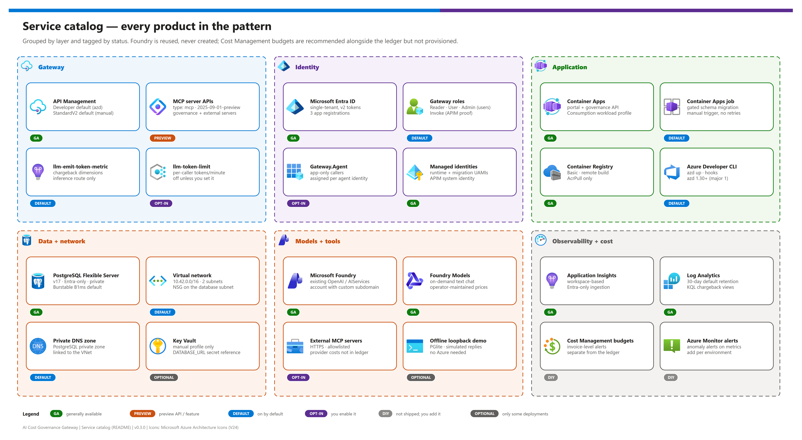

# AI Cost Governance Gateway

> [!WARNING]
> **For testing and demonstration purposes only.** This is a personal reference demo provided "as is" under the [MIT License](LICENSE), without warranty or support. It is not an official Microsoft product or sample, has not been through a production security review, and is not intended for production use. Review, test, and harden it before reusing any part of it, deploy only to non-production subscriptions, and never use real customer or personal data.

<p align="center">
  
  
  
  
  
  
  
  
</p>

<p align="center">
  
  
  
  
  
  
  
  
</p>

Put **real-time budget caps** in front of Microsoft Foundry models and MCP tools. Every team and agent gets a USD budget that is checked *before* each model call, token usage is emitted as **chargeback metrics** per team, model and caller, and MCP traffic flows through a **governed gateway** instead of directly to tools.

Under the hood it is a focused management portal and governance API with **Azure API Management (APIM) as the AI and MCP gateway**. Manage deployments in an existing Foundry account, assign team access, and admit inference requests only when a conservative maximum charge fits the team's remaining budget. It is for platform engineers, architects and FinOps teams who need to show - and then adapt - how model spend stays inside agreed budgets.

> [!NOTE]
> **Status: locally validated** (typecheck, unit/integration tests, offline loopback demo), **not yet live-deployed** to Azure. Treat the infrastructure templates as a reviewed starting point, not a production-proven deployment. Subscription, region, permissions and cost approval remain operator decisions.

## At a glance

| | Item | Value |
|---|---|---|
|  | **What you get** | Per-team USD budgets enforced **before** each model call; uncertain outcomes stay held, never silently refunded |
|  | **Gateway** |  API Management: Entra validation, rate limits, `llm-emit-token-metric`, optional `llm-token-limit`, MCP servers  |
|  | **Callers** | Delegated users, and app-only agents/managed identities with the `Gateway.Agent` role - same budget, full attribution |
|  | **Chargeback** | Token metrics by team, model, client app and caller type in workspace-based Application Insights |
|  | **Deploy with** | `azd up` (Entra setup, remote ACR build, gated migration). Bring-your-own path in [03b](./docs/03b-manual-deployment.md) |
|  | **Try it offline** | Loopback demo with simulated replies and a fake agent identity - no Azure subscription |

## What this pattern delivers

- A React/TypeScript portal for models, teams, budgets, MCP registrations, usage, audit events, and a text-chat playground.
- A TypeScript API for Foundry deployment management and gateway configuration, using Microsoft Entra roles and managed identity in Azure.
- A durable, transactional USD-microdollar ledger. Pending and uncertain inference charges reserve budget before a model call is sent.
- APIM policy and Bicep templates for the OpenAI-compatible inference route, read-only catalog/budget MCP tools, and authenticated MCP traffic.
- **Token metrics for chargeback:** APIM `llm-emit-token-metric` sends prompt/completion/total tokens to workspace-based Application Insights, by team, model, client application, caller type and API. Optional per-caller `llm-token-limit` throttling complements (never replaces) the ledger.
- **App-only callers:** agents, managed identities and service principals can call inference and the MCP tools with the `Gateway.Agent` application role. Each is registered to a team, spends that team's budget, and is attributed as an application in the ledger and audit trail. Users keep the delegated flow.
- An azd profile with private, Entra-only PostgreSQL, separate migration/runtime identities, and no local Docker or PostgreSQL requirement for cloud deployment.
- An explicitly labeled, loopback-only demo using simulated model responses; it does not require an Azure subscription or make Azure changes. It includes a fake app-only agent identity so the agent flow can be shown offline.

This is an original implementation inspired by the projects in [Design sources and provenance](./docs/01-architecture.md#design-sources-and-provenance), not a fork or a concatenation of their codebases.

> [!TIP]
> New to the pattern? Run the [offline loopback demo](./docs/00-reproduce-this-demo.md#part-b---offline-loopback-demo) first - it exercises budgets, admission, agent attribution and refusal without an Azure subscription.

## Pattern at a glance

[](./docs/assets/ai-cost-governance-gateway-architecture.png)

<sub>Editable source: [`docs/assets/ai-cost-governance-gateway-architecture.drawio`](./docs/assets/ai-cost-governance-gateway-architecture.drawio) - regenerate with `python scripts/export_diagrams.py docs/assets`.</sub>

The portal is a control plane, not a place to paste subscription keys. The inference route cannot skip the budget ledger. The API independently validates the caller and APIM's identity proof. An `X-Team-Id` header selects a team; it never grants membership. Walkthrough of every numbered path: [01 - Architecture](./docs/01-architecture.md#request-paths).

## What's inside

[](./docs/assets/service-catalog.png)

<sub>Editable source: [`docs/assets/service-catalog.drawio`](./docs/assets/service-catalog.drawio) - regenerate with `python scripts/export_diagrams.py docs/assets`.</sub>

<table>
  <tr>
    <td align="center" width="25%"><br><b>API Management</b><br><sub>AI + MCP gateway: token validation, rate limits, token metrics, APIM proof.</sub></td>
    <td align="center" width="25%"><br><b>Container Apps</b><br><sub>Portal + governance API; gated migration job.</sub></td>
    <td align="center" width="25%"><br><b>PostgreSQL</b><br><sub>USD-microdollar ledger and audit; private and Entra-only (azd).</sub></td>
    <td align="center" width="25%"><br><b>Microsoft Foundry</b><br><sub>Existing account and on-demand chat deployments, reused.</sub></td>
  </tr>
  <tr>
    <td align="center"><br><b>Microsoft Entra ID</b><br><sub>SPA, user API and proof API; five gateway roles.</sub></td>
    <td align="center"><br><b>Managed identities</b><br><sub>Runtime, migration and APIM identities - no keys or secrets.</sub></td>
    <td align="center"><br><b>Application Insights</b><br><sub><code>ai-gateway</code> token metrics for chargeback.</sub></td>
    <td align="center"><br><b>Log Analytics</b><br><sub>Workspace for metrics and logs; KQL views.</sub></td>
  </tr>
  <tr>
    <td align="center"><br><b>Container Registry</b><br><sub>Remote build; release by immutable digest.</sub></td>
    <td align="center"><br><b>VNet + private DNS</b><br><sub>Private database connectivity (azd).</sub></td>
    <td align="center"><br><b>MCP tools</b> <sub>(opt-in external)</sub><br><sub>Read-only governance tools; allowlisted external servers.</sub></td>
    <td align="center"><br><b>Azure Developer CLI</b><br><sub><code>azd up</code> with Entra setup and a release gate.</sub></td>
  </tr>
</table>

## Choose a path

| | Path | Needs | What it proves | Recommendation |
|---|---|---|---|---|
|  | **Offline loopback demo**  | Node.js 24 | Admission, settlement, agent attribution, refusal - with simulated replies | **Start here** to understand and present the pattern |
|  | **`azd up`**  | Subscription, existing Foundry, Entra rights, cost approval | The full Azure deployment with a gated release | **Use for Azure** - the normal deployment path |
|  | **Manual profile**  | Your PostgreSQL, ACR and Entra registrations | Same app and policies on resources you own | Only when policy requires bring-your-own resources |

## Quick start

### Run locally

Requires **Node.js 24 LTS** and npm 10 or newer. `package-lock.json` resolves from the public npm registry. If you must use a package mirror, configure it for your user (`npm config set registry <mirror-url>`); npm rewrites the lockfile's registry host automatically, and integrity hashes are still checked. Container builds accept `--build-arg NPM_CONFIG_REGISTRY=<mirror-url>`.

```powershell
npm ci
Copy-Item .env.example .env
npm run dev
```

Open `http://localhost:5173`. The API listens on `127.0.0.1:3001`. Demo data is local and deliberately synthetic. Keep demo mode bound to loopback; it is not an authentication mechanism for shared environments. To demonstrate an app-only agent offline, tick **Call as the demo agent identity** in the playground, or send `X-Demo-Caller: app` to the inference route:

```powershell
$body = @{ model = 'demo-chat'; max_completion_tokens = 32; messages = @(@{ role = 'user'; content = 'Hello from an agent' }) } | ConvertTo-Json -Depth 4
Invoke-RestMethod http://127.0.0.1:3001/openai/v1/chat/completions -Method Post -ContentType application/json `
  -Headers @{ 'X-Team-Id' = 'demo-engineering'; 'X-Demo-Caller' = 'app' } -Body $body
```

The call is charged to `demo-engineering` (which registers the fake agent) and appears under **Activity** as an `App` caller.

```powershell
npm run typecheck
npm test
npm run build
npm start
```

The built application is served by the API at `http://127.0.0.1:3001`. See `.env.example` for runtime settings and `compose.yaml` for optional local PostgreSQL. Production requires PostgreSQL; the local embedded database is not a multi-replica production database. The full story with expected results is in [00 - Reproduce this demo](./docs/00-reproduce-this-demo.md#part-b---offline-loopback-demo).

### Deploy with azd

Requires Node.js 24, PowerShell 7, Azure Developer CLI 1.30+ (major version 1), Bicep CLI, an existing Foundry account, and the Azure/Entra permissions in [02 - Prerequisites](./docs/02-prerequisites.md).

> [!WARNING]
> Sign in to the **intended** tenant explicitly; never rely on whichever account `azd` or `az` used last. The two CLIs keep separate logins, and the hooks stop on a tenant/subscription mismatch.

| Step | | Action | Validation |
|---|---|---|---|
| **0** |  | `azd auth login --tenant-id <TENANT_ID>` | ☐ Signed in to the intended tenant |
| **1** |  | `azd env new gateway-dev`; set `AZURE_TENANT_ID` and `AZURE_SUBSCRIPTION_ID` | ☐ `azd env get-values` shows the target |
| **2** |  | `azd up` - answer prompts for region, Foundry account and APIM publisher | ☐ Every hook passes; release gate succeeds |
| **3** |  | Run the live acceptance checks | ☐ [03 - Phase 4](./docs/03-deployment.md#phase-4---live-acceptance-checks) all green |

<details><summary><b>Full command block</b></summary>

```powershell
azd auth login --tenant-id <TENANT_ID>
azd env new gateway-dev
azd env set AZURE_TENANT_ID <TENANT_ID>
azd env set AZURE_SUBSCRIPTION_ID <SUBSCRIPTION_ID>
azd env get-values   # confirm the tenant and subscription
azd up

# Optional az commands (for example assigning Gateway.Agent) use a separate sign-in:
az login --tenant <TENANT_ID>
az account set --subscription <SUBSCRIPTION_ID>
az account show --query "{tenant:tenantId, subscription:id}" -o table
```

</details>

Setup asks for missing subscription/region, existing Foundry resource group and account, and APIM publisher contact. Supporting infrastructure, registration setup, image build, database bootstrap/migration and app release are automated. If tenant policy blocks Entra changes, setup stops with administrator actions; it never weakens authentication to continue. **Defaults are for evaluation:** APIM Developer and a Burstable PostgreSQL server. Foundry is reused, not recreated. ACR build workers must reach the public npm registry (or the mirror passed as a build argument).

For application updates, run `azd deploy gateway`; it uses the same migration gate. `azd down` is blocked until explicit ledger/data-deletion acknowledgement. Enable an agent with [07 - Identity and security](./docs/07-identity-and-security.md#enable-an-app-only-caller) and set up [chargeback views](./docs/08-observability-and-token-metrics.md#querying-chargeback-data).

## Understand the budget guarantee

[](./docs/assets/budget-admission-flow.png)

> [!IMPORTANT]
> **This enforces admission against an administrator-configured price ledger. It does not impose a hard cap on the Azure invoice.**

Each request reserves a conservative maximum using the configured model limits and rates. Admission includes settled spend **and all outstanding reservations**, so parallel requests cannot all spend the same remaining balance. Successful responses settle using validated usage at the original price snapshot. Timeouts, crashes, missing usage, and uncertain failures retain their reservation; funds are not automatically released by a timer.

The initial supported surface is **non-streaming, text-only Chat Completions** with an explicit output-token limit. Streaming, tools in model requests, multimodal requests, and unpriced models are rejected rather than bypassing budget checks. Conservative reservations can reject a request whose eventual actual charge would have fit; that tradeoff is intentional.

The guarantee depends on correct and current model pricing/context limits, durable storage, and routing all governed traffic through this service. Infrastructure costs, taxes, currency changes, provisioned-throughput charges, external MCP-provider fees, and direct Foundry calls are outside this ledger. Model price inputs are operator-maintained, not a live Azure billing feed. Full detail: [06 - Budgets and ledger](./docs/06-budgets-and-ledger.md).

## Documentation

| | Doc | Covers |
|---|---|---|
|  | [00 - Reproduce this demo](./docs/00-reproduce-this-demo.md) | One-page orchestrator: offline demo through Azure deployment, with checkpoints |
|  | [01 - Architecture](./docs/01-architecture.md) | Tiers, request paths, trust boundaries, design decisions, provenance |
|  | [02 - Prerequisites](./docs/02-prerequisites.md) | Tools, RBAC, Entra rights, regions, cost, pre-flight checklist |
|  | [03 - Deployment](./docs/03-deployment.md) | `azd up` runbook, acceptance checks, updates, teardown |
|  | [03b - Manual deployment](./docs/03b-manual-deployment.md) | Bring-your-own-resource Bicep path |
|  | [04 - Testing](./docs/04-testing.md) | Test layers, smoke flow, PostgreSQL concurrency, live-validation status |
|  | [05 - Troubleshooting](./docs/05-troubleshooting.md) | Error codes → fixes |
|  | [06 - Budgets and ledger](./docs/06-budgets-and-ledger.md) | The admission guarantee and failure semantics |
|  | [07 - Identity and security](./docs/07-identity-and-security.md) | Users vs. agents, APIM proof, `Gateway.Agent`, bypass controls |
|  | [08 - Observability and token metrics](./docs/08-observability-and-token-metrics.md) | Chargeback telemetry and its limits |
|  | [09 - MCP governance](./docs/09-mcp-governance.md) | Built-in read-only tools, external server registration |
|  | [10 - API reference](./docs/10-api-reference.md) | Routes, shapes, roles, error codes |
|  | [11 - azd integration contract](./docs/11-azd-integration-contract.md) | Templates, release gate, outputs, database identity model |
|  | [12 - Configuration reference](./docs/12-configuration-reference.md) | Every variable, parameter, output and recipe |

Release notes: [CHANGELOG](CHANGELOG.md).

## Moved documents

The documentation was reorganized in v0.3.0. If you followed an older link, use this table:

| Old location | New location |
|---|---|
| `docs/DEPLOYMENT.md` | [docs/03-deployment.md](./docs/03-deployment.md) (prerequisites → [02](./docs/02-prerequisites.md), app-only callers → [07](./docs/07-identity-and-security.md#enable-an-app-only-caller), token metrics → [08](./docs/08-observability-and-token-metrics.md)) |
| `docs/API.md` | [docs/10-api-reference.md](./docs/10-api-reference.md) |
| `docs/SECURITY.md` | [docs/07-identity-and-security.md](./docs/07-identity-and-security.md) (MCP section → [09](./docs/09-mcp-governance.md)) |
| `docs/BUDGETS.md` | [docs/06-budgets-and-ledger.md](./docs/06-budgets-and-ledger.md) |
| `docs/AZD-CONTRACT.md` | [docs/11-azd-integration-contract.md](./docs/11-azd-integration-contract.md) |
| `docs/TESTING.md` | [docs/04-testing.md](./docs/04-testing.md) |
| `docs/SOURCES.md` | [docs/01-architecture.md#design-sources-and-provenance](./docs/01-architecture.md#design-sources-and-provenance) |
| `infra/README.md` (operator reference) | [docs/03b-manual-deployment.md](./docs/03b-manual-deployment.md); `infra/README.md` is now a short folder guide |
| `infra/azd/README.md` (profile reference) | [docs/11-azd-integration-contract.md](./docs/11-azd-integration-contract.md); `infra/azd/README.md` is now a short folder guide |
| `.azure/deployment-plan.md` | Removed - it was a local tool artifact; `.azure/` is fully gitignored |

## Repository layout

| | Path | Purpose |
|---|---|---|
|  | `apps/api/` | Fastify governance API: auth, ledger, Foundry/APIM management, bootstrap and migrations |
|  | `apps/web/` | React portal (Overview, Teams, Models, MCP, Playground, Activity) |
|  | `azure.yaml`, `infra/azd/`, `scripts/azd/` | azd profile: templates and lifecycle hooks |
|  | `infra/main.bicep`, `infra/modules/`, `infra/policies/` | Manual profile, shared modules, APIM policies |
|  | `scripts/*.ps1` | Manual deployment helper and offline infrastructure tests |
|  | `scripts/*.py`, `tests/test_doc_visuals.py` | Diagram export, badge generation, docs lint |
|  | `tests/` | Loopback smoke test and azd hook suite |
|  | `docs/`, `docs/assets/` | All narrative docs; draw.io sources, PNG exports, [product icons](./docs/assets/icons/README.md) and status badges |
|  | `.github/workflows/ci.yml` | CI: typecheck, tests, PostgreSQL 17 integration test, container build, Bicep compile |

Never commit populated parameter files (`*.local.json`), `.env` files, `.azure/` environment state, tokens or connection strings - all are gitignored.

## Provenance

| | Source | License | Used for |
|---|---|---|---|
|  | [`Azure-Samples/AI-Gateway`](https://github.com/Azure-Samples/AI-Gateway) | MIT | APIM as the shared model/tool gateway, Entra authentication, managed identity, native MCP patterns (design reference) |
|  | [`Azure-Samples/ai-gateway-dev-portal`](https://github.com/Azure-Samples/ai-gateway-dev-portal) | MIT | Model/MCP catalog and developer-management workflows (design reference) |
|  | [Azure Architecture Icons V24](https://learn.microsoft.com/azure/architecture/icons/) and [Entra icons](https://learn.microsoft.com/entra/architecture/architecture-icons) | Microsoft icon terms | Product icons - see [`docs/assets/icons/README.md`](./docs/assets/icons/README.md) |

No upstream source files were copied; see [Design sources and provenance](./docs/01-architecture.md#design-sources-and-provenance).

## Disclaimer

> [!CAUTION]
> This project is provided for testing, learning, and demonstration purposes only. It is not an official Microsoft product, sample, or service, and it is not supported under any Microsoft support program. Azure services, APIs, and pricing referenced here change over time — validate against current Microsoft Learn documentation before relying on any detail. Deploying it creates billable Azure resources; you are responsible for their cost, security, and cleanup.

## License

> [!NOTE]
> Released under the [MIT License](LICENSE).

*Last updated: 2026-10-08*
