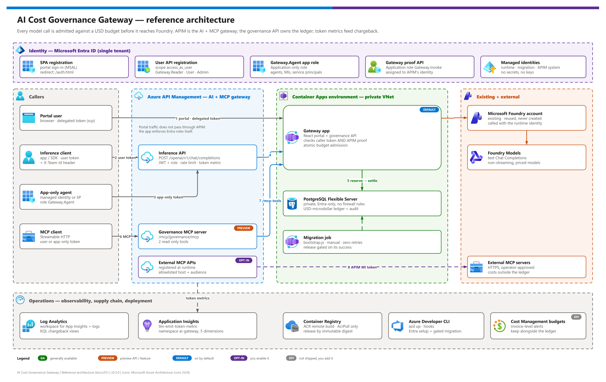
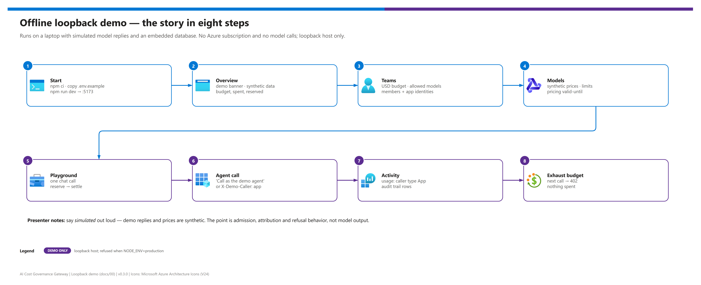

[README](../README.md) › docs index › 00 Reproduce this demo

# 00 - Reproduce this demo

<p>
  
  
  
  
  
  
  
  
</p>

<p>
  
  
  
  
  
</p>

The single-page orchestrator: stand the AI Cost Governance Gateway up from scratch, in order, with a checkpoint after each part. Parts A-B run entirely on a laptop with no Azure subscription (simulated model replies). Parts C-F take it to Azure with `azd up`, verify it, enable agents and chargeback, and tear it down safely. It is also the index for the rest of the docs.

## At a glance

| | Part | Outcome | Needs Azure? |
|---|---|---|---|
|  | **A** - Install and verify | Dependencies installed; typecheck and tests green | No |
|  | **B** - Offline loopback demo | The full story: budgets, admission, agent attribution, refusal | No |
|  | **C** - Prepare the Azure target | Tenant, subscription, Foundry, Entra rights, cost approved | Planning only |
|  | **D** - Deploy with azd | Resources provisioned, migration gate passed, app released | Yes |
|  | **E** - Live acceptance | Sign-in, APIM proof, inference, MCP and metrics verified | Yes |
|  | **F** - Agents, chargeback, teardown | App-only callers enabled; chargeback views; guarded cleanup | Yes |

> [!NOTE]
> **Status: locally validated, not yet live-deployed.** Parts A-B are fully exercised by the test suites. Parts D-F are the documented procedure; they have not yet been executed against a real subscription, so treat every Azure step as a reviewed starting point.

## Time budget

Planning estimates - not measured, because the template has not been live-deployed.

| | Part | First time | Subsequent |
|---|---|---|---|
|  | A - Install and verify | 10-20 min | 5 min |
|  | B - Offline demo | 15 min | 10 min |
|  | C - Prepare the target | hours to days (approvals, Entra rights) | minutes |
|  | D - `azd up` | about an hour, dominated by APIM provisioning | 10-20 min (`azd deploy gateway`) |
|  | E - Live acceptance | 30-60 min | 15 min |
|  | F - Agents, chargeback, teardown | 30 min | 10 min |

## End state

[](./assets/ai-cost-governance-gateway-architecture.png)

<sub>Editable source: [`assets/ai-cost-governance-gateway-architecture.drawio`](./assets/ai-cost-governance-gateway-architecture.drawio) - regenerate with `python scripts/export_diagrams.py docs/assets`.</sub>

```text
Browser portal -- Entra token --> Management API -- managed identity --> ARM
                                        |
                                        +--> team/model config + audit

Inference client -- Entra token + team --> APIM --> App Insights
 (user, or app-only agent /                |          (LLM token metrics)
  managed identity with Gateway.Agent)     |
                          caller token + APIM identity proof
                                           |
                                           v
                                  Governed inference API
                                           |
                        PostgreSQL atomic budget reservation
                                           |
                                  Foundry model inference
                                           |
                              verified usage -> settlement

MCP client --> APIM MCP --> read-only catalog/budget operations
                       \-> approved external MCP servers
```

The portal is a control plane, not a place to paste subscription keys. The inference route cannot skip the budget ledger. The API independently validates the caller and APIM's identity proof. An `X-Team-Id` header selects a team; it never grants membership.

## Part A - Install and verify

Requires **Node.js 24 LTS** and npm 10 or newer ([02 - Prerequisites](./02-prerequisites.md#local-tools)).

```powershell
npm ci
npm run typecheck
npm test
npm run build
```

- [ ] `npm ci` completes from the public npm registry (or your configured mirror)
- [ ] Typecheck passes; API, portal and azd-hook suites pass ([04 - Testing](./04-testing.md))

## Part B - Offline loopback demo

[](./assets/loopback-demo-story.png)

<sub>Editable source: [`assets/loopback-demo-story.drawio`](./assets/loopback-demo-story.drawio) - regenerate with `python scripts/export_diagrams.py docs/assets`.</sub>

```powershell
Copy-Item .env.example .env
npm run dev
```

Open `http://localhost:5173`. The API listens on `127.0.0.1:3001`. Demo data is local and deliberately synthetic. Keep demo mode bound to loopback; it is not an authentication mechanism for shared environments.

| Step | | Do | Expected result |
|---|---|---|---|
| **1** |  | Open **Overview** | Demo banner; budget, spent and reserved totals |
| **2** |  | Open **Teams**; inspect a team | USD budget, allowed models, member and application identity lists |
| **3** |  | Open **Models** | Synthetic prices, context and output limits, pricing valid-until |
| **4** |  | **Playground**: send one prompt | Simulated reply; a settled row with charged microdollars |
| **5** |  | Tick **Call as the demo agent identity** and send again | Charged to `demo-engineering`; **Activity** shows an `App` caller |
| **6** |  | Open **Activity** | Usage rows with caller type; audit rows for each action |
| **7** |  | Create a team with a tiny budget (for example `0.0001` USD) and call it | `402 BUDGET_EXCEEDED` before any model call; nothing spent |

To demonstrate the agent path from a terminal instead of the playground, send `X-Demo-Caller: app` to the inference route:

```powershell
$body = @{ model = 'demo-chat'; max_completion_tokens = 32; messages = @(@{ role = 'user'; content = 'Hello from an agent' }) } | ConvertTo-Json -Depth 4
Invoke-RestMethod http://127.0.0.1:3001/openai/v1/chat/completions -Method Post -ContentType application/json `
  -Headers @{ 'X-Team-Id' = 'demo-engineering'; 'X-Demo-Caller' = 'app' } -Body $body
```

The call is charged to `demo-engineering` (which registers the fake agent) and appears under **Activity** as an `App` caller.

> [!TIP]
> **Presenter notes.** Say *simulated* out loud - demo replies and prices are synthetic. The point of the demo is admission, attribution and refusal, not model output. For a production-like local run, use `npm run build` then `npm start` (served by the API at `http://127.0.0.1:3001`), or the scripted `npm run test:smoke` flow in [04](./04-testing.md#full-local-http-flow-loopback-smoke). `compose.yaml` offers optional local PostgreSQL; production requires PostgreSQL, and the embedded database is not a multi-replica production database.

- [ ] Admission, settlement, agent attribution and refusal all observed

## Part C - Prepare the Azure target

Work through [02 - Prerequisites](./02-prerequisites.md) and its pre-flight checklist: tools, the existing Foundry account, Azure RBAC, Entra rights (or an administrator handoff), network reachability, region and cost approval.

- [ ] Tenant and subscription IDs known; region verified; cost approved
- [ ] Existing Foundry account and on-demand chat deployments identified, with verified prices and limits
- [ ] Entra mode chosen: `auto` (you may manage registrations) or `existing` (administrator-supplied)

> [!WARNING]
> Sign in to the **intended** tenant explicitly with both CLIs. `azd` and `az` keep separate logins, and a bare `azd up` can target the wrong tenant or subscription.

## Part D - Deploy with azd

Follow [03 - Deployment](./03-deployment.md):

```powershell
azd auth login --tenant-id <TENANT_ID>
azd env new gateway-dev
azd env set AZURE_TENANT_ID <TENANT_ID>
azd env set AZURE_SUBSCRIPTION_ID <SUBSCRIPTION_ID>
azd env get-values   # confirm the tenant and subscription
azd up
```

- [ ] `preup` and `preprovision` pass; resources provisioned
- [ ] Migration gate passed on the exact image digest; revision released; `postdeploy` verified

No azd? Use the bring-your-own-resource path in [03b - Manual deployment](./03b-manual-deployment.md).

## Part E - Live acceptance

Run the acceptance table in [03 - Phase 4](./03-deployment.md#phase-4---live-acceptance-checks): sign-in, direct calls refused, governed inference settles, budget refusal, MCP tools, token metrics. Record results in [04 - Live validation](./04-testing.md#live-validation).

> [!IMPORTANT]
> `postdeploy` proves the app is running, not that Entra consent, the APIM proof, model pricing or MCP forwarding work. Do not point real consumers at the gateway on the strength of a healthy `/readyz` alone.

- [ ] Every gate passed - only then direct real consumers at the gateway

## Part F - Agents, chargeback and teardown

| | Task | Where |
|---|---|---|
|  | Enable each agent or managed identity | [07 - Enable an app-only caller](./07-identity-and-security.md#enable-an-app-only-caller) |
|  | Build chargeback views and alerts | [08 - Querying chargeback data](./08-observability-and-token-metrics.md#querying-chargeback-data) |
|  | Approve external MCP servers if needed | [09 - MCP governance](./09-mcp-governance.md) |
|  | Teardown: back up and reconcile the ledger, then `azd env set AZD_ALLOW_DATA_DELETION true` and `azd down`; Entra registrations are retained | [03 - Recovery](./03-deployment.md#recovery-state-and-deletion) |

- [ ] Agents attributed as `App` in Activity; chargeback split by team visible; cleanup owner named

## Docs index

| | Doc | Read it for |
|---|---|---|
|  | [01 - Architecture](./01-architecture.md) | Tiers, request paths, trust boundaries, design decisions, provenance |
|  | [02 - Prerequisites](./02-prerequisites.md) | Tools, RBAC, Entra, regions, cost, pre-flight checklist |
|  | [03 - Deployment](./03-deployment.md) | `azd up` runbook, acceptance checks, updates, teardown |
|  | [03b - Manual deployment](./03b-manual-deployment.md) | Bring-your-own-resource Bicep path |
|  | [04 - Testing](./04-testing.md) | Test layers, smoke flow, PostgreSQL concurrency, docs checks |
|  | [05 - Troubleshooting](./05-troubleshooting.md) | Error codes → fixes |
|  | [06 - Budgets and ledger](./06-budgets-and-ledger.md) | The admission guarantee and failure semantics |
|  | [07 - Identity and security](./07-identity-and-security.md) | Users vs. agents, APIM proof, `Gateway.Agent`, bypass controls |
|  | [08 - Observability and token metrics](./08-observability-and-token-metrics.md) | Chargeback telemetry and its limits |
|  | [09 - MCP governance](./09-mcp-governance.md) | Built-in tools, external server registration |
|  | [10 - API reference](./10-api-reference.md) | Routes, shapes, roles, error codes |
|  | [11 - azd integration contract](./11-azd-integration-contract.md) | Templates, release gate, outputs, database identity model |
|  | [12 - Configuration reference](./12-configuration-reference.md) | Every variable, parameter, output and recipe |

---

Next: [01 - Architecture](./01-architecture.md) →

*Last updated: 2026-10-08*
