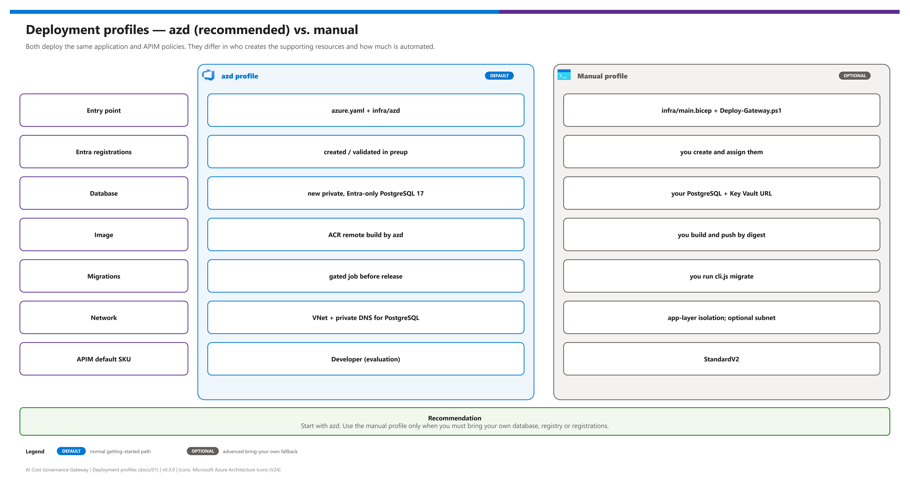

[README](../README.md) › [docs index](./00-reproduce-this-demo.md) › 01 Architecture

# 01 - Architecture

  
  
  
  
  
  
  

  
  
  
  
  

How the AI Cost Governance Gateway is put together and why. **Azure API Management** is the single AI and MCP gateway; a small **governance API** (with a React portal) owns a durable USD-microdollar **ledger** in PostgreSQL and admits each model call only when its conservative maximum charge fits the team's remaining budget; **Application Insights** receives per-team token metrics for chargeback; existing **Microsoft Foundry** deployments are reused. This page is for architects reviewing the design and for teams adapting it; it can be shared on its own.

## At a glance

| | Tier | Anchor product | Role |
|---|---|---|---|
|  | Identity | Microsoft Entra ID | Three registrations, five gateway roles, managed identities - no secrets |
|  | Gateway | API Management | Token validation, rate limits, token metrics, MCP servers, APIM identity proof |
|  | Application | Container Apps | Portal + governance API; atomic budget admission; Foundry deployment management |
|  | Data | Azure Database for PostgreSQL | Ledger, teams, models, audit - private and Entra-only in the azd profile |
|  | Models + tools | Microsoft Foundry | Existing account and on-demand chat deployments; optional external MCP servers |
|  | Operations | Application Insights + Log Analytics | Token metrics for chargeback; ACR + azd for supply chain and release |

> [!IMPORTANT]
> The design enforces **admission against an administrator-configured price ledger** for traffic routed through the gateway. It is not a cap on the Azure invoice, and it does not govern direct Foundry calls that bypass the gateway. See [06 - Budgets and ledger](./06-budgets-and-ledger.md#boundaries).

## Reference architecture

Editable source: [`assets/ai-cost-governance-gateway-architecture.drawio`](./assets/ai-cost-governance-gateway-architecture.drawio) - regenerate with `python scripts/export_diagrams.py docs/assets`.

| Tier | Component | Product | Role |
|---|---|---|---|
| Identity |  SPA registration | Microsoft Entra ID | Portal sign-in (MSAL), redirect `/auth.html` |
| Identity |  User API registration | Microsoft Entra ID | Scope `access_as_user`; roles Reader/User/Admin (users) and Agent (applications) |
| Identity |  Gateway proof API | Microsoft Entra ID | Role `Gateway.Invoke`, assigned only to APIM's identity |
| Identity |  Managed identities | Managed identity | Runtime, migration (azd) and APIM system identities |
| Gateway |  Inference API | API Management | `POST /openai/v1/chat/completions`; JWT + role, 60/min per `oid`, 64 KiB body, token metric, optional token limit |
| Gateway |  Governance MCP server | API Management | `/mcp/governance/mcp`, tools `list_models` and `read_budget` |
| Gateway |  External MCP APIs | API Management | Runtime-registered, allowlisted, APIM managed-identity token per server |
| Application |  Gateway app | Container Apps | React portal + Fastify governance API on port 3001 |
| Application |  Migration job (azd) | Container Apps | `bootstrap.js`; release gated on its success |
| Data |  Ledger database | Azure Database for PostgreSQL | v17, private, Entra-only (azd); your server (manual) |
| Data |  VNet + private DNS (azd) | Virtual Network / Azure DNS | `10.42.0.0/16`, ACA and PostgreSQL delegated subnets |
| Models |  Foundry account | Microsoft Foundry | Existing; reused, never created |
| Models |  Model deployments | Foundry Models | On-demand text Chat Completions |
| Operations |  Application Insights | Azure Monitor | `ai-gateway` token metrics, workspace-based, Entra-only ingestion |
| Operations |  Log Analytics | Azure Monitor | Workspace for metrics and logs |
| Operations |  Container Registry | Container Registry | Remote build; `AcrPull` only; deploy by digest |

## Request paths

| Step | | Path | What is enforced |
|---|---|---|---|
| **1** |  | Portal user → gateway app (control plane) | Delegated token; Reader/Admin roles; portal traffic does not pass through APIM |
| **2** |  | Inference client → APIM inference API | Entra token with User/Admin role, `oid` present, route/content checks, rate limit |
| **3** |  | App-only agent → APIM inference API | Same policy; `Gateway.Agent` role; no `scp` |
| **4** |  | APIM → gateway app | Caller token preserved + APIM proof (`X-Gateway-Authorization`, `Gateway.Invoke`) |
| **5** |  | Gateway app → ledger | Row-locked reserve of the conservative maximum; settle at the price snapshot |
| **6** |  | MCP client → governance MCP server | Same token rules; Reader allowed; 120/min per `oid` |
| **7** |  | APIM → `/mcp-tools/*` | APIM proof; results filtered by principal |
| **8** |  | APIM → external MCP server | APIM managed-identity token for the allowlisted audience only |

The gateway app calls Foundry with its runtime managed identity (no keys), after step 5 succeeds. Detailed flows: [06 - Budgets and ledger](./06-budgets-and-ledger.md), [07 - Identity and security](./07-identity-and-security.md), [08 - Observability and token metrics](./08-observability-and-token-metrics.md), [09 - MCP governance](./09-mcp-governance.md).

## Trust boundaries

| Boundary | Inside | Enforced by | Never trusted |
|---|---|---|---|
| Tenant | Users, agents, registrations | Entra ID token validation (issuer, audience, expiry, tenant, roles) | Tokens from other tenants; `api://` URIs as audiences |
| Gateway | APIM policies | `validate-azure-ad-token`, rate limits, content limits | Caller-supplied `X-Gateway-Authorization` (deleted) |
| Application | Governance API | Independent token + APIM proof validation; team membership by `oid` | `X-Team-Id` as membership; caller-supplied cost, price, role or usage |
| Ledger | PostgreSQL | Transactions + row locks; integer microdollars | Analytics or metrics as a spend source |
| Model | Foundry | Runtime identity with account-scoped roles | Direct inference traffic (must be removed separately) |
| Tools | External MCP servers | Allowlists; per-server APIM identity audience | The caller's token (never forwarded) |

> [!WARNING]
> Public ingress remains reachable for the portal, APIM and (manual profile) the database path you choose. Authentication protects them, but private ingress, edge protection and abuse limits are production decisions you still own.

## Deployment profiles

Editable source: [`assets/deployment-profiles.drawio`](./assets/deployment-profiles.drawio) - regenerate with `python scripts/export_diagrams.py docs/assets`.

| Aspect | azd profile  | Manual profile  |
|---|---|---|
| Entry point | `azure.yaml` + `infra/azd` | `infra/main.bicep` + `scripts/Deploy-Gateway.ps1` |
| Entra registrations | Created or validated in `preup` | You create and assign them |
| Database | New private, Entra-only PostgreSQL 17 | Your PostgreSQL + Key Vault URL reference |
| Image | ACR remote build by azd | You build and push by digest |
| Migrations | Gated job before release | You run `cli.js migrate` |
| Network | VNet + private DNS for PostgreSQL | Application-layer isolation; optional subnet |
| APIM default SKU | Developer (evaluation) | StandardV2 |
| **Recommendation** | **Start here** | Only when you must bring your own database, registry or registrations |

## Design decisions

| Decision | Rationale | Tradeoff |
|---|---|---|
| Reserve a **conservative maximum** before the model call | Output usage is unknown until the provider answers; reserving the worst case makes concurrent admission safe | Some requests that would have fit are rejected |
| **No automatic retry or release** of uncertain reservations | An HTTP error does not prove no billable work happened | Held money until an evidence-based reconciliation |
| **Integer microdollars**, prices per million tokens | Avoids floating-point undercharging | Prices are operator-maintained, not a live billing feed |
| **APIM in front of the app**, not of Foundry | The ledger must see every governed call before Foundry does | APIM forwards to the app, which calls Foundry |
| **Separate proof API** (`Gateway.Invoke`) | The app can prove a request came through APIM without trusting a header | One more registration and an Entra role assignment |
| **App-only callers via an Application-only role** | Agents spend a team's budget with full attribution; `appRoleAssignmentRequired` blocks unassigned apps | Per-agent assignment and team registration |
| **Token metrics as observability only** | Metrics are aggregated and can drop data under cardinality limits | Two sources (ledger + metrics) to reconcile |
| **Server-level MCP policy**, read-only built-in tools | Matches APIM's MCP policy scope; no privileged tools exposed | Separate servers per trust level |
| **Gated migration job** on the exact digest (azd) | Schema and code can never drift apart in a release | Slower releases; failures block |
| **Non-streaming, text-only** surface | A defensible maximum charge exists only for this shape | Streaming, tools and multimodal are rejected |

## Adapting this pattern

The pattern is domain-neutral: teams, models and tools are data, not code. To retarget it:

| Change | Where | Code change? |
|---|---|---|
| Teams, budgets, members, agent identities | Portal **Teams** (or `POST/PUT /api/teams`) | No |
| Governed models, prices, limits, validity | Portal **Models** (or `/api/models`) | No |
| External MCP servers | `MCP_ALLOWED_HOSTS` / `MCP_ALLOWED_AUDIENCES` + portal **MCP** | No |
| SKUs, replicas, retention, token throttle | azd environment ([12](./12-configuration-reference.md)) | No |
| Additional token-metric dimension | `infra/policies/inference.xml` (5 is the per-policy maximum - replace one) | Policy edit |
| New billable surface (streaming, tools, images) | Ledger pricing bound + request schema | Yes - and only with a defensible maximum |

Keep fixed: the reserve-before-call invariant, the APIM proof, the separation of user `principals` and agent `applications`, and metadata-only logging.

## Design sources and provenance

Research date: September 18, 2026. This project is original code; no upstream source files were copied. Dependencies retain their own licenses.

| Source | What informed this project | Deliberate simplification |
| --- | --- | --- |
|  [Azure-Samples/ai-gateway-dev-portal](https://github.com/Azure-Samples/ai-gateway-dev-portal) | Model/MCP catalog and developer-management workflows; source license reviewed as MIT. | A single focused portal with a server-side authority rather than broad browser ARM access, pasted tokens, and many separate analytics pages. |
|  [Azure-Samples/AI-Gateway](https://github.com/Azure-Samples/AI-Gateway) | APIM as the shared model/tool gateway, Entra authentication, managed identity, and native MCP patterns. | A narrow supported inference surface with a durable pre-inference budget check instead of assembling many independent labs. |
|  `github.com/Mehdi-Bl/foundry-budgets` | Listed as a related community project during research. | Returned HTTP 404 through public and authenticated GitHub access during research. Its code and license could not be reviewed; no assumptions or code reuse depend on it. |

A supplemental governance repository found during research was not used as a source of implementation code. Periodically synchronizing spend from analytics or downgrading to a cheaper model does not meet this project's pre-admission budget requirement.

<b>Show primary Microsoft documentation</b>

- [APIM MCP resource management](https://learn.microsoft.com/azure/api-management/manage-mcp-servers-rest-api)
- [APIM MCP capabilities and limitations](https://learn.microsoft.com/azure/api-management/mcp-server-overview)
- [Securing MCP servers](https://learn.microsoft.com/azure/api-management/secure-mcp-servers)
- [APIM LLM token limits](https://learn.microsoft.com/azure/api-management/llm-token-limit-policy)
- [APIM token metrics (`llm-emit-token-metric`; `azure-openai-emit-token-metric` now redirects to it), dimensions and custom-metric limits](https://learn.microsoft.com/azure/api-management/llm-emit-token-metric-policy)
- [APIM Application Insights integration, managed-identity loggers and `"metrics": true`](https://learn.microsoft.com/azure/api-management/api-management-howto-app-insights)
- [Application Insights Microsoft Entra authentication](https://learn.microsoft.com/azure/azure-monitor/app/azure-ad-authentication)
- [Azure Monitor custom metric limits](https://learn.microsoft.com/azure/azure-monitor/essentials/metrics-custom-overview)
- [App-only access tokens and application permissions (app roles)](https://learn.microsoft.com/entra/identity-platform/access-tokens)
- [Cost Management budgets](https://learn.microsoft.com/azure/cost-management-billing/costs/tutorial-acm-create-budgets)
- [Local embedded PostgreSQL (PGlite)](https://pglite.dev/docs/)

> [!NOTE]
> MCP management uses a preview API version. Revalidate regional/SKU support and the exact API resource schema before deploying; local Bicep compilation is not an Azure deployment acceptance test.

---

Next: [02 - Prerequisites](./02-prerequisites.md) →

*Last updated: 2026-10-08*
