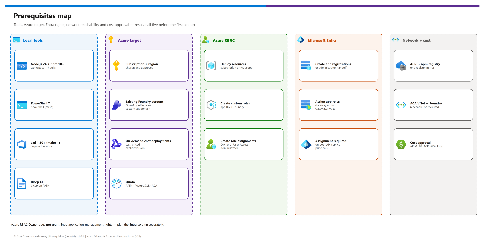

[README](../README.md) › [docs index](./00-reproduce-this-demo.md) › 02 Prerequisites

# 02 - Prerequisites

<p>
  
  
  
  
  
  
</p>

<p>
  
  
  
  
</p>

Everything to resolve **before** the first `azd up`: local tools, the Azure target (including the existing Foundry account this pattern reuses), Azure RBAC, Microsoft Entra rights, network reachability, regions, and cost approval. The offline loopback demo needs only Node.js 24 and npm. This page ends with a pre-flight checklist you can hand to the subscription owner.

## At a glance

| | Area | You need |
|---|---|---|
|  | **Local tools** | Node.js 24 LTS + npm 10+, PowerShell 7, azd 1.30+ (major 1), Bicep CLI on `PATH` |
|  | **Existing Foundry** | An OpenAI or AIServices account with a custom subdomain, in the target subscription |
|  | **Azure RBAC** | Deploy resources + create custom roles and role assignments in the app and Foundry resource groups |
|  | **Entra** | Rights to create three app registrations and assign app roles - or an administrator handoff |
|  | **Network** | ACR build workers → npm registry; local tools → Azure/Graph; new ACA VNet → Foundry |
|  | **Cost** | Approval for APIM, PostgreSQL, ACR, Container Apps, private DNS and logging in the chosen region |

> [!IMPORTANT]
> Azure RBAC **Owner** does not grant Entra application-management rights. Plan the Entra column separately - most stalled first deployments stop at Graph permissions, not at ARM.

## Prerequisites map

[](./assets/prerequisites-map.png)

<sub>Editable source: [`assets/prerequisites-map.drawio`](./assets/prerequisites-map.drawio) - regenerate with `python scripts/export_diagrams.py docs/assets`.</sub>

## Local tools

| Tool | Version | Why | Check |
|---|---|---|---|
|  Node.js + npm | Node 24 LTS (`>=24 <25`), npm 10+ | Workspace, hooks (`NODE_VERSION` otherwise) | `node --version` |
|  PowerShell | 7.2+ | Hook shell (`pwsh`), infrastructure scripts | `pwsh --version` |
|  Azure Developer CLI | 1.30 or newer within major version 1 (`AZD_VERSION` otherwise) | `azd up`, hooks | `azd version` |
|  Bicep CLI | recent; 0.44.1 and 0.48.1 were used to validate | Hooks compile `migration-job.bicep`; offline tests | `bicep --version` |
|  Azure CLI | optional | Only for the optional `az` operator commands and the manual profile | `az version` |

No local Docker daemon, local PostgreSQL or database password is required by the default deployment path. Native azd remote builds use ACR. azd may offer a local Docker fallback after a remote build failure; resolve the remote network/registry/permissions issue first.

`package-lock.json` resolves from the public npm registry. If you must use a package mirror, configure it for your user (`npm config set registry <mirror-url>`); npm rewrites the lockfile's registry host automatically, and integrity hashes are still checked. Container builds accept `--build-arg NPM_CONFIG_REGISTRY=<mirror-url>`.

## Azure target

| Resource | Requirement | Why |
|---|---|---|
|  Subscription | Real, enabled, explicitly selected (`SUBSCRIPTION_UNAVAILABLE` otherwise) | A tenant-level login is not a deployment target |
|  Foundry account | Existing public-Azure OpenAI or AIServices account **with a custom subdomain**, same subscription; may be in a different resource group (`FOUNDRY_UNSUPPORTED` otherwise) | Reused for inference; this workflow does not create Foundry or model deployments |
|  Model deployments | On-demand (token-priced) text-chat deployments with an explicit version | Provisioned throughput and fixed hosting charges cannot use the token-price ledger (`UNSUPPORTED_DEPLOYMENT`) |
|  Quota | APIM, PostgreSQL Flexible Server SKU, Container Apps in the chosen region | Not established without a real target |

> [!WARNING]
> Model prices, context windows and maximum outputs are **operator-maintained**. Verify them against the current rate card and your actual deployment before enabling a model; understated limits invalidate the maximum-charge guarantee. Check the [model retirement schedule](https://learn.microsoft.com/azure/foundry/openai/concepts/model-retirement-schedule) so a governed model is not about to retire.

## Azure RBAC

The deploying identity needs rights to provision the supporting Azure resources and to create the narrow custom roles and role assignments in **both** the new resource group and the existing Foundry resource group.

| Scope | Needed for | Typical role |
|---|---|---|
| Subscription (azd creates `rg-<env>`) or target resource group | Resource deployment | Contributor |
| New resource group | Custom APIM role + assignments (ACR, APIM, App Insights, identities) | Owner or User Access Administrator |
| Existing Foundry resource group / account | Custom Foundry deployment role + `Cognitive Services OpenAI User` assignment | Owner or User Access Administrator |

No subscription-wide Contributor/Owner role is granted to a workload identity. Every role the workloads receive is listed in [07 - Identity and security](./07-identity-and-security.md#managed-identities-and-azure-rbac).

## Microsoft Entra

| Need | auto mode (default) | existing mode |
|---|---|---|
| Create SPA, user API and proof API registrations | Deploying user | An administrator, beforehand |
| Assign bootstrap `Gateway.Admin` | Deploying user (or `GATEWAY_ADMIN_OBJECT_ID`) | An administrator |
| Require assignment on both API service principals | Setup | An administrator |
| Assign `Gateway.Invoke` to APIM's identity | Service `predeploy` | An administrator, after provisioning |
| Register the SPA redirect URI | Service `predeploy` | An administrator, after provisioning |
| **Recommendation** | Use when the deployer may manage app registrations | Use when tenant policy restricts app registration |

Entra permission to create/manage the three application registrations and their service-principal role assignments is required, or an administrator who supplies preconfigured registrations. Setup never creates client secrets, persists access tokens, or grants broad Graph permissions to runtime identities.

## Network reachability

| From | To | Why |
|---|---|---|
| Local tools | Azure Resource Manager, Microsoft Graph | azd and hook calls |
| ACR build workers | `https://registry.npmjs.org/` (or your mirror) | `npm ci` during the remote image build |
| New ACA VNet (`10.42.0.0/16`) | Existing Foundry endpoint | Inference and deployment management; restricted accounts need a reviewed design (`FOUNDRY_NETWORK_REVIEWED`) |
| Browsers | Container Apps HTTPS ingress | Portal |
| Clients and agents | APIM gateway | Data plane and MCP |

Review address overlap before connecting the isolated `10.42.0.0/16` development VNet to other networks.

## Regions

All components must be available in one region; the existing Foundry account may be elsewhere, but the same region keeps latency and egress low.

| Tier | Guidance |
|---|---|
| **Tier 1 - recommended** | The region of your existing Foundry account, when it offers APIM Developer/v2 SKUs, PostgreSQL Flexible Server `Standard_B1ms` (or your chosen SKU) and Container Apps workload-profile environments |
| **Tier 2 - acceptable** | A nearby region with all of the above when the Foundry region lacks one of them; accept cross-region inference latency and data-transfer cost |
| **Tier 3 - workaround** | Change SKUs (for example APIM `BasicV2`/`StandardV2`, another PostgreSQL SKU) to fit an available region; re-verify the MCP API support for the chosen APIM tier |

| Component | Product | Availability as of 2026-10-08 |
|---|---|---|
|  APIM Developer / v2 tiers | API Management |  regional - verify the SKU in your region |
|  MCP server APIs | API Management |  API version `2025-09-01-preview`; not on Consumption or workspaces |
|  PostgreSQL Flexible Server 17 | Azure Database for PostgreSQL |  SKU availability varies by region |
|  Workload-profile environment | Container Apps |  regional |
|  Workspace-based App Insights | Azure Monitor |  regional |

> [!NOTE]
> Regional availability moves. Verify at deployment time, in the target subscription:

<details><summary><b>Show verification commands</b></summary>

```powershell
az account show --query "{tenant:tenantId, subscription:id}" -o table
az provider show -n Microsoft.ApiManagement --query "resourceTypes[?resourceType=='service'].locations" -o tsv
az postgres flexible-server list-skus --location <region> -o table
az containerapp env workload-profile list-supported --location <region> -o table
az provider show -n Microsoft.Insights --query "resourceTypes[?resourceType=='components'].locations" -o tsv
```

</details>

## Cost

**Costs are not estimated or approved by this repository.** Select the real subscription and region, obtain prices, and review the deployment before provisioning. Creating the foundation alone starts charges for standing resources.

| Resource | Product | Billed for | Default sizing |
|---|---|---|---|
|  APIM | API Management | Units per hour | Developer, 1 unit |
|  Database | Azure Database for PostgreSQL | Compute, storage, backups | Burstable `Standard_B1ms`, 32 GiB, 7-day backups |
|  Registry | Container Registry | Storage, build tasks | Basic |
|  App + job | Container Apps | Replicas, job executions | 0.5 vCPU / 1 GiB, min 1 replica |
|  Private DNS | Azure DNS | Zones and queries | One PostgreSQL zone |
|  Logs | Log Analytics + Application Insights | Ingestion and retention | 30 days |
|  Network | Container Apps managed resources | Data transfer, managed public IP/load balancer in an extra managed resource group | - |
|  Models | Foundry Models | Tokens (governed by the ledger) | Your deployments |

> [!TIP]
> Create an [Azure Cost Management budget](https://learn.microsoft.com/azure/cost-management-billing/costs/tutorial-acm-create-budgets) on the new resource group before `azd up`. The gateway ledger governs model spend only.

## Pre-flight checklist

> [!TIP]
> Hand this list to the subscription owner before scheduling a deployment; every unchecked item has stopped a first `azd up` somewhere.

- [ ] Node.js 24, npm 10+, PowerShell 7, azd 1.30+ (major 1) and Bicep CLI installed
- [ ] `npm ci`, `npm run typecheck` and `npm test` pass locally ([04](./04-testing.md))
- [ ] Target tenant and subscription identified by ID; `azd auth login --tenant-id` done
- [ ] Region chosen and SKU availability verified with the commands above
- [ ] Existing Foundry account (OpenAI/AIServices, custom subdomain) in the same subscription; network reachability reviewed
- [ ] On-demand chat deployments, current prices, context windows and maximum outputs written down
- [ ] Deployer can create custom roles and role assignments in the new and the Foundry resource groups
- [ ] Entra rights confirmed, or administrator-supplied registrations ready for `ENTRA_SETUP_MODE=existing`
- [ ] ACR build workers can reach the npm registry (or a mirror is configured)
- [ ] Cost approved and a Cost Management budget created
- [ ] Ledger backup and teardown owner named (`azd down` is guarded)

---

Next: [03 - Deployment](./03-deployment.md) →

*Last updated: 2026-10-08*
