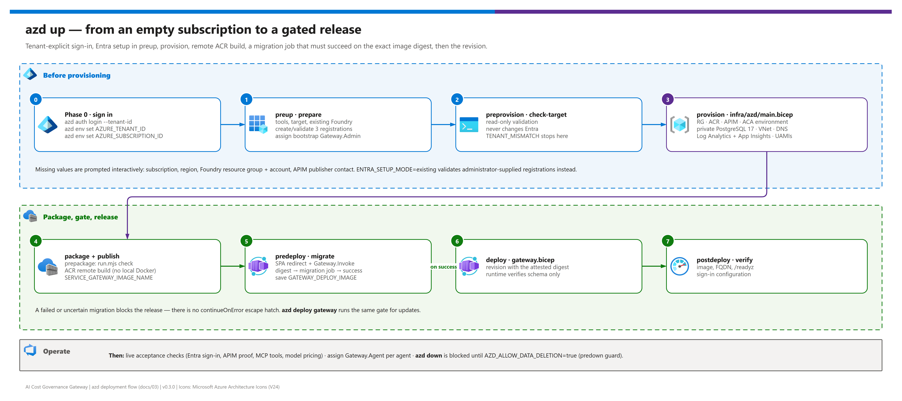

[README](../README.md) › [docs index](./00-reproduce-this-demo.md) › 03 Deployment

# 03 - Deployment (azd)

<p>
  
  
  
  
  
  
</p>

<p>
  
  
  
  
</p>

The primary deployment runbook. `azure.yaml` is the entry point; `azd up` provisions the supporting services, configures Entra access when permitted, builds the image remotely in ACR, runs a gated database migration job, and then releases the app. Foundry is reused, never created. For a bring-your-own-resource build without azd, see [03b - Manual deployment](./03b-manual-deployment.md).

## At a glance

| | | |
|---|---|---|
|  | **Tool** | `azd up` (azd 1.30+ within major version 1) with `preup`, `preprovision`, service `prepackage`/`predeploy`/`postdeploy` and `predown` hooks |
|  | **Entra** | Three registrations created or validated in `preup` (`ENTRA_SETUP_MODE=auto`), or supplied by an administrator (`existing`) |
|  | **Creates** | Resource group, ACR, APIM, Container Apps environment, private PostgreSQL 17, VNet + private DNS, Log Analytics, Application Insights, two managed identities, scoped roles |
|  | **Release gate** | Migration job on the exact image digest must succeed before the revision is applied |
|  | **Defaults** | Evaluation sizing: APIM Developer, PostgreSQL Burstable `Standard_B1ms` / 32 GiB, small Container Apps footprint |
|  | **No local Docker** | Remote ACR build; no local PostgreSQL or database password |

> [!WARNING]
> **This repository has been validated locally, not deployed to Azure.** Choose and approve a real subscription, region, service sizes and cost before provisioning. A tenant-level CLI sign-in alone is not a subscription selection. Treat the templates as a reviewed starting point.

> [!WARNING]
> **Phase 0 is not optional.** Operators often hold accounts in several tenants. `azd` and `az` keep **separate** sign-ins, and the ambient account drifts. Always name the tenant and subscription explicitly and verify them before any command that acquires a token or changes resources. A bare `azd up` can target the wrong tenant.

## Fast path - azd up

[](./assets/azd-deployment-flow.png)

<sub>Editable source: [`assets/azd-deployment-flow.drawio`](./assets/azd-deployment-flow.drawio) - regenerate with `python scripts/export_diagrams.py docs/assets`.</sub>

| Step | | Action | Gate |
|---|---|---|---|
| **0** |  | Sign in to the intended tenant (azd, and az for optional commands) | ☐ `azd env get-values` and `az account show` show the target |
| **1** |  | Create the environment and set required values | ☐ Tenant, subscription, region, Foundry, publisher set |
| **2** |  | `azd up` | ☐ Every hook passes; release gate succeeds |
| **3** |  | Live acceptance checks | ☐ Sign-in, APIM proof, inference, MCP, metrics verified |
| **4** |  | Enable agents and chargeback views | ☐ `Gateway.Agent` assigned per agent; metrics split by team |

### Phase 0 - Authenticate to the right tenant

 Resolve the intended tenant and subscription first (ask the subscription owner if unknown - never guess), then:

```powershell
# Required for the azd profile (the hooks use only the azd sign-in)
azd auth login --tenant-id <TENANT_ID>

# Optional: only for the az-based operator commands in this guide
az login --tenant <TENANT_ID>
az account set --subscription <SUBSCRIPTION_ID>
az account show --query "{tenant:tenantId, subscription:id, name:name}" -o table
```

Use `--use-device-code` on either login when no browser is available. If `az account show` reports a different tenant or subscription, sign in again before continuing.

### Phase 1 - Create the environment

 After the target and cost have been approved:

```powershell
azd env new gateway-dev
azd env set AZURE_TENANT_ID <TENANT_ID>
azd env set AZURE_SUBSCRIPTION_ID <SUBSCRIPTION_ID>
azd env get-values   # confirm tenant and subscription before provisioning
```

When values are missing, interactive setup asks for subscription ID, location, existing Foundry resource group/account, and APIM publisher name/email. Noninteractive execution requires them in advance:

```powershell
azd env set AZURE_LOCATION <region>
azd env set FOUNDRY_RESOURCE_GROUP <existing-foundry-rg>
azd env set FOUNDRY_ACCOUNT_NAME <existing-foundry-account>
azd env set APIM_PUBLISHER_NAME "<operator or team name>"
azd env set APIM_PUBLISHER_EMAIL <operator-email>
```

Optional sizing, allowlist and throttle settings are listed in [12 - Configuration reference](./12-configuration-reference.md#platform-sizing-and-policy).

The Foundry endpoint and tenant are derived from the selected Azure resources, not guessed from the current CLI tenant. An explicitly supplied inconsistent endpoint or tenant is rejected. Setup verifies that the selected subscription belongs to `AZURE_TENANT_ID` and stops on a mismatch. Setup refuses to adopt an unrelated existing `rg-<environment>` resource group.

> [!IMPORTANT]
> If Foundry disables public access or uses a default-deny network ACL, setup stops (`FOUNDRY_NETWORK_RESTRICTED`). Review/customize routing, DNS or approved egress from the new isolated ACA VNet before setting `FOUNDRY_NETWORK_REVIEWED=true`. This acknowledgement is not a network configuration change: the profile never opens the existing account's firewall or silently claims private Foundry connectivity.

### Phase 2 - Run azd up

 `azd up` runs these hooks in order. Each one is `continueOnError: false`.

| Hook | Command | What it does |
|---|---|---|
| `preup` | `node ./scripts/azd/run.mjs prepare` | Validates tools, subscription, region and the existing Foundry account; creates or validates the SPA, user API and proof API registrations; assigns the bootstrap operator `Gateway.Admin` |
| `preprovision` | `run.mjs check-target` | Read-only validation of the same target; never creates or changes Entra registrations |
| service `prepackage` | `run.mjs check` | Offline configuration check before packaging |
| service `predeploy` | `run.mjs migrate` | Sets the SPA `/auth.html` redirect and APIM's `Gateway.Invoke` assignment; resolves the published image to a digest; deploys and runs the migration job on that digest; saves `GATEWAY_DEPLOY_IMAGE` only on success |
| service `postdeploy` | `run.mjs verify` | Confirms the deployed image, FQDN, `/readyz` and sign-in configuration |
| `predown` | `run.mjs guard-down` | Blocks `azd down` unless `AZD_ALLOW_DATA_DELETION=true` |

```powershell
azd up
```

What happens automatically:

1. Validate the selected subscription, Foundry account, tools and setup values. Create or validate a single-tenant SPA, delegated user API and separate gateway-proof API. Assign the bootstrap operator `Gateway.Admin`.
2. Provision ACR, APIM, Container Apps environment, private PostgreSQL/network/DNS, Log Analytics plus workspace-based Application Insights (APIM logger and inference diagnostics for LLM token metrics), two user-assigned identities and narrowly scoped Azure role assignments. PostgreSQL uses Entra-only authentication with no public database endpoint.
3. Let azd build/publish the existing Dockerfile remotely in ACR from the public npm registry (or the mirror you pass as a build argument).
4. In service predeploy, configure the SPA's actual `/auth.html` redirect and assign APIM the proof API's Application-only `Gateway.Invoke` role.
5. Resolve the published image to an immutable digest. Run a manual migration job using that digest in the private application network, with its own PostgreSQL administrator identity. Map the runtime principal to a non-admin database role, apply migrations and grant only necessary data permissions.
6. Only after successful migration, apply the Container App revision with the same digest. There is no publicly published placeholder app. Runtime startup checks schema compatibility instead of running DDL.
7. Check the actual deployed image, FQDN, `/readyz` and sign-in configuration. Live model and MCP acceptance tests remain operator checks before enabling consumers; health alone does not prove those integrations.

The full engineering contract, including outputs and the exact release-gate ordering, is in [11 - azd integration contract](./11-azd-integration-contract.md).

> [!TIP]
> Want a provision plan first? Registration creation belongs to `preup`, so `azd provision --preview` only checks existing registrations. Either supply administrator-configured registrations, or deliberately run `azd hooks run preup` (which **does** perform Entra setup) before the plan.

### Phase 3 - Entra permissions and administrator handoff

 `ENTRA_SETUP_MODE=auto` is the default. If Graph access, application registration policy or role assignment is blocked, the hook stops with the administrator action required; it never weakens authentication to continue. Switch to `existing` mode with administrator-supplied registrations:

```powershell
azd env set ENTRA_SETUP_MODE existing
azd env set ENTRA_SPA_CLIENT_ID <spa-client-guid>
azd env set ENTRA_API_AUDIENCE <user-api-client-guid>
azd env set GATEWAY_API_AUDIENCE <proof-api-client-guid>
azd env set GATEWAY_ADMIN_OBJECT_ID <bootstrap-user-object-guid>
```

Roles, scope, assignment policy and the full handoff list are in [07 - Identity and security](./07-identity-and-security.md#entra-setup-and-administrator-handoff). For service-principal/CI deployment, always set `GATEWAY_ADMIN_OBJECT_ID` to the intended Entra user object ID.

### Phase 4 - Live acceptance checks

 `postdeploy` proves the app is running, not that the integrations work. Before enabling consumers:

| Check | | How | Gate |
|---|---|---|---|
| Sign-in |  | Open `GATEWAY_URL`; sign in as the bootstrap admin | ☐ Portal shows Azure mode, no demo banner |
| Direct calls fail |  | Call `GATEWAY_URL/openai/v1/chat/completions` directly with a valid token | ☐ `403 GATEWAY_PROOF_REQUIRED` |
| Governed inference |  | Price a model, create a team, call `APIM_GATEWAY_URL/openai/v1/chat/completions` | ☐ `200`, a settled row in Activity |
| Budget refusal |  | Create a team with a tiny budget and call it | ☐ `402`, no new settled spend |
| App-only caller |  | Assign `Gateway.Agent`, register the object ID, call with a `.default` token | ☐ Activity shows `App` |
| MCP |  | `initialize`, `tools/list`, `tools/call` on `/mcp/governance/mcp` | ☐ Tools respond, stream not buffered |
| Token metrics |  | Metrics explorer, namespace `ai-gateway`, split by `Team ID` | ☐ Values appear for the test team |

Then [enable app-only callers](./07-identity-and-security.md#enable-an-app-only-caller) and set up [chargeback views](./08-observability-and-token-metrics.md#querying-chargeback-data).

## Updates

For application updates, run `azd deploy gateway`; it uses the same migration gate. A failed or uncertain job blocks release; there is no `continueOnError` escape hatch. Do not run concurrent deployments against the same azd environment.

```powershell
azd deploy gateway
```

## Defaults, costs and production review

The profile defaults to APIM **Developer**, PostgreSQL **Burstable Standard_B1ms**, 32 GiB storage, and a small Container Apps configuration (0.5 vCPU / 1 GiB, 1-3 replicas). These are evaluation defaults, not a production availability or capacity recommendation. Regional SKU availability and quotas have not been established without a real target.

| Resource | Product | Default | Review before production |
|---|---|---|---|
|  APIM | API Management | `APIM_SKU=Developer`, `APIM_CAPACITY=1` | Developer has no production SLA; consider StandardV2 / PremiumV2 |
|  Database | Azure Database for PostgreSQL | `Burstable`, `Standard_B1ms`, 32 GiB | Tier, SKU, storage, HA, geo-backup |
|  App | Container Apps | `GATEWAY_MIN_REPLICAS=1`, `GATEWAY_MAX_REPLICAS=3` | Capacity and concurrency |
|  Token throttle | API Management | `LLM_TOKENS_PER_MINUTE_PER_CALLER=0` | Enable if bursts matter |
|  MCP allowlists | API Management | empty (deny) | Approve `MCP_ALLOWED_HOSTS` / `MCP_ALLOWED_AUDIENCES` deliberately |

Estimate APIM, compute, database, storage, logging, registry and model costs for the selected region before provisioning - see [02 - Prerequisites](./02-prerequisites.md#cost). The portal remains public HTTPS with Entra authorization and a separate APIM proof on data-plane calls. PostgreSQL is private. Existing Foundry networking, key authentication and other consumer RBAC assignments are not rewritten. Prevent direct-model bypass separately; the budget ledger is not an Azure invoice cap.

## Recovery, state and deletion

Local `.azure` environment state is ignored by Git. It contains resource/application IDs, not access tokens or database passwords. Protect it and never enable secret/debug output in logs.

Partial setup is resumable: rerun after fixing permissions or network issues. Check the specific migration job execution (`GATEWAY_MIGRATION_EXECUTION`) for failures. Never erase or expire financial reservations to make a failed release look healthy. This profile creates a new database; it does not import an existing manual deployment's ledger. Migrating an established gateway requires preserving and reconciling that ledger before directing consumers at a new environment.

> [!CAUTION]
> `azd down` deletes the environment's PostgreSQL ledger and supporting resources. The project blocks it unless `AZD_ALLOW_DATA_DELETION=true` is explicitly set. Back up and reconcile the ledger before acknowledging destruction. Entra registrations are intentionally retained; review/delete them separately with appropriate tenant authorization.

```powershell
azd env set AZD_ALLOW_DATA_DELETION true   # only after the ledger is backed up and reconciled
azd down
```

## Validation before deployment

These checks do not provision or acquire Azure/Graph credentials:

```powershell
npm run typecheck
npm test
npm run test:azd
npm run build
npm run validate:azd
.\scripts\Test-AzdInfrastructure.ps1
azd hooks run prepackage --no-prompt
```

For production, also run real PostgreSQL concurrency, the container build, live Entra/APIM proof and native MCP calls, backend RBAC/network access, and current pricing/limits. See [04 - Testing](./04-testing.md), [07 - Identity and security](./07-identity-and-security.md) and [11 - azd integration contract](./11-azd-integration-contract.md).

---

Next: [03b - Manual deployment](./03b-manual-deployment.md) →

*Last updated: 2026-10-08*
