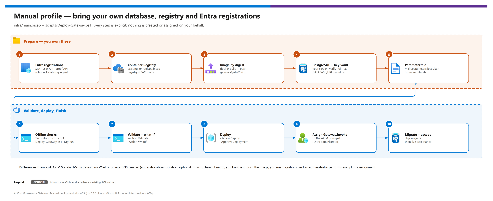

[README](../README.md) › [docs index](./00-reproduce-this-demo.md) › 03b Manual deployment

# 03b - Manual deployment (bring your own resources)

<p>
  
  
  
  
  
  
</p>

<p>
  
  
  
</p>

The advanced, bring-your-own-resource alternative to `azd up`: `infra/main.bicep` plus the offline-first helper `scripts/Deploy-Gateway.ps1`. Use it when you must bring your own PostgreSQL, container registry and Entra registrations, or when your organization cannot run azd hooks. Every step is explicit and nothing is created or assigned on your behalf. The normal getting-started path is [03 - Deployment](./03-deployment.md).

## At a glance

| | | |
|---|---|---|
|  | **Tool** | `Deploy-Gateway.ps1 -Action Checklist\|Build\|Validate\|WhatIf\|Deploy`; offline by default |
|  | **Entra** | You (or an administrator) create the SPA, user API and proof API registrations and assignments |
|  | **Database** | Your production PostgreSQL; `DATABASE_URL` delivered as a Key Vault parameter reference |
|  | **Image** | You build and push; deploy by immutable digest `gateway@sha256:<64-hex>` |
|  | **APIM default** | `StandardV2` (`Developer` is evaluation-only) |
|  | **Network** | Application-layer isolation; optional `infrastructureSubnetId` attaches an existing subnet |

> [!WARNING]
> **Scaffolding only; nothing has been deployed.** Azure configuration is deferred until a real subscription, tenant registrations, existing Foundry account, production PostgreSQL and network decisions are available. A tenant-only CLI session is not a deployment target.

## Steps

[](./assets/manual-deployment-steps.png)

<sub>Editable source: [`assets/manual-deployment-steps.drawio`](./assets/manual-deployment-steps.drawio) - regenerate with `python scripts/export_diagrams.py docs/assets`.</sub>

| Path | Hands-on effort (planning estimate) | What you do yourself |
|---|---|---|
|  `azd up` ([03](./03-deployment.md)) | One command plus approvals | Choose target, approve cost, answer prompts |
|  Manual profile (this page) | Noticeably more - expect several extra hours across teams | Entra registrations and assignments, registry, image build and push, database, Key Vault secret, migrations, every acceptance check |
| **Recommendation** | Use azd unless policy forces you to bring your own database, registry or registrations | - |

Anything azd writes for you (the azd environment, image digest, Entra IDs, migration) must be produced and recorded by hand in this path. Durations are estimates; this repository has not been timed against a live deployment.

## Topology and trust boundary

One Azure Container Apps Consumption service serves the compiled React portal and Fastify API on port 3001. APIM uses a system-assigned identity; the application uses a separate user-assigned identity for Foundry, ARM and ACR image pull. APIM is created first, then the application receives its principal ID, and a separate module binds gateway APIs to the resulting application FQDN. This avoids circular identity/hostname dependencies.

- `POST /openai/v1/chat/completions` in APIM forwards to the **same path** on the application. The application atomically reserves durable PostgreSQL budget before invoking Foundry. There is no APIM-to-Foundry inference backend.
- APIM validates tenant, audience and `Gateway.User`, `Gateway.Admin` or the app-only `Gateway.Agent` role, then rate-limits by the validated JWT `oid`. The app accepts delegated user tokens (`scp`) everywhere and app-only tokens only on the data plane, for teams that register the caller's object ID in `applications`. It preserves the caller `Authorization` and replaces any caller-provided `X-Gateway-Authorization` with an APIM identity token for the **different** `gatewayApiAudience`.
- The app validates both tokens and requires the proof token's `oid` to equal `APIM_PRINCIPAL_ID`, its `roles` to include `Gateway.Invoke`, and an app-only token (not a delegated user token). A forged header, a user's proof token or a direct application request without APIM proof fails. This includes read-only tool endpoints. `X-Team-Id` selects a team; it never confers team membership.
- The public portal/control plane remains app-authenticated with Entra roles; the template does not add a catch-all APIM proxy to management routes. Public `/healthz`, static content and `/api/config` disclose no secrets.
- Chat bodies are limited to 64 KiB at APIM and are also bounded by the app. Only the one chat operation is configured. No retries or semantic caching can bypass reservations, replay uncertain requests, or expose another team's data.

> [!IMPORTANT]
> The baseline is **application-layer isolation, not private network isolation**. It publishes the portal's HTTPS ingress. Supplying `infrastructureSubnetId` connects the new ACA environment to an already prepared subnet, but creates no private endpoint, DNS zone, route, NAT gateway or firewall rules.

For an invoice-isolated deployment, plan and implement Foundry private endpoints and DNS, restrict public access and local keys on the **existing** Foundry account, remove other inference principals/routes, and provide private ACA connectivity. APIM-to-application private connectivity and the portal ingress design require an appropriate APIM/network tier and separate network work. PostgreSQL must have private/routed connectivity or narrowly approved fixed egress; never enable all-Azure or `0.0.0.0/0` database firewall access to make this baseline work. The ledger is a configured-price admission guarantee, not a cap on the Azure invoice.

## Parameters

Run `.\scripts\Deploy-Gateway.ps1` for the offline checklist. It contacts no Azure service by default, installs nothing, and changes no subscription context. Required values in `infra/main.parameters.example.json`:

| Parameter | Operator supplies |
| --- | --- |
| `location`, `appName`, `apimServiceName` | Approved region and names; APIM name is globally unique |
| `publisherName`, `publisherEmail` | Real APIM operator contact |
| `containerRegistryName` | Existing ACR in target RG, registry-RBAC mode, with the tested image |
| `imageRepositoryDigest` | `gateway@sha256:<64-hex-digest>`, never a mutable release tag |
| `databaseUrl` | ARM reference to an existing Key Vault secret containing the production PostgreSQL URL |
| `azureTenantId`, `entraSpaClientId` | Existing tenant and operator-created SPA app registration IDs |
| `entraApiAudience`, `entraApiScope` | User API application GUID (v2 token audience) and exposed delegated scope URI |
| `gatewayApiAudience` | Separate operator-created internal proof API application GUID, used for MI resource and v2 token audience |
| `foundryResourceGroup`, `foundryAccountName`, `foundryEndpoint` | Existing Azure OpenAI-compatible Foundry account; same subscription, optionally different RG |
| `mcpAllowedHosts`, `mcpAllowedAudiences` | Exact external server DNS names and token resources; empty arrays deny registration |
| `llmTokensPerMinutePerCaller` (optional) | Per-caller `llm-token-limit` tokens/minute on inference; `0` (default) disables it |
| `logRetentionInDays` (optional) | Retention of the gateway telemetry Log Analytics workspace (default 30) |

Optional replica counts, tags, APIM SKU/capacity and an existing ACA infrastructure subnet can be supplied - every parameter with its default is in [12 - Configuration reference](./12-configuration-reference.md#manual-profile-parameters). The default APIM `StandardV2` is a starting point, not a capacity/availability or regional-support promise. `Developer` is evaluation-only. MCP does not use APIM Consumption or workspaces.

Set `sslmode=verify-full` on PostgreSQL URLs and test server-certificate verification with the application's driver. Apply migrations once before admitting traffic; the Docker entrypoint does not silently modify a production database. The database operator owns availability, backup/restore, transaction capacity, credentials and rotation.

> [!CAUTION]
> The secret parameter is `@secure()` and maps only to the ACA secret `database-url` and environment `DATABASE_URL` via `secretRef`. The helper rejects literal secrets in parameters; use an ARM Key Vault parameter reference with deployment access configured. No secret values or connection strings are output. Never enable shell tracing around secrets or commit populated local parameter files (`*.local.json` is gitignored).

## Entra registrations (manual prerequisite)

No workload app registrations, tenant-wide permissions or consent are invented or created by this template. Each step has a portal equivalent under **Microsoft Entra admin center → App registrations**.

| Step | | Action (portal / CLI) | Gate |
|---|---|---|---|
| **1** |  | Register the portal as a **single-page application** and configure its actual HTTPS redirect URI (`https://<app-fqdn>/auth.html`). | ☐ SPA client ID recorded |
| **2** |  | Register the **user API** with v2 access tokens (`api.requestedAccessTokenVersion = 2`), expose the delegated scope `access_as_user`, authorize the SPA, and grant appropriate consent. | ☐ API GUID + scope URI recorded |
| **3** |  | Define `Gateway.Reader`, `Gateway.User`, `Gateway.Admin` app roles (User member type). To allow app-only callers, also define **`Gateway.Agent`** with `allowedMemberTypes: ["Application"]`. Require assignment on the enterprise application. | ☐ Roles visible under *App roles* |
| **4** |  | Register a **separate** internal gateway proof API, require v2 tokens, expose **`Gateway.Invoke`** with `allowedMemberTypes: ["Application"]`, and require service-principal assignment. Its app-role **value** must be exactly `Gateway.Invoke` (case-sensitive), not merely its display name. | ☐ Proof API GUID recorded |
| **5** |  | After the first deployment creates APIM, use the nonsecret principal ID output to grant that APIM service principal the proof API's `Gateway.Invoke` role (an Entra administrator; Azure RBAC does not confer Entra application roles). | ☐ Data-plane calls stop returning `GATEWAY_PROOF_REQUIRED` |
| **6** |  | Configure each approved external MCP API's application permissions for APIM separately. Do not reuse the internal proof audience for an external server. | ☐ Per-server permission granted |

Management mutations require Admin; model inference requires User/Admin plus the app's team membership check. Assign users/groups only as intended. For app-only callers, assign `Gateway.Agent` to each caller's service principal and register that object ID on a team as an application identity ([07](./07-identity-and-security.md#enable-an-app-only-caller)).

Set both APIs' `api.requestedAccessTokenVersion` to `2`. Their `aud` claim is the API application/client GUID, not its `api://...` application ID URI. Set `entraApiAudience` and `gatewayApiAudience` to these distinct GUIDs; the APIM MI resource uses the proof API GUID too. The delegated scope remains a URI such as `api://<user-api-guid>/access_as_user`. Do not copy that scope URI into `audience`. Until APIM can acquire its proof token, application data-plane calls fail closed. Do not relax proof validation to work around identity propagation.

## Azure permissions

The application UAMI receives:

| Resource | Grant | Excludes |
|---|---|---|
|  Existing Foundry account | Account-scoped custom role: account read, deployments read/write; `Cognitive Services OpenAI User` for the OpenAI inference path | Account creation/deletion, deployment deletion, key listing |
|  This APIM service | Custom role: service read, API read/write, API policy read/write (operator-authorized external MCP registration) | APIM subscriptions/keys, the service itself, Azure roles |
|  Existing registry | `AcrPull` | Push; repository-ABAC registries need a separate reviewed role adjustment |

APIM gets **no Foundry RBAC assignment**. Its tokens target the app proof API or approved external MCP audiences only. Keep this APIM dedicated to the gateway: the runtime registration identity can modify API policies within this service. Protect Admin assignments, application code and deployment permissions accordingly.

The deployer needs resource deployment rights and permission to create the custom roles and role assignments in both the app and Foundry resource groups. No subscription-wide Contributor/Owner role is granted to a workload identity.

## Staged workflow

| Step | | Action | Gate |
|---|---|---|---|
| **1** |  | Resolve all prerequisites and review costs/network design. Provision an ACR separately if needed using `infra/registry.bicep`; no script does this automatically. | ☐ Target, cost, network approved |
| **2** |  | Run `npm ci` and the root build/test commands, then review and invoke the Docker build and push instructions printed by the checklist. The image uses Node 24, production dependencies and the non-root `node` user; pass `--build-arg NPM_CONFIG_REGISTRY=<mirror-url>` to build through a mirror. | ☐ Image pushed; digest recorded |
| **3** |  | Copy the example to `infra\main.parameters.local.json` and populate real values. | ☐ Helper accepts the file |
| **4** |  | Run `.\scripts\Test-Infrastructure.ps1` for offline compilation and invariants. | ☐ All checks pass |
| **5** |  | Invoke `Deploy-Gateway.ps1 -Action Validate`, then `-Action WhatIf`, with `-SubscriptionId`, `-ResourceGroup`, `-ParameterFile` and `-PrerequisitesReviewed`. These require Azure access; `-DryRun` validates locally, and PowerShell `-WhatIf` prevents cloud calls. | ☐ What-if reviewed |
| **6** |  | Only an explicit `-Action Deploy -ApproveDeployment` performs the deployment. The helper targets the supplied subscription on every Azure command and does not build images, migrate, register apps, change networking or install packages. | ☐ Deployment succeeded |
| **7** |  | Complete Entra role assignment and database initialization: `node apps/api/dist/cli.js migrate` with the production environment and database credentials (no `tsx` needed). Runtime startup and `/readyz` verify schema compatibility without changing tables. | ☐ `/readyz` returns 200 |

```powershell
az login --tenant <TENANT_ID>
az account set --subscription <SUBSCRIPTION_ID>
az account show --query "{tenant:tenantId, subscription:id}" -o table

.\scripts\Deploy-Gateway.ps1                                     # offline checklist
.\scripts\Test-Infrastructure.ps1
.\scripts\Deploy-Gateway.ps1 -Action Validate -SubscriptionId <SUBSCRIPTION_ID> -ResourceGroup <rg> `
  -ParameterFile .\infra\main.parameters.local.json -PrerequisitesReviewed
.\scripts\Deploy-Gateway.ps1 -Action WhatIf   -SubscriptionId <SUBSCRIPTION_ID> -ResourceGroup <rg> `
  -ParameterFile .\infra\main.parameters.local.json -PrerequisitesReviewed
.\scripts\Deploy-Gateway.ps1 -Action Deploy   -SubscriptionId <SUBSCRIPTION_ID> -ResourceGroup <rg> `
  -ParameterFile .\infra\main.parameters.local.json -PrerequisitesReviewed -ApproveDeployment
```

After deployment, verify that unauthorized direct inference/tool requests fail, the APIM user + proof flow succeeds, unknown routes fail, MCP `initialize`/`tools/list`/`tools/call` works, and MCP responses stream without content logging. Verify ledger concurrent/reservation failures and current model rate cards before enabling users. The same acceptance table as the azd path applies: [03 - Phase 4](./03-deployment.md#phase-4---live-acceptance-checks).

## Native MCP and telemetry in this profile

The governance MCP server, external-MCP registration shape and server-level policy limits are identical to the azd profile - see [09 - MCP governance](./09-mcp-governance.md). All APIs use JWT auth with `subscriptionRequired: false`; no subscription keys are created or returned.

The template provisions a dedicated Log Analytics workspace (`logRetentionInDays`) and workspace-based Application Insights (local auth disabled) with an APIM logger that uses APIM's system-assigned identity (`Monitoring Metrics Publisher`), plus an inference-API diagnostic with `metrics: true` and no header/body logging. ACA application log export stays disabled. Any additional telemetry must contain only operational metadata, not prompts, completions, auth headers, database credentials or tool payloads. See [08 - Observability and token metrics](./08-observability-and-token-metrics.md).

> [!NOTE]
> Local Bicep compilation and policy XML parsing do **not** validate APIM runtime policy support, regional SKU availability, Entra consent, RBAC propagation, existing-resource networking or deployed native-MCP token forwarding. These are mandatory deployment acceptance checks, not results claimed by this scaffold.

## Verified reference locations

Schemas and behavior were checked against Microsoft Learn on September 18, 2026:

<details><summary><b>Show references</b></summary>

- [Manage MCP servers with the REST API](https://learn.microsoft.com/azure/api-management/manage-mcp-servers-rest-api)
- [`service/apis` 2025-09-01-preview](https://learn.microsoft.com/azure/templates/microsoft.apimanagement/2025-09-01-preview/service/apis)
- [`service/apis/tools` 2025-09-01-preview](https://learn.microsoft.com/azure/templates/microsoft.apimanagement/2025-09-01-preview/service/apis/tools)
- [Export a REST API as an MCP server](https://learn.microsoft.com/azure/api-management/export-rest-mcp-server)
- [authentication-managed-identity policy](https://learn.microsoft.com/azure/api-management/authentication-managed-identity-policy)
- [Access token claims reference](https://learn.microsoft.com/entra/identity-platform/access-token-claims-reference)
- [validate-content policy](https://learn.microsoft.com/azure/api-management/validate-content-policy)
- [Keyless connections](https://learn.microsoft.com/azure/developer/ai/keyless-connections)
- [Container Apps 2025-01-01](https://learn.microsoft.com/azure/templates/microsoft.app/2025-01-01/containerapps) and [managed environments](https://learn.microsoft.com/azure/templates/microsoft.app/2025-01-01/managedenvironments)
- [llm-emit-token-metric policy](https://learn.microsoft.com/azure/api-management/llm-emit-token-metric-policy)
- [llm-token-limit policy](https://learn.microsoft.com/azure/api-management/llm-token-limit-policy)
- [APIM + Application Insights](https://learn.microsoft.com/azure/api-management/api-management-howto-app-insights)

</details>

---

Next: [04 - Testing](./04-testing.md) →

*Last updated: 2026-10-08*
