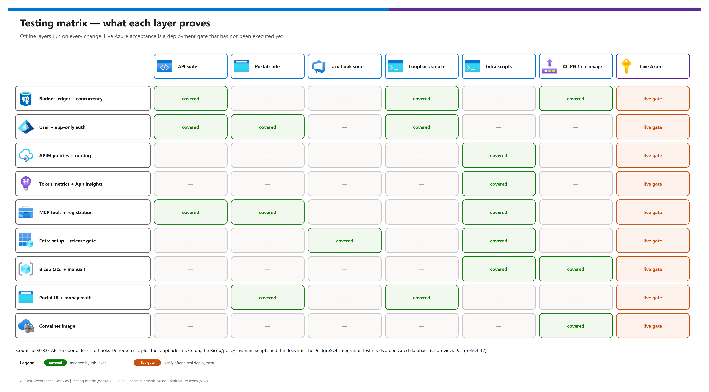

[README](../README.md) › [docs index](./00-reproduce-this-demo.md) › 04 Testing

# 04 - Testing

<p>
  
  
  
  
  
  
</p>

<p>
  
  
  
</p>

What is tested, how to run it, and what each layer does **not** prove. The suites are offline: Azure and Graph calls are mocked, no paid model is called, and no Azure resource is touched. This page separates those local checks from the PostgreSQL, container and deployed-Azure acceptance gates that still need a real target. It is for contributors and reviewers.

## At a glance

| | Layer | Count / scope |
|---|---|---|
|  | **API suite** (`node --test`) | 75 tests - ledger, auth, cloud, bootstrap, database auth |
|  | **Portal suite** (Vitest) | 66 tests - money math, sign-in states, navigation, forms, playground |
|  | **azd hook suite** (`node --test`) | 19 tests - Entra setup, release gate, readiness, teardown guard |
|  | **Loopback smoke** | End-to-end HTTP flow against a running demo server |
|  | **Infrastructure scripts** | Bicep compilation + policy, auth and contract invariants (manual and azd profiles) |
|  | **Docs checks** | Visual-doc lint, diagram freshness, link resolution |

> [!WARNING]
> **Offline success is not deployment proof.** Live Entra sign-in and consent, APIM policy acceptance, token-metric arrival, native MCP token forwarding, PostgreSQL identity and private connectivity, RBAC propagation and model pricing are deployment gates that have **not** been executed.

## Testing matrix

[](./assets/testing-matrix.png)

<sub>Editable source: [`assets/testing-matrix.drawio`](./assets/testing-matrix.drawio) - regenerate with `python scripts/export_diagrams.py docs/assets`.</sub>

## Run everything locally

The lockfile resolves from the public npm registry. Behind a package mirror, set it once per user (`npm config set registry <mirror-url>`); npm rewrites the lockfile's `registry.npmjs.org` host to the configured registry, so `npm ci` needs no extra flags. Package integrity hashes are still verified.

```powershell
npm ci
npm run typecheck
npm test                         # API + portal + azd hook suites
npm run build
.\scripts\Test-Infrastructure.ps1
npm run validate:azd
.\scripts\Test-AzdInfrastructure.ps1
azd hooks run prepackage --no-prompt
```

| Command | Proves | Does not prove |
|---|---|---|
| `npm run typecheck` | Strict TypeScript for API and portal | Runtime behavior |
| `npm test` | API, portal and azd-hook behavior with mocks | Live Azure, real PostgreSQL concurrency |
| `npm run build` | Production API and portal bundles | The Linux container starts |
| `Test-Infrastructure.ps1` | Manual-profile Bicep compiles; policy/auth/routing invariants | APIM accepts the policy at runtime |
| `npm run validate:azd` | All three azd entry points compile; release-gate checks | ARM what-if, quotas |
| `Test-AzdInfrastructure.ps1` | azd profile resources and the output contract ([11](./11-azd-integration-contract.md#shared-infrastructure-outputs)) | Private DNS resolution, RBAC propagation |
| `azd hooks run prepackage --no-prompt` | azd loads `azure.yaml` and runs the offline service hook | Anything in Azure |

## What the suites cover

**API suite.** Reservations, concurrent admission, immutable prices, idempotent settlement, month boundaries, uncertain outcomes, durable reopen, quarantining invalid usage, roles and APIM proof, app-only (`Gateway.Agent`) callers with team registration, budget enforcement and ledger/audit attribution, the v2 attribution migration, scoped catalogs, stale pricing, unsupported request shapes, deployment inventory drift, MCP management request shapes, and target validation. Managed-identity database/bootstrap tests are part of this suite; they do not invoke the real Azure `pgaadauth` extension or obtain tokens.

**Portal suite.** Exact microdollar conversion, configuration/sign-in states, role-aware navigation, form submissions (including application identities), the demo-only agent playground toggle, explicit errors, and avoiding automatic inference retries. A UI test is not proof that live Entra consent is configured.

**azd hook suite.** Runs by default in `npm test`; use `npm run test:azd` alone for focused deployment-hook checks. It mocks Azure/Graph and verifies owned registration reuse, existing-registration read-only mode, permission failures, exact-image migration gating, readiness, secret-safe errors, and destructive-down refusal.

**Infrastructure scripts.** `Test-Infrastructure.ps1` compiles Bicep, parses policies and PowerShell, and checks authentication/routing invariants (including `Gateway.Agent`, the `llm-emit-token-metric` dimensions, metadata-only diagnostics, Entra-only Application Insights, and a public-registry lockfile) plus the deployment helper's placeholder, wildcard, and secret-literal refusal. It makes no Azure calls. `Test-AzdInfrastructure.ps1` (add `-Restore` for a first-time public module download) compiles every azd entry point and asserts the subscription scope, private Entra-only PostgreSQL, distinct identities, ACR settings, network topology and every contract output.

> [!NOTE]
> Bicep compilation does not prove APIM accepts the policy expressions or that token metrics arrive. Verify both after a real deployment.

## Full local HTTP flow (loopback smoke)

Use a separate demo database, not a ledger you want to keep pristine:

```powershell
$env:GATEWAY_MODE = 'demo'
$env:HOST = '127.0.0.1'
$env:DATABASE_URL = 'pglite://data/http-smoke'
npm run build
npm start
```

In a second terminal:

```powershell
npm run test:smoke
```

| Step | | Smoke check | Expected |
|---|---|---|---|
| **1** |  | Create a unique team | `201` |
| **2** |  | Simulated inference | `200`, settled row |
| **3** |  | Exhaust the available cap | Next request `402`, nothing spent |
| **4** |  | Request streaming | Rejected |
| **5** |  | Create a team that registers the fake demo agent; call with `X-Demo-Caller: app` | `actorType=app` settlement and audit attribution |
| **6** |  | Agent calls an unregistered team | Refused |
| **7** |  | Load the built portal | `200` |

The smoke test refuses non-demo/non-loopback targets. It intentionally leaves its records in this **separate** database so persistence can be inspected across a restart.

> [!CAUTION]
> Stop the server before deleting test data. PGlite uses a process lock: after a forcibly killed process, confirm the recorded PID has stopped before removing only that database's sibling `.gateway.lock` file. Do not release financial reservations merely because a process stopped.

## Real PostgreSQL concurrency

The default local database is PGlite, which is single-process. Its tests cannot establish PostgreSQL multi-replica behavior. This separate test uses independent connection pools, concurrent reservations, and concurrent duplicate settlement:

```powershell
# Supply a connection to a dedicated test database through your environment.
$env:TEST_DATABASE_URL = '<postgresql URL of a throwaway test database>'
npm run test:integration
```

`TEST_DATABASE_URL` is required; the command fails rather than claiming a successful skipped test. The test creates a uniquely named schema and removes only that schema afterward. Never point it at a production ledger.

The CI workflow (`.github/workflows/ci.yml`) supplies PostgreSQL 17 for this check and also builds the container. Running `npm test` locally does not mean this integration test ran. The primary azd deployment path builds remotely in ACR; it does not require a local Docker daemon.

## Documentation and diagram checks

```powershell
python scripts/lint_doc_visuals.py --strict      # icons, badges, diagrams, callouts, links, footers
python scripts/export_diagrams.py docs/assets --check   # 0 stale or missing PNGs
python -m pytest tests/test_doc_visuals.py       # the same lint as a test
```

| Check | Fails when |
|---|---|
| `lint_doc_visuals.py --strict` | A doc lacks a hero icon row, a diagram, callouts, product icons in service tables, a footer, nav links, or a local link/anchor does not resolve |
| `export_diagrams.py --check` | A `.drawio` was edited without re-exporting its PNG |
| `test_doc_visuals.py` | The strict lint fails (wraps it for pytest) |

Re-export after editing any diagram: `python scripts/export_diagrams.py docs/assets` (needs draw.io desktop; set `DRAWIO_EXE` if it is not found).

## Regression checklist before a release

> [!NOTE]
> CI runs the application and infrastructure jobs on every push; the docs and diagram checks need Python (and draw.io desktop to re-export), so run them locally before tagging a release.

- [ ] `npm ci`, `npm run typecheck`, `npm test` (API 75, portal 66, azd hooks 19 at v0.3.0), `npm run build`
- [ ] `npm run test:smoke` against a fresh `pglite://data/http-smoke` demo server
- [ ] `.\scripts\Test-Infrastructure.ps1`, `.\scripts\Test-AzdInfrastructure.ps1 -Restore`, `npm run validate:azd`
- [ ] `python scripts/lint_doc_visuals.py --strict` = 0 errors; `python scripts/export_diagrams.py docs/assets --check` = 0 stale
- [ ] CI green (PostgreSQL 17 integration test + container build)
- [ ] CHANGELOG entry and version bump

## Live validation

**Not yet executed.** When a deployment exists, run the acceptance table in [03 - Phase 4](./03-deployment.md#phase-4---live-acceptance-checks) and record the results here (pass/fail matrix, redacted evidence). Until then every Azure-facing behavior carries the static-only badge.

| Gate | Status |
|---|---|
| Live Entra sign-in and consent | ⏳ |
| APIM user + proof flow; direct calls refused | ⏳ |
| Inference settle / refuse against a real deployment | ⏳ |
| App-only caller with `Gateway.Agent` through APIM | ⏳ |
| Native MCP `initialize` / `tools/list` / `tools/call` | ⏳ |
| Token metrics in Application Insights | ⏳ |
| Cross-replica budget behavior on Azure PostgreSQL | ⏳ |
| Release gate on a real migration job | ⏳ |

Before deployment, run the explicit checks in [03 - Deployment](./03-deployment.md#validation-before-deployment) against the approved Azure target. These checks are deliberately not presented as completed without a real deployment.

---

Next: [05 - Troubleshooting](./05-troubleshooting.md) →

*Last updated: 2026-10-08*
