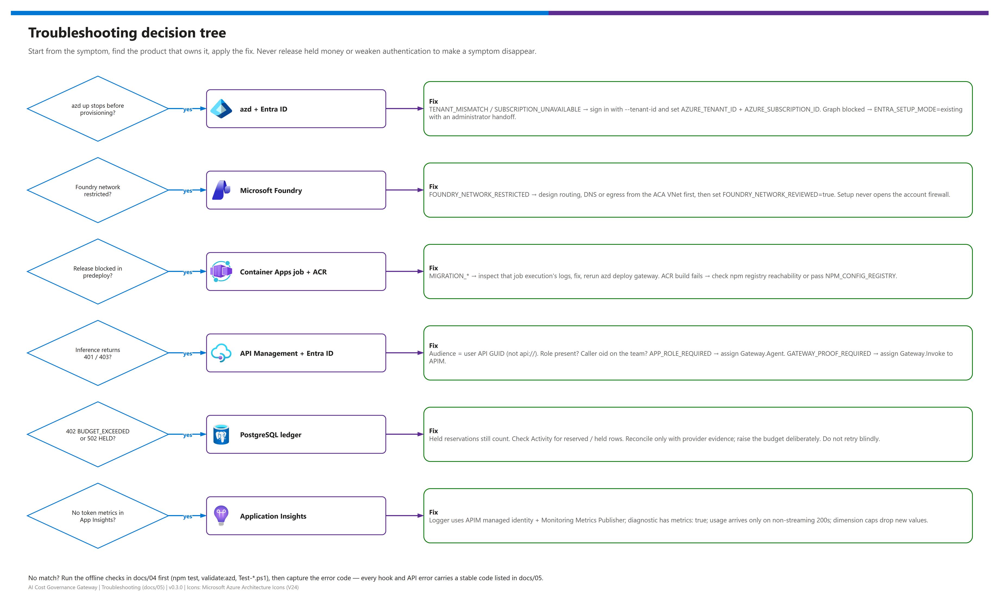

[README](../README.md) › [docs index](./00-reproduce-this-demo.md) › 05 Troubleshooting

# 05 - Troubleshooting

  
  
  
  
  
  

  
  
  

Symptom → owning product → fix. Every setup hook and API error carries a **stable code**, so start from the code in the message. Two rules apply throughout: never release held money to make a symptom disappear, and never weaken authentication to get past a permission error. This page is for operators running the gateway and anyone reproducing it.

## At a glance

| | Symptom | Where | First thing to check |
|---|---|---|---|
|  | `azd up` stops in `preup` / `preprovision` | azd + Entra ID | Tenant, subscription, Graph permissions |
|  | `FOUNDRY_NETWORK_RESTRICTED` | Microsoft Foundry | Network design, then `FOUNDRY_NETWORK_REVIEWED=true` |
|  | Release blocked in `predeploy` | Container Apps job / ACR | The migration job execution logs |
|  | 401 / 403 on inference | API Management + Entra ID | Audience, role, team registration, APIM proof |
|  | 402 or 502 held | PostgreSQL ledger | Held reservations in Activity |
|  | No token metrics | Application Insights | Logger identity, `metrics: true`, dimension caps |

> [!WARNING]
> Do not delete reservations, reset spend, disable APIM proof validation, open the Foundry firewall or add an all-Azure database firewall rule to "fix" an error. Each of those removes a control the design depends on.

## Decision tree

Editable source: [`assets/troubleshooting-decision-tree.drawio`](./assets/troubleshooting-decision-tree.drawio) - regenerate with `python scripts/export_diagrams.py docs/assets`.

## Quick triage

| Symptom / code | Likely cause | Fix |
|---|---|---|
| `TENANT_MISMATCH` | Subscription does not belong to `AZURE_TENANT_ID` | `azd auth login --tenant-id <id>`; set both IDs explicitly |
| `SUBSCRIPTION_UNAVAILABLE` | Tenant-level login only, or disabled subscription | Select a real, enabled subscription |
| `LOGIN_REQUIRED` | azd not signed in | `azd auth login --tenant-id <TENANT_ID>` |
| `AZD_VERSION` / `NODE_VERSION` | Wrong tool versions | azd 1.30+ (major 1), Node.js 24 |
| `CONFIG_REQUIRED` | Missing value in noninteractive mode | Set the named value with `azd env set` |
| `RESOURCE_GROUP_NOT_OWNED` / `RESOURCE_GROUP_MISMATCH` | `rg-<env>` exists for something else | Use a different environment name |
| `FOUNDRY_UNSUPPORTED` / `FOUNDRY_ENDPOINT_MISMATCH` | Not OpenAI/AIServices, no custom subdomain, or wrong endpoint | Pick a supported account; let setup derive the endpoint |
| `ADMIN_REQUIRED` | Service-principal deployment without a bootstrap admin | `azd env set GATEWAY_ADMIN_OBJECT_ID <user-object-guid>` |
| `IDENTITY_SETUP_REQUIRED` | A provision plan before any Entra setup | Run `azd up`, or deliberately `azd hooks run preup` |
| `MIGRATION_*` / `IMAGE_GATE_MISSING` | Migration job failed, uncertain or mismatched | Inspect the job execution; rerun `azd deploy gateway` |
| `DATA_DELETION_BLOCKED` | `azd down` guard | Back up the ledger, then `AZD_ALLOW_DATA_DELETION=true` |
| `403 GATEWAY_PROOF_REQUIRED` | APIM lacks `Gateway.Invoke`, or a direct call | Assign the role to APIM; always call through APIM |
| `403 APP_ROLE_REQUIRED` | App-only caller without `Gateway.Agent` | Assign the app role |
| `403 TEAM_ACCESS_DENIED` | Caller not on the team / model not allowed | Register the object ID; allow the model |
| `401 USER_TOKEN_REQUIRED` | App-only token on a portal route | Agents use the data plane only |
| `402 BUDGET_EXCEEDED` | Settled + held + new maximum exceeds budget | Check held rows; raise the budget deliberately |
| `502 RESERVATION_HELD` | Provider outcome uncertain | Reconcile with provider evidence; do not retry blindly |
| `409 STALE_PRICING` | `pricingValidUntil` passed | Verify the rate card, update the model |

## Azure Developer CLI and setup hooks

 Every hook is `continueOnError: false`, and partial setup is resumable: fix the cause and rerun `azd up` (or `azd deploy gateway`).

| Code | Message (abridged) | Fix |
|---|---|---|
| `TENANT_MISMATCH` | The selected subscription does not belong to `AZURE_TENANT_ID` | Re-authenticate to the right tenant; check `azd env get-values` |
| `SUBSCRIPTION_UNAVAILABLE` | A tenant-level CLI context cannot deploy resources | Set `AZURE_SUBSCRIPTION_ID` to a real, enabled subscription |
| `INVALID_SKU` | Select an APIM Developer or supported v2 SKU | `Developer`, `BasicV2`, `StandardV2`, `PremiumV2` |
| `INVALID_SCALE` | Minimum 1-10, maximum 1-30, maximum ≥ minimum | Fix `GATEWAY_MIN_REPLICAS` / `GATEWAY_MAX_REPLICAS` |
| `INVALID_MCP_HOSTS` / `INVALID_MCP_AUDIENCES` | Exact public DNS names; audiences must not include the proof API | Remove wildcards, IPs, URLs and the internal audience |
| `UNSAFE_ENVIRONMENT_VALUE` | Refusing to persist a secret or invalid value | Never store secrets in the azd environment |
| `NETWORK_FAILURE` / `OPERATION_TIMEOUT` | Azure request failed or timed out; outcome may be uncertain | Check the target, then rerun the idempotent setup |
| `AZD_CONTRACT` | Deployment hooks must stop on errors | Do not edit `continueOnError` in `azure.yaml` |

> [!TIP]
> Run `npm run validate:azd` and `azd hooks run prepackage --no-prompt` first - both are offline and catch most configuration mistakes before anything reaches Azure.

## Microsoft Entra ID

 If Graph access, application registration policy or role assignment is blocked, setup stops before the next stage with the administrator action required.

| Code | Cause | Fix |
|---|---|---|
| `ASSIGNMENT_REQUIRED` | API enterprise applications do not require assignment | Enable *Assignment required* on both API service principals |
| `REGISTRATION_SEPARATION` | SPA, user API and proof API are not three distinct apps | Use three registrations |
| `INVALID_API_REGISTRATION` / `INVALID_SPA_REGISTRATION` | Not single-tenant, or not v2 tokens | Single-tenant; `requestedAccessTokenVersion = 2` |
| `MISSING_API_SCOPE` / `MISSING_API_URI` / `MISSING_APP_ROLE` | Scope `access_as_user`, `api://<app-id>` URI or a role is missing | Add it, or let `auto` mode create it |
| `PRINCIPAL_REQUIRED` | Enterprise application not created for a supplied registration | An administrator creates the service principal |
| `REGISTRATION_NOT_OWNED` / `AMBIGUOUS_REGISTRATION` | Setup refuses to repurpose another environment's app | Supply explicit IDs in `existing` mode |
| `ROLE_ASSIGNMENT_REQUIRED` / `REDIRECT_REQUIRED` | `existing` mode: APIM `Gateway.Invoke` or SPA redirect not yet configured | Administrator assigns the role / registers `https://<app-fqdn>/auth.html` |

Sign-in works but calls fail with `401 INVALID_TOKEN`: the API expects the **application GUID** as audience, not the `api://` URI; tokens must be v2. Remember `X-Team-Id` never grants membership.

## Microsoft Foundry

 `FOUNDRY_NETWORK_RESTRICTED` means the account disables public access or uses a default-deny ACL. Design routing, DNS or approved egress from the new ACA VNet (`10.42.0.0/16`) first, then set `FOUNDRY_NETWORK_REVIEWED=true`. The acknowledgement changes nothing; setup never opens the account firewall.

| Symptom | Cause | Fix |
|---|---|---|
| `409 UNSUPPORTED_DEPLOYMENT` | Provisioned or non-OpenAI deployment | Use on-demand OpenAI text-chat deployments |
| `409 MODEL_NOT_READY` / `403 MODEL_DISABLED` | Deployment still provisioning, disabled or quarantined | Wait for `Succeeded`; investigate quarantine |
| `409 MODEL_QUARANTINED` | Earlier usage violated the configured bound | Reconcile with evidence, fix limits, then re-enable |
| `400 CONTEXT_LIMIT` | Input bound + requested output exceeds the model limits | Lower `max_completion_tokens` or shorten input |
| `502 AZURE_CONTROL_PLANE_FAILED` | ARM call failed | Check runtime identity roles on the Foundry account |

## Container Apps job and Container Registry

 The release is blocked whenever the migration gate cannot prove success on the exact image.

| Code | Meaning | Fix |
|---|---|---|
| `MIGRATION_DEPLOYMENT_FAILED` | Job provisioning failed | Read the ARM deployment error; fix and rerun |
| `MIGRATION_OUTCOME_UNCERTAIN` | Job start returned no valid execution | Inspect job executions **before** retrying |
| `MIGRATION_JOB_MISMATCH` | Job image or identity changed before execution | Do not run concurrent deployments; rerun |
| `MIGRATION_IMAGE_UNVERIFIED` | Execution did not attest the intended image | Rerun; investigate registry tampering if it repeats |
| `DIGEST_UNVERIFIED` / `REGISTRY_MISMATCH` / `UNAPPROVED_IMAGE` | Image not from this environment's ACR or digest unresolved | Publish through azd to the environment's ACR |
| `RELEASE_MISMATCH` | Deployed endpoint, image or identity differs from the release | Check for manual changes to the Container App |
| `ACR_AUTH_FAILED` | ACR did not return a credential | Check azd sign-in and ACR availability |

Remote build failures usually mean ACR build workers cannot reach `https://registry.npmjs.org/` - pass `--build-arg NPM_CONFIG_REGISTRY=<mirror-url>` or allow the registry. azd may offer a local Docker fallback after a remote failure; resolve the remote issue first. Find the last execution name in `GATEWAY_MIGRATION_EXECUTION`.

## API Management

 APIM answers before the API does; its rejections never create a reservation.

| Status | Source | Fix |
|---|---|---|
| `401` "valid tenant access token with a gateway role" | `validate-azure-ad-token` | Token audience = user API GUID; role User/Admin/Agent assigned |
| `403` "principal object ID is required" | Token without `oid` | Use a user or service-principal token |
| `404` "Unsupported inference route" | Wrong method/path or a query string | `POST /openai/v1/chat/completions`, no query |
| `415` | Not uncompressed JSON | `Content-Type: application/json`, no compression |
| Content-size rejection | `validate-content` (64 KiB maximum) | Shorten the request |
| `429` | 60 calls/min per `oid`, or `llm-token-limit` | Back off; tune `LLM_TOKENS_PER_MINUTE_PER_CALLER` |
| `403 GATEWAY_PROOF_REQUIRED` (from the API) | APIM cannot mint its proof token | Assign `Gateway.Invoke` to APIM's principal |

## Governance API startup

 These stop the process before it serves traffic (`/readyz` returns `503 NOT_READY` while the database is not ready).

| Code | Fix |
|---|---|
| `CONFIG_MISSING` | Set the named variable; all Entra/Azure values are required in `azure` mode ([12](./12-configuration-reference.md#runtime-environment-variables)) |
| `CONFIG_INVALID` | HTTPS origins without path/query, distinct audiences, exactly one `sslmode=verify-full`, durable PostgreSQL in Azure |
| `DEMO_LOCAL_ONLY` | Demo binds loopback only and never with `NODE_ENV=production` |
| `DATABASE_RUNTIME_ROLE_UNSAFE` | Runtime must be a non-owning, unprivileged role - rerun the migration job |
| `DATABASE_IDENTITY_FAILED` / `MANAGED_IDENTITY_UNAVAILABLE` | Check `AZURE_CLIENT_ID` and the identity attached to the app |

## PostgreSQL ledger

 A `402` is the design working. Admission counts settled spend **and** every reserved, held and invalid-usage row.

1. Open **Activity** (or `GET /api/usage`) and filter the team for `held`, `reserved` and `invalid_usage` rows.
2. For held rows, obtain provider evidence (Foundry usage) before any reconciliation; there is no one-click refund by design.
3. Raise the budget deliberately if the spend is legitimate (`BUDGET_COMMITTED` prevents lowering it below committed funds).

> [!CAUTION]
> PGlite (local) is single-process. After a forced kill, confirm the recorded PID has stopped before removing only the sibling `.gateway.lock` file. Restoring an old ledger backup can forget already-billed work - stop inference, reconcile, then reopen.

## Application Insights

 No token metrics after a successful call:

| Check | Expected |
|---|---|
| APIM logger | Application Insights logger using APIM's managed identity |
| Role assignment | APIM system identity has `Monitoring Metrics Publisher` on the component |
| Diagnostic | Inference API diagnostic with `metrics: true` |
| Request | Non-streaming `200` with `usage` (only then is a metric emitted) |
| Cardinality | Under 100 values per dimension and 1,000 time series per namespace - beyond that new values are silently dropped |

## Escalation

> [!CAUTION]
> Never paste access tokens, database URLs, connection strings or `.azure/` environment files into an issue, chat or log. Error codes, timestamps and resource names are enough to diagnose.

If a symptom persists after the fixes above, capture the error code, the azd environment name, the time window and the migration execution name (never tokens, keys or database URLs) and open an issue on the repository. For Azure service incidents, check [Azure status](https://azure.status.microsoft/) and your subscription's Service Health.

---

Next: [06 - Budgets and ledger](./06-budgets-and-ledger.md) →

*Last updated: 2026-10-08*
