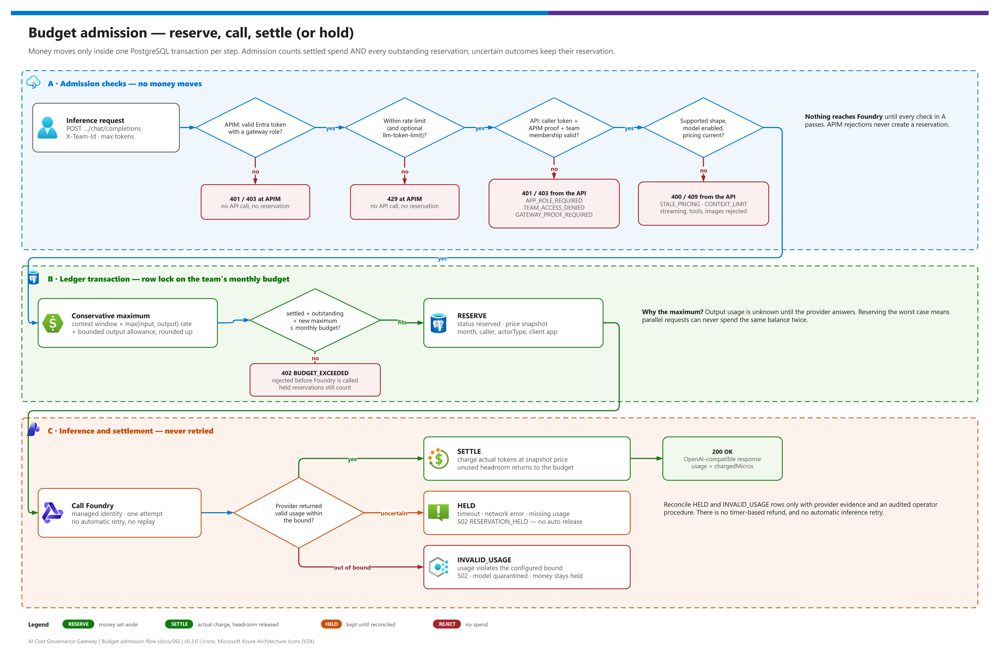

[README](../README.md) › [docs index](./00-reproduce-this-demo.md) › 06 Budgets and ledger

# 06 - Budgets and the USD ledger

<p>
  
  
  
  
  
</p>

<p>
  
  
  
  
</p>

This page explains the one guarantee the gateway makes: **a model call is admitted only when a conservative maximum charge fits the team's remaining USD budget**, and that check happens before Foundry is contacted. It is for architects and finance or platform owners who need to know exactly what the cap does and does not cover, and for reviewers who want the failure semantics. It can be shared on its own.

## At a glance

| | Topic | One-line answer |
|---|---|---|
|  | **Unit** | Integer USD microdollars (`$1 = 1,000,000`); prices are microdollars **per million tokens**. |
|  | **Invariant** | `settled + all outstanding reservations + new maximum <= monthly budget`, per team, per UTC month, under a row lock. |
|  | **Supported surface** | Non-streaming, text-only Chat Completions with an explicit output-token limit. Everything else is rejected. |
|  | **Uncertain outcomes** | The reservation stays **held**. No timer, no automatic refund, no automatic retry. |
|  | **Token metrics** | Chargeback observability only. They never admit or reject a request. |
|  | **Not covered** | Infrastructure, taxes, provisioned throughput, external MCP fees, and traffic that bypasses the gateway. |

> [!IMPORTANT]
> **This enforces admission against an administrator-configured price ledger. It does not impose a hard cap on the Azure invoice.** Model price inputs are operator-maintained, not a live Azure billing feed. Keep [Azure Cost Management budgets](https://learn.microsoft.com/azure/cost-management-billing/costs/tutorial-acm-create-budgets) for invoice-level alerts.

## The admission flow

[](./assets/budget-admission-flow.png)

<sub>Editable source: [`assets/budget-admission-flow.drawio`](./assets/budget-admission-flow.drawio) - regenerate with `python scripts/export_diagrams.py docs/assets`.</sub>

| Step | | What happens | Money moves? |
|---|---|---|---|
| **A** |  | APIM validates the Entra token and role, applies rate limits (and the optional `llm-token-limit`), then the API validates the caller token, the APIM proof, team membership, request shape, model state and pricing validity. | No |
| **B** |  | Inside one transaction that locks the team's monthly budget row, the API computes the conservative maximum and **reserves** it if it fits. | Reserved |
| **C** |  | One inference call to Foundry. Valid usage **settles** at the reservation's price snapshot and releases the unused headroom. An uncertain outcome is **held**; usage outside the bound is **invalid_usage** and quarantines the model. | Settled or held |

## Units and invariant

The API uses integer USD microdollars: `$1 = 1,000,000` microdollars. Token prices are microdollars **per million tokens**, not per token. Arithmetic rounds charges up and uses integer intermediates to avoid floating-point undercharging. JSON amounts must remain safe integers (an amount beyond the safe-integer range fails with `UNSAFE_AMOUNT`).

For a team and a UTC calendar month, admission requires:

```text
settled spend + all outstanding reservations + new maximum charge
    <= configured monthly budget
```

The database serializes admission against the shared budget row. Every replica must use the same PostgreSQL database. A local process mutex is not sufficient for production; the embedded demo database (PGlite) is single-process.

Each reservation captures its original month, model, caller (user or app-only application, plus the client application ID for apps), price snapshot, and maximum charge. App-only callers (agents, managed identities, service principals) spend the budget of the team that registers their object ID in `applications`, under exactly the same admission rule; they have no separate or unlimited allowance. Settlement occurs in that original month even if the response arrives after midnight on the first of the following month. Configuration changes cannot retroactively reprice an in-flight request.

> [!NOTE]
> All monetary values in the API are non-negative safe integers in microdollars. The portal converts them exactly (see `apps/web/src/money.ts`), so `250.00` USD is stored as `250000000`.

## Why reserve a maximum instead of estimated input tokens?

Output usage is not known until the provider returns. Checking current spend and charging after a response permits simultaneous requests to exceed a cap. Checking an eventually consistent analytics feed also leaves an overspend window.

| Approach | Parallel-safe? | Can overspend? | Can reject a request that would have fit? | Recommendation |
|---|---|---|---|---|
| Charge after the response | ❌ | ✅ yes, under concurrency | ❌ | Not acceptable for a hard admission rule |
| Sync spend from analytics / metrics | ❌ | ✅ yes, during the lag window | ❌ | Use for reporting only |
| Estimate likely output, reserve that | ⚠️ | ✅ when the estimate is low | ⚠️ sometimes | Not defensible as a maximum |
| **Reserve the conservative maximum (this repo)** | ✅ | ❌ (within configured prices and limits) | ✅ yes, intentionally | **Recommended** - the tradeoff is deliberate |

This implementation reserves against a conservative configured context/output bound instead of predicting the likely answer length. The initial conservative maximum reserves the configured deployment context window at the greater of input/output rates (plus any necessary separately bounded output allowance). Text input has a conservative UTF-8-byte/framing bound before admission (`CONTEXT_LIMIT` when the bound plus the requested output exceeds the verified model limits).

Administrators must verify the actual deployed model version, context window, maximum output, and price validity. Understating those bounds invalidates a maximum-charge claim. Do not copy example prices into production.

Only plain-text chat is initially supported. Extra billing surfaces (streaming, tools in model requests, images, audio, `n != 1`, unknown options, unpriced models) are rejected until the service has a defensible pricing bound for them. No cache discount is assumed; charging uncached input rates is conservative. No live Azure invoice reconciliation or currency conversion is implied.

## Failure semantics

| Event | Behavior | Error code |
|---|---|---|
| Insufficient available budget | Reject before Foundry is called. Held reservations still count. | `402 BUDGET_EXCEEDED` |
| Missing/expired pricing or disabled model | Reject; do not select a fallback model. | `409 STALE_PRICING`, `403 MODEL_DISABLED` |
| Unavailable database | Reject; do not fall back to memory or analytics. | `503 STORAGE_UNAVAILABLE` |
| Valid provider usage | Settle once using the reservation's original price snapshot; unused headroom is released. | `200` |
| Provider timeout, network error, or missing usage | Keep the reservation held; surface uncertainty. | `502 RESERVATION_HELD` |
| Process crashes after reservation | Reservation remains held in durable storage. | - |
| Actual usage violates the configured bound | Fail closed, mark `invalid_usage`, quarantine the model. | `502 INVALID_USAGE_RESERVATION_HELD` |
| Team budget is reduced below committed funds | Reject the update. | `409 BUDGET_COMMITTED` |
| Month changes during inference | Settle the original month, not the current month. | - |

Inference is not automatically retried. An HTTP error does not prove that a provider performed no billable work. A retry sent by a client is a new admission with a new maximum reservation. Idempotency/replay keys are rejected (`IDEMPOTENCY_NOT_SUPPORTED`).

> [!WARNING]
> Never "fix" a dashboard by deleting reservations or resetting spend. A held reservation means the provider **may** have billed you; releasing it without evidence re-opens the overspend window this design exists to close.

## Reservation states

| State | Counts against the budget? | How it ends |
|---|---|---|
| `reserved` | ✅ the full maximum | Settles on valid usage, or becomes `held` |
| `held` | ✅ the full maximum | Only through an audited, evidence-based operator reconciliation |
| `invalid_usage` | ✅ the full maximum | Operator reconciliation; the model stays quarantined (`MODEL_QUARANTINED` blocks re-enabling) |
| `settled` | ✅ the actual charge only | Final |

The usage API (`GET /api/usage`) and the portal **Activity** page show each row's status, actor type (`user` or `app`), client application ID, and token counts.

## Uncertain reservations

Do not delete old reservations or reset accumulated spend to make a dashboard look correct. There is intentionally no automatic expiration/refund. Reconciliation requires verified provider evidence and an audited operator procedure. The initial portal does not offer a one-click refund for uncertain charges; leaving money held is safer than guessing that it was not spent.

Database backups and recovery matter: restoring an old ledger can forget already-billed work. Stop inference during recovery, reconcile provider usage, and confirm balances before reopening admission.

> [!CAUTION]
> `azd down` deletes the environment's PostgreSQL ledger. It is blocked until `AZD_ALLOW_DATA_DELETION=true` is set explicitly. Back up and reconcile the ledger first - see [03 - Deployment](./03-deployment.md#recovery-state-and-deletion).

## Complementary APIM token controls

APIM's `llm-emit-token-metric` reports prompt/completion/total tokens by API, team, model, client application and caller type in Application Insights. Use it for chargeback dashboards and anomaly alerts; it is not used for admission. Details in [08 - Observability and token metrics](./08-observability-and-token-metrics.md).

| Control | Unit | Enforced where | Role | Recommendation |
|---|---|---|---|---|
| USD ledger reservation | microdollars | Governance API + PostgreSQL | **Authoritative** spend control, before the model call | Always on |
| `llm-token-limit`  | tokens per minute per caller `oid` | APIM | Burst smoothing; rejects with 429 before the API, so no reservation is created | Enable when bursts matter (`LLM_TOKENS_PER_MINUTE_PER_CALLER`) |
| `llm-emit-token-metric`  | tokens | APIM → Application Insights | Chargeback reporting and alerts | Always on |
| Cost Management budget  | invoice currency | Azure billing | Whole-subscription spend visibility | Add per subscription |

`llm-token-limit` is available as an **optional** per-caller tokens-per-minute throttle (`llmTokensPerMinutePerCaller`, azd `LLM_TOKENS_PER_MINUTE_PER_CALLER`, default `0` = off), keyed by the validated token `oid`. It counts actual response usage (no prompt estimation) and smooths bursts. A throttled request is rejected by APIM with 429 before the API is called, so no reservation is created. It is per-gateway and approximate, and is never a substitute for the ledger: the USD reservation above remains the authoritative spend control. Reference: [llm-token-limit policy](https://learn.microsoft.com/azure/api-management/llm-token-limit-policy).

## Boundaries

The cap covers the configured inference-price ledger for traffic routed through this application. It does not cover all Azure spend, external MCP tools, capacity reservations/provisioned throughput, taxes, or traffic that bypasses the gateway. Prevent bypass with Foundry RBAC, disabled local-key access, and network isolation appropriate to your deployment. Keep separate Azure Cost Management budgets and alerts for infrastructure/invoice visibility.

| Cost | Inside the ledger? | Where to watch it |
|---|---|---|
| Governed Chat Completions through the gateway | ✅ | Ledger + token metrics |
| Direct Foundry calls that bypass the gateway | ❌ | Remove other inference RBAC; disable local keys ([07](./07-identity-and-security.md#network-and-bypass-controls)) |
| External MCP provider charges and tool side effects | ❌ | The provider's own billing ([09](./09-mcp-governance.md)) |
| APIM, Container Apps, PostgreSQL, ACR, logs | ❌ | Cost Management |
| Provisioned throughput, taxes, currency changes | ❌ | Cost Management / billing |

---

Next: [07 - Identity and security](./07-identity-and-security.md) →

*Last updated: 2026-10-08*
