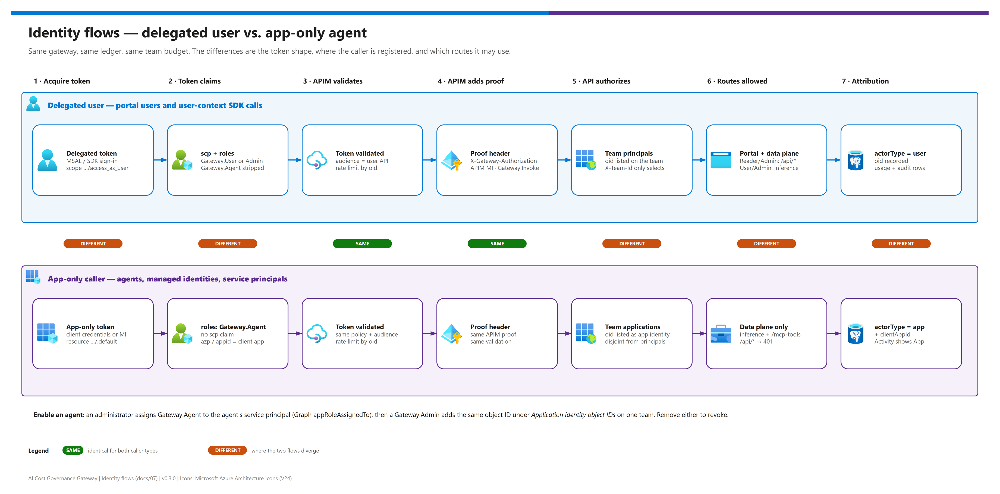

[README](../README.md) › [docs index](./00-reproduce-this-demo.md) › 07 Identity and security

# 07 - Identity and security

<p>
  
  
  
  
  
  
</p>

<p>
  
  
  
  
</p>

Who can call what, how each caller proves it, and where the trust boundaries are. This page covers the two caller types - **delegated users** and **app-only callers** (agents, managed identities, service principals holding the `Gateway.Agent` role) - the APIM identity proof, the managed identities the platform uses, and the network, logging and bypass controls you still own. It is for security reviewers and platform engineers and can be shared on its own.

## At a glance

| | Topic | One-line answer |
|---|---|---|
|  | **Registrations** | Three single-tenant apps: portal SPA, user API (scope `access_as_user`), separate gateway-proof API. v2 tokens, GUID audiences. |
|  | **Roles** | `Gateway.Reader`, `Gateway.User`, `Gateway.Admin` (users); `Gateway.Agent` (applications); `Gateway.Invoke` (APIM only). |
|  | **App-only callers** | Data plane only, no `scp`, role `Gateway.Agent`, object ID registered on exactly the teams it may spend. |
|  | **APIM proof** | APIM adds its own managed-identity token in `X-Gateway-Authorization`; the API rejects data-plane calls without it. |
|  | **Azure access** | Managed identities only - no keys, no developer CLI login, no client secrets. |
|  | **Logging** | Metadata only. No prompts, completions, tokens, keys or database URLs in audit or telemetry. |

> [!IMPORTANT]
> Browser visibility checks are only a UX convenience. **The API is authoritative**: it validates signature, issuer, audience, expiry, tenant and roles on every call, and `X-Team-Id` only *selects* a team - it never grants membership.

## Two caller types, one gateway

[](./assets/identity-flows.png)

<sub>Editable source: [`assets/identity-flows.drawio`](./assets/identity-flows.drawio) - regenerate with `python scripts/export_diagrams.py docs/assets`.</sub>

| | Delegated user | App-only caller | Same? |
|---|---|---|---|
|  **Token** | Delegated, scope `api://<ENTRA_API_AUDIENCE>/access_as_user` (`scp` present) | Client credentials or managed identity for `api://<ENTRA_API_AUDIENCE>/.default` (no `scp`) | ❌ |
|  **Role** | `Gateway.User` or `Gateway.Admin` to infer; `Gateway.Reader`/`Gateway.Admin` for portal reads | `Gateway.Agent` (Application member type only) | ❌ |
|  **APIM validation** | `validate-azure-ad-token`, audience = user API GUID, rate limit by `oid` | Same policy, same audience, same rate limit | ✅ |
|  **APIM proof** | `X-Gateway-Authorization` with `Gateway.Invoke` | Same | ✅ |
|  **Team registration** | `oid` in the team's `principals` | `oid` (service-principal object ID) in the team's `applications` | ❌ |
|  **Routes** | Portal `/api/*` and the data plane | Data plane only (`/openai/v1/chat/completions`, `/mcp-tools/*`) | ❌ |
|  **Attribution** | `actorType=user` | `actorType=app` + client application ID (`azp`/`appid`) | ❌ |
| **Recommendation** | Use for people and user-context SDKs | Use for agents and automation; register each identity on one team | - |

## Identities and roles

The portal uses a single-tenant Entra SPA registration and a delegated scope for the governance API. The backend validates signature, issuer, audience, expiry, tenant, and assigned application roles.

| Role | Member type | Intended capability |
|---|---|---|
| `Gateway.Reader` | User | Read governance configuration and reporting. |
| `Gateway.User` | User | Infer using explicitly assigned teams and models. |
| `Gateway.Admin` | User | Change configuration, create deployments, register approved MCP servers. |
| `Gateway.Agent` | **Application** | App-only callers only: infer and read the MCP catalog/budget for teams that register the caller. |
| `Gateway.Invoke` | **Application** (on the separate proof API) | APIM's managed identity only: proves a data-plane request came through the gateway. |

Inference additionally requires membership in the selected team. Do not assign admin roles to ordinary inference clients.

Users present a **delegated access token** with the API scope (`scp`). App-only tokens (managed identities, service principals, Entra agent identities) are accepted only on the data plane (inference and read-only MCP tools), only when they carry no `scp`, carry the `Gateway.Agent` app role (which can be assigned only to applications), present a client application ID (`azp`/`appid`), and are not APIM's own identity. The caller's service-principal object ID (`oid`) must be registered in the selected team's `applications` list, which is kept disjoint from user `principals` (`PRINCIPAL_CONFLICT` if an ID is in both). App-only tokens are always rejected on portal/admin routes (`401 USER_TOKEN_REQUIRED`), and `Gateway.Agent` is stripped from delegated tokens. Reservations and audit rows record `actor_type` (`user`/`app`) and the client application ID. The API app registration keeps `appRoleAssignmentRequired`, so a tenant application cannot obtain a token for it without an explicit assignment.

All API tokens are v2 with distinct application GUID audiences. Their `aud` claim is the API application/client GUID, not its `api://...` application ID URI. The delegated scope remains a URI such as `api://<user-api-guid>/access_as_user`. Reference: [access tokens and app roles](https://learn.microsoft.com/entra/identity-platform/access-tokens).

## The APIM identity proof

APIM authenticates the caller and forwards the original user (or app-only) access token. It supplies its own managed-identity token in `X-Gateway-Authorization`, first deleting any caller-supplied value. The application checks this proof independently against the expected APIM principal (`APIM_PRINCIPAL_ID`), the proof audience (`GATEWAY_API_AUDIENCE`) and the `Gateway.Invoke` role, and requires it to be an app-only token, before accepting data-plane requests. A caller's arbitrary header cannot substitute for a valid gateway token; a forged header, a user's proof token or a direct request without APIM proof fails with `403 GATEWAY_PROOF_REQUIRED` - including on the read-only tool endpoints.

<details><summary><b>Show the inference policy's identity steps (infra/policies/inference.xml)</b></summary>

```xml
<validate-azure-ad-token tenant-id="{{entra-tenant-id}}" header-name="Authorization"
    failed-validation-httpcode="401" output-token-variable-name="callerJwt">
  <audiences><audience>{{entra-api-audience}}</audience></audiences>
  <required-claims>
    <claim name="roles" match="any">
      <value>Gateway.User</value><value>Gateway.Admin</value><value>Gateway.Agent</value>
    </claim>
  </required-claims>
</validate-azure-ad-token>
<rate-limit-by-key calls="60" renewal-period="60"
    counter-key='@("inference:" + ((Jwt)context.Variables["callerJwt"]).Claims.GetValueOrDefault("oid", ""))' />
<set-header name="X-Gateway-Authorization" exists-action="delete" />
<authentication-managed-identity resource="{{gateway-api-audience}}" output-token-variable-name="gatewayToken" ignore-error="false" />
<set-header name="X-Gateway-Authorization" exists-action="override">
  <value>@("Bearer " + (string)context.Variables["gatewayToken"])</value>
</set-header>
```

</details>

> [!NOTE]
> Until APIM can acquire its proof token (the `Gateway.Invoke` assignment is an Entra operation, not Azure RBAC), application data-plane calls fail closed. Do not relax proof validation to work around identity propagation.

## Enable an app-only caller

Agents, managed identities and service principals are **opt-in per identity**. Each one is registered to a team, spends that team's budget, and is attributed as an application in the ledger and audit trail. Users keep the delegated flow.

| Step | | Action | Gate |
|---|---|---|---|
| **1** |  | Find the caller's **service principal object ID** (for a managed identity, its `principalId`; for an app registration, the enterprise application's object ID - not the client ID). | ☐ Object ID recorded |
| **2** |  | A tenant administrator or an owner of the user API enterprise application assigns it the `Gateway.Agent` app role. | ☐ `appRoleAssignedTo` shows the assignment |
| **3** |  | A `Gateway.Admin` edits the team in the portal and adds the same object ID under **Application identity object IDs**. | ☐ Team saved, no `PRINCIPAL_CONFLICT` |
| **4** |  | The agent acquires a token for `api://<ENTRA_API_AUDIENCE>/.default` (managed identity resource `api://<ENTRA_API_AUDIENCE>`) and calls `<APIM_GATEWAY_URL>/openai/v1/chat/completions` with `X-Team-Id`. | ☐ Activity shows an `App` caller |

> [!WARNING]
> The Graph call below changes your tenant. Sign in to the **intended** tenant explicitly and select the subscription - `az` and `azd` keep separate logins, and the ambient account drifts between tenants.

```powershell
az login --tenant <TENANT_ID>
az account set --subscription <SUBSCRIPTION_ID>
az account show --query "{tenant:tenantId, subscription:id}" -o table

$apiSp  = azd env get-value ENTRA_API_SERVICE_PRINCIPAL_ID
$roleId = azd env get-value GATEWAY_AGENT_ROLE_ID
$body = @{ principalId = '<AGENT_SP_OBJECT_ID>'; resourceId = $apiSp; appRoleId = $roleId } | ConvertTo-Json -Compress
az rest --method POST --uri "https://graph.microsoft.com/v1.0/servicePrincipals/$apiSp/appRoleAssignedTo" `
  --headers "Content-Type=application/json" --body $body
```

Remove the app-role assignment or the team registration to revoke access. Environments created before v0.2.0 receive `Gateway.Agent` on the next `azd up` in `auto` mode; in `existing` mode an administrator adds it (until then app-only callers stay disabled). Errors: `APP_ROLE_REQUIRED` (403, role missing), `TEAM_ACCESS_DENIED` (403, not registered to the team or model not allowed), `BUDGET_EXCEEDED` (402).

## Entra setup and administrator handoff

`ENTRA_SETUP_MODE=auto` is the default. Setup creates only registrations owned by this environment, identifies them by an environment/subscription marker, and reuses their saved IDs on rerun. It does not create client secrets, persist access tokens, assign broad Graph permissions to runtime identities, or grant tenant-wide consent to unrelated APIs.

The user API exposes `access_as_user`, User-member roles `Gateway.Reader`, `Gateway.User`, and `Gateway.Admin`, and the Application-member role `Gateway.Agent` for app-only callers (saved as `GATEWAY_AGENT_ROLE_ID`; never assigned automatically). The separate proof API exposes the Application-member role `Gateway.Invoke`. Assignment is required on both API service principals.

By default the signed-in operator is the initial admin. For service-principal/CI deployment, set `GATEWAY_ADMIN_OBJECT_ID` to the intended Entra user object ID (`ADMIN_REQUIRED` otherwise). Additional consumers and team/model memberships are assigned deliberately, not automatically opened to the whole tenant.

If Graph access, application registration policy or role assignment is blocked, the hook stops before moving to the next stage. Have an appropriately authorized administrator run setup, or switch to existing mode:

```powershell
azd env set ENTRA_SETUP_MODE existing
azd env set ENTRA_SPA_CLIENT_ID <spa-client-guid>
azd env set ENTRA_API_AUDIENCE <user-api-client-guid>
azd env set GATEWAY_API_AUDIENCE <proof-api-client-guid>
azd env set GATEWAY_ADMIN_OBJECT_ID <bootstrap-user-object-guid>
```

Existing mode validates rather than modifies registrations/assignments. An administrator must supply the required roles/scope/assignment policy, assign the bootstrap admin, and after provisioning register the reported SPA redirect and assign `Gateway.Invoke` to the reported APIM principal. Rerun `azd up` or `azd deploy gateway` after resolving the reported action. No failed permission check is treated as successful setup.

> [!TIP]
> Registration creation belongs to `preup`, not `preprovision`. A provision preview only checks existing registrations and never creates them (`IDENTITY_SETUP_REQUIRED`). To preview before the first `up`, either run `azd hooks run preup` deliberately (this **does** perform Entra setup) or supply administrator-configured registrations.

## Managed identities and Azure RBAC

The application uses managed identity for Azure operations. Production must not depend on a developer's Azure CLI login, pasted bearer tokens, or model API keys. Grants are scoped to the existing Foundry account and APIM service.

| Identity | Product | Grants | Never has |
|---|---|---|---|
|  Runtime UAMI | Container Apps (gateway app) | Account-scoped custom role (Foundry account read, deployments read/write); `Cognitive Services OpenAI User` on that account; custom APIM role (service read, API read/write, API policy read/write); `AcrPull`; mapped non-admin PostgreSQL role `gateway_app` | Account create/delete, deployment delete, key listing, APIM subscriptions/keys, Graph permissions, PostgreSQL admin |
|  Migration UAMI (azd) | Container Apps job | PostgreSQL Entra administrator; `AcrPull` | Foundry or APIM management roles |
|  APIM system identity | API Management | `Gateway.Invoke` on the proof API (Entra); `Monitoring Metrics Publisher` on Application Insights | Any Foundry RBAC assignment |

APIM gets **no Foundry RBAC assignment**. Its tokens target the app proof API or approved external MCP audiences only. Keep this APIM dedicated to the gateway: the runtime registration identity can modify API policies within this service. Protect Admin assignments, application code and deployment permissions accordingly. No subscription-wide Contributor/Owner role is granted to a workload identity.

## Network and bypass controls

Protect the existing Foundry account independently. Remove unnecessary inference RBAC assignments, disable local key authentication where supported, and use private connectivity/firewall policies. The templates do not silently rewrite networking on an existing resource.

| Control | azd profile | Manual profile | You still own |
|---|---|---|---|
| PostgreSQL | Private, Entra-only, no firewall rules, `publicNetworkAccess: Disabled`, NSG accepts 5432 only from ACA and its own subnet | Your server; `sslmode=verify-full`; least-privilege principal | Backups, restore drills, capacity |
| Portal/API ingress | Public HTTPS, Entra-authorized | Public HTTPS, Entra-authorized | Private ingress, edge protection, abuse limits |
| Foundry | Reused; firewall never opened (`FOUNDRY_NETWORK_RESTRICTED` stops setup) | Reused | Private endpoints/DNS, disable local keys, remove other inference principals |
| ACR | Admin and anonymous access off, `AcrPull` only | Existing registry, registry-RBAC mode | Repository-ABAC adjustments |

Use production PostgreSQL with `sslmode=verify-full` and an application-specific least-privilege database principal. The runtime needs data access; migrations may need a separate elevated principal. Do not allow all Azure addresses solely to make deployment convenient. Database topology and connectivity are deployment prerequisites, not assumed secure because a connection string works.

The primary azd profile creates private, Entra-only PostgreSQL and two separate managed identities. Only the short-lived migration job uses the PostgreSQL administrator identity. It maps a non-admin runtime role, applies versioned migrations, and grants data access without schema/role administration. The runtime obtains PostgreSQL tokens for new connections; no password/token is stored in its database URI. The manual profile retains its explicit bring-your-own-database/password option.

The portal/API is protected by tokens, but public ingress remains reachable. Review private ingress, edge protection, tenant app-assignment requirements, and abuse limits for your environment before production.

## Logging and data handling

APIM sends request telemetry and `llm-emit-token-metric` custom metrics to a workspace-based Application Insights resource. Ingestion uses APIM's system-assigned identity with `Monitoring Metrics Publisher`; local (instrumentation-key) authentication is disabled. Diagnostics log no headers, bodies, LLM messages or client IP addresses. Metric dimensions are bounded identifiers only (API, team, model, client application ID, caller type), never prompt or completion content. The inference policy reads only the request's `model` field (with a strict identifier pattern) to label the metric. Token metrics are observability for chargeback reporting; the PostgreSQL ledger remains the authoritative, pre-admission budget control.

| Data | Audit log | Telemetry | Never stored |
|---|---|---|---|
| Configuration changes, actor IDs, actor type, resource IDs, outcomes, accounting metadata | ✅ | - | - |
| Token counts by team/model/client app/caller type | - | ✅ | - |
| Prompts, model responses, MCP payloads | - | - | ✅ |
| Access tokens, subscription keys, database URLs | - | - | ✅ |

Apply appropriate retention/access policies to operational logs and backups.

> [!CAUTION]
> Local demo mode is **not** production authentication. It must remain loopback-only and cannot be enabled with `NODE_ENV=production` (`DEMO_LOCAL_ONLY`). Demo replies and price data are synthetic, not live Foundry traffic or pricing.

## Not included

This starter is not a compliance certification, penetration test, content safety service, or prompt-injection prevention system. Content safety, end-to-end private-network topology (beyond the azd profile's private database), external-tool approval, automated invoice reconciliation, and organizational incident response require an explicit production design. Do not advertise these as enforced merely because APIM supports related policies.

| Capability | Status | Where to start |
|---|---|---|
| Content safety / prompt shields |  | Add an APIM content-safety policy and test it |
| Private ingress for the portal and APIM |  | Requires an appropriate APIM/network tier and separate network work |
| Automated invoice reconciliation |  | Compare the ledger with Cost Management exports |
| Incident response runbooks |  | Start from [05 - Troubleshooting](./05-troubleshooting.md) |

---

Next: [08 - Observability and token metrics](./08-observability-and-token-metrics.md) →

*Last updated: 2026-10-08*
