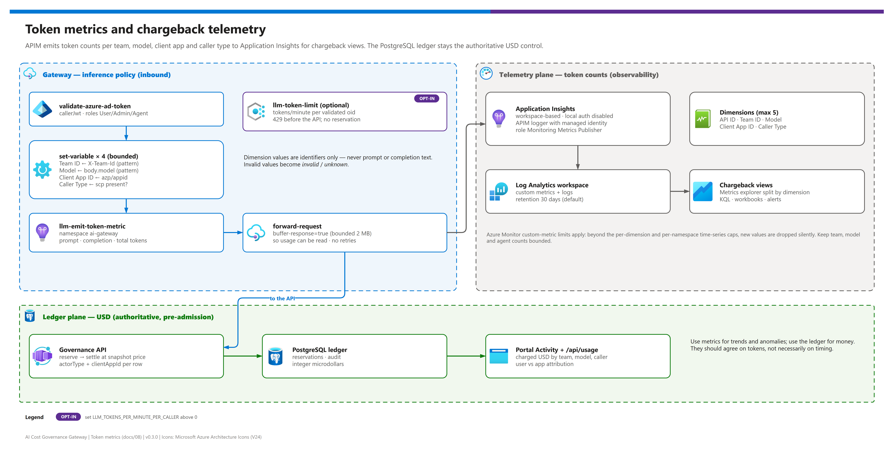

[README](../README.md) › [docs index](./00-reproduce-this-demo.md) › 08 Observability and token metrics

# 08 - Observability and token metrics

<p>
  
  
  
  
  
  
</p>

<p>
  
  
  
  
</p>

How token usage becomes **chargeback data**: APIM's `llm-emit-token-metric` policy emits prompt, completion and total tokens per team, model, client application and caller type into workspace-based Application Insights, where you split, chart and alert on them. This page also explains why those metrics are observability, not enforcement, and the Azure Monitor limits that shape the design. It is for platform, FinOps and operations teams.

## At a glance

| | Topic | One-line answer |
|---|---|---|
|  | **Emitter** | `llm-emit-token-metric` on the inference API only, namespace `ai-gateway`. |
|  | **Dimensions** | `API ID`, `Team ID`, `Model`, `Client App ID`, `Caller Type` (5 = the per-policy maximum). |
|  | **Destination** | Workspace-based Application Insights, local auth disabled, APIM logger authenticated by managed identity. |
|  | **Workspace** | The environment's Log Analytics workspace (azd) or a dedicated one (manual, `logRetentionInDays`). |
|  | **Optional throttle** | `llm-token-limit` per validated caller `oid`, off by default. |
|  | **Authority** | The PostgreSQL USD ledger. Metrics never admit or reject a request. |

> [!WARNING]
> **Static only.** Bicep compilation and policy parsing pass, but this repository has not been live-deployed. Verify after deployment that APIM accepts the policy expressions and that token metrics actually arrive in Application Insights before relying on them for chargeback.

## Telemetry vs. ledger

[](./assets/token-metrics-telemetry.png)

<sub>Editable source: [`assets/token-metrics-telemetry.drawio`](./assets/token-metrics-telemetry.drawio) - regenerate with `python scripts/export_diagrams.py docs/assets`.</sub>

| | Token metrics (Application Insights) | USD ledger (PostgreSQL) |
|---|---|---|
| **Unit** | tokens | integer microdollars |
| **When written** | after the response returns `usage` | reserve before the call, settle after |
| **Consistency** | eventually consistent, aggregated | transactional, row-locked |
| **Attribution** | team, model, client app, caller type | team, model, actor, actor type, client app, price snapshot |
| **Can admit or reject?** | ❌ | ✅ |
| **Drops data under load?** | ⚠️ beyond custom-metric caps | ❌ fails closed instead |
| **Recommendation** | Trends, dashboards, anomaly alerts | Money, chargeback statements of record |

## How the metric is produced

APIM emits `llm-emit-token-metric` custom metrics (namespace `ai-gateway`) for the inference route with dimensions **API ID, Team ID, Model, Client App ID, Caller Type**. The dimension values are computed from bounded identifiers only and validated by pattern:

| Dimension | Source | Validation | Fallback value |
|---|---|---|---|
| `API ID` | APIM default dimension | - | - |
| `Team ID` | `X-Team-Id` request header | `^[a-zA-Z0-9][a-zA-Z0-9_-]{0,63}$` | `invalid` |
| `Model` | `model` field of the request body | same identifier pattern | `invalid` |
| `Client App ID` | token `azp` (or v1 `appid`) | GUID pattern, lower-cased | `unknown` |
| `Caller Type` | `scp` claim present? | - | `user` or `app` |

The team and model are validated again by the ledger; a metric only labels what the gateway saw. The inference route buffers its bounded (2 MB), non-streaming response (`buffer-response="true"`) so the policy can read `usage`; MCP routes never buffer. No retries were added - a retry could leave an unresolved billable reservation.

<details><summary><b>Show the metric policy (infra/policies/inference.xml)</b></summary>

```xml
<set-variable name="metricTeam" value='@{
  var team = context.Request.Headers.GetValueOrDefault("X-Team-Id", "");
  return System.Text.RegularExpressions.Regex.IsMatch(team, "^[a-zA-Z0-9][a-zA-Z0-9_-]{0,63}$") ? team : "invalid";
}' />
<set-variable name="metricModel" value='@{
  try {
    var body = context.Request.Body.As&lt;JObject&gt;(preserveContent: true);
    var model = (string)body["model"] ?? "";
    return System.Text.RegularExpressions.Regex.IsMatch(model, "^[a-zA-Z0-9][a-zA-Z0-9_-]{0,63}$") ? model : "invalid";
  } catch { return "invalid"; }
}' />
<set-variable name="metricClientApp" value='@{
  var jwt = (Jwt)context.Variables["callerJwt"];
  var client = jwt.Claims.GetValueOrDefault("azp", jwt.Claims.GetValueOrDefault("appid", ""));
  return System.Text.RegularExpressions.Regex.IsMatch(client, "^[0-9a-fA-F-]{36}$") ? client.ToLowerInvariant() : "unknown";
}' />
<set-variable name="metricCallerType" value='@(string.IsNullOrEmpty(((Jwt)context.Variables["callerJwt"]).Claims.GetValueOrDefault("scp", "")) ? "app" : "user")' />
<llm-emit-token-metric namespace="ai-gateway">
  <dimension name="API ID" />
  <dimension name="Team ID" value='@((string)context.Variables["metricTeam"])' />
  <dimension name="Model" value='@((string)context.Variables["metricModel"])' />
  <dimension name="Client App ID" value='@((string)context.Variables["metricClientApp"])' />
  <dimension name="Caller Type" value='@((string)context.Variables["metricCallerType"])' />
</llm-emit-token-metric>
```

</details>

Reference: [llm-emit-token-metric policy](https://learn.microsoft.com/azure/api-management/llm-emit-token-metric-policy) (`azure-openai-emit-token-metric` now redirects to it).

## Application Insights wiring

`infra/modules/observability.bicep` provisions workspace-based Application Insights and wires APIM to it. Both deployment profiles use it: the azd profile on the environment's existing Log Analytics workspace; the manual profile on a new dedicated workspace with configurable `logRetentionInDays` (default 30).

| Resource | Product | Setting | Why |
|---|---|---|---|
|  Application Insights | Application Insights | Workspace-based, `DisableLocalAuth`, custom metrics with dimensions | Entra-only ingestion; dimensions are required for chargeback splits |
|  Role assignment | Azure RBAC | APIM system identity → `Monitoring Metrics Publisher` | Lets the logger authenticate without an instrumentation key |
|  APIM logger | API Management | Application Insights logger using APIM's managed identity | No secret in the logger configuration |
|  Inference API diagnostic | API Management | `metrics: true`; no header, body, LLM message or client-IP logging | Custom metrics on, content off |
|  Log Analytics | Azure Monitor | 30-day retention by default | Query and alert on the metrics with KQL |

References: [APIM + Application Insights (managed-identity loggers, `"metrics": true`)](https://learn.microsoft.com/azure/api-management/api-management-howto-app-insights), [Application Insights Microsoft Entra authentication](https://learn.microsoft.com/azure/azure-monitor/app/azure-ad-authentication).

## Custom-metric limits

Azure Monitor custom-metric limits apply. Per the policy reference, you can configure at most **5 custom dimensions per policy**; APIM limits each dimension to **100 unique values** and each metric namespace to **1,000 active time series**, and beyond those caps new dimension values or time series are **silently discarded**. Several APIM instances in the same region and subscription share the regional active-time-series limit.

| Dimension | Typical cardinality | Risk | Recommendation |
|---|---|---|---|
| `Team ID` | number of teams | grows with onboarding | Keep under 100; aggregate in Log Analytics beyond that |
| `Model` | number of governed deployments | low | Retire unused model IDs |
| `Client App ID` | number of distinct client apps and agents | grows with agent adoption | Register agents deliberately; watch the 100-value cap |
| `Caller Type` | 2 (`user`, `app`) | none | - |
| `API ID` | 1 (inference API) | none | - |

> [!IMPORTANT]
> The product of unique values across dimensions drives active time series. 10 teams × 5 models × 20 client apps × 2 caller types is already 2,000 combinations - above the 1,000-series namespace cap. When counts grow, rely on the ledger (`/api/usage`) for statements of record and use metrics for aggregate trends. See [custom metric limits](https://learn.microsoft.com/azure/azure-monitor/essentials/metrics-custom-overview).

## Querying chargeback data

In **Metrics explorer**, select the Application Insights resource, choose the `ai-gateway` custom namespace, pick a token metric, and **apply splitting** by `Team ID`, `Model`, `Client App ID` or `Caller Type`. In Log Analytics, custom metrics land in the `customMetrics` view of the Application Insights resource.

<details><summary><b>Show a starting KQL query (verify metric names after deployment)</b></summary>

```kusto
// Run in the Application Insights resource's Logs blade.
// Metric names are provider-dependent; list them first with:
//   customMetrics | where timestamp > ago(1d) | distinct name
customMetrics
| where timestamp > ago(30d)
| where name has "Tokens"
| extend team = tostring(customDimensions["Team ID"]),
         model = tostring(customDimensions["Model"]),
         clientApp = tostring(customDimensions["Client App ID"]),
         callerType = tostring(customDimensions["Caller Type"])
| summarize tokens = sum(valueSum) by name, team, model, callerType, clientApp
| order by tokens desc
```

</details>

> [!TIP]
> Compare `sum(tokens)` per team with the ledger's settled rows for the same window. They should agree on tokens, not necessarily on timing, because metrics are aggregated and the ledger settles per request. A large gap points at bypass traffic or dropped time series.

## Optional per-caller throttling

`azd env set LLM_TOKENS_PER_MINUTE_PER_CALLER <n>` (manual profile: `llmTokensPerMinutePerCaller`) enables `llm-token-limit` on the inference route, keyed by the validated token `oid`. Default `0` = off, and the policy element is not rendered at all. It counts actual response usage (no prompt estimation), smooths bursts, and rejects with 429 before the API is called - so no reservation is created. It complements, never replaces, the prepaid ledger.

| Setting | Value | Effect |
|---|---|---|
| `LLM_TOKENS_PER_MINUTE_PER_CALLER` | `0`  | No token throttle; the 60-calls-per-minute `rate-limit-by-key` per `oid` still applies |
| `LLM_TOKENS_PER_MINUTE_PER_CALLER` | `> 0`  | Per-caller tokens/minute ceiling at APIM; per-gateway and approximate |

Reference: [llm-token-limit policy](https://learn.microsoft.com/azure/api-management/llm-token-limit-policy).

## Alerts and dashboards to add

The repository ships the metric plumbing, not opinionated dashboards. Recommended additions per environment:

| Signal | Source | Suggested rule | Status |
|---|---|---|---|
| Team token spike | `ai-gateway` metric split by `Team ID` | Dynamic threshold on total tokens per team |  |
| New, unexpected client app | `Client App ID` dimension | Alert when a value appears that is not a registered agent |  |
| Held reservations | Ledger (`/api/usage`, status `held`) | Daily check; held rows need reconciliation |  |
| Invoice drift | Cost Management | Subscription budget with actual + forecast alerts |  |

---

Next: [09 - MCP governance](./09-mcp-governance.md) →

*Last updated: 2026-10-08*
