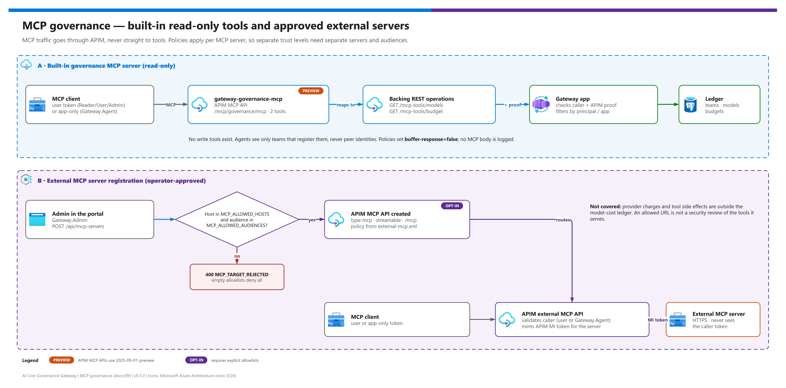

[README](../README.md) › [docs index](./00-reproduce-this-demo.md) › 09 MCP governance

# 09 - MCP governance

<p>
  
  
  
  
  
  
</p>

<p>
  
  
  
  
</p>

How Model Context Protocol (MCP) traffic is governed. Every MCP client reaches tools **through APIM**, never directly: a built-in, read-only governance MCP server exposes the model catalog and the caller's budgets, and administrators can register **operator-approved** external MCP servers that APIM fronts with its own managed identity. This page is for platform engineers and security reviewers deciding what agents may call and how.

## At a glance

| | Topic | One-line answer |
|---|---|---|
|  | **Built-in server** | `gateway-governance-mcp` at `/mcp/governance/mcp`, two read-only tools (`list_models`, `read_budget`). |
|  | **External servers** | Registered at runtime by a `Gateway.Admin`, only for exact allowlisted HTTPS hosts and token audiences. |
|  | **Callers** | Delegated users (Reader/User/Admin) or app-only callers with `Gateway.Agent`. |
|  | **Backend auth** | External servers get an APIM managed-identity token for their own audience - never the caller's token. |
|  | **Policy scope** | Per MCP **server**, not per tool. Separate trust levels need separate servers and audiences. |
|  | **Cost** | External provider charges and tool side effects are **outside** the model-cost ledger. |

> [!WARNING]
> **Preview API.** APIM MCP API and tool resources pin `Microsoft.ApiManagement` API version `2025-09-01-preview`. Revalidate regional/SKU support and the exact resource schema before deploying; local Bicep compilation is not an Azure deployment acceptance test. MCP does not use APIM Consumption or workspaces. See [MCP server overview](https://learn.microsoft.com/azure/api-management/mcp-server-overview).

## Flow

[](./assets/mcp-governance-flow.png)

<sub>Editable source: [`assets/mcp-governance-flow.drawio`](./assets/mcp-governance-flow.drawio) - regenerate with `python scripts/export_diagrams.py docs/assets`.</sub>

| | Built-in governance server | External MCP server |
|---|---|---|
| **Created by** | Bicep (`infra/modules/gateway.bicep`) | The governance API at runtime (`POST /api/mcp-servers`) |
| **Tools** | `list_models`, `read_budget` (read-only) | Whatever the external server exposes |
| **Caller auth at APIM** | Entra token, roles Reader/User/Admin/Agent, rate limit 120/min per `oid` | Entra token, roles User/Admin/Agent, rate limit 60/min per API + `oid` |
| **Backend auth** | APIM proof token (`Gateway.Invoke`) + the caller's token to the governance API | APIM managed-identity token for the server's allowlisted audience only |
| **Data filtering** | The API filters by the caller's principal or app registration | None - the server decides |
| **Status** |   |   |
| **Recommendation** | Give agents read-only budget and catalog awareness | Register only servers whose tools you have reviewed |

## Built-in read-only governance tools

The backing REST API exposes exactly `GET /mcp-tools/models` and `GET /mcp-tools/budget`. Native APIM MCP API `gateway-governance-mcp` exports those two operation resource IDs as tools at `/mcp/governance/mcp`; it exposes no writes. Both the MCP server policy and the direct backing REST policy require `Gateway.Reader`, `Gateway.User`, `Gateway.Admin` or `Gateway.Agent`. The application filters results by principal.

| MCP tool | Operation | Returns | Caller sees |
|---|---|---|---|
| `list_models` | `GET /mcp-tools/models` | Enabled models | Only models visible to the authenticated principal |
| `read_budget` | `GET /mcp-tools/budget` | Current budgets | Only the caller's teams; app-only callers see only teams that register them, never peer identities |

Both require the same end-user or app-only (`Gateway.Agent`) and gateway authentication as inference. The server is represented by `Microsoft.ApiManagement/service/apis` with `type: 'mcp'`; its `service/apis/tools` resources reference full backing operation resource IDs.

> [!NOTE]
> Built-in tools are read-only catalog/budget operations, not privileged deployment-management tools. There is no MCP tool that creates teams, changes budgets or deploys models.

## Registering an external MCP server

External registrations are created at runtime by the backend, not by `main.bicep`. Their verified management shape is `type: 'mcp'`, an HTTPS `serviceUrl` origin, and `mcpProperties` with `transportType: 'streamable'` and one endpoint `{ name: 'message', uriTemplate: '/mcp' }`. See [manage MCP servers with the REST API](https://learn.microsoft.com/azure/api-management/manage-mcp-servers-rest-api).

| Step | | Action | Gate |
|---|---|---|---|
| **1** |  | Approve the server: set `MCP_ALLOWED_HOSTS` (exact public DNS names) and `MCP_ALLOWED_AUDIENCES` (exact managed-identity resource audiences), then redeploy. | ☐ Both lists set; neither contains the internal proof audience |
| **2** |  | A `Gateway.Admin` opens **MCP** in the portal and registers `{id, name, path, backendUrl, authAudience}`. | ☐ Saved, no `MCP_TARGET_REJECTED` |
| **3** |  | The API validates host/audience against the allowlists, generates the policy from the reference template, and creates the APIM MCP API using its runtime identity's narrow APIM role. | ☐ API visible in APIM |
| **4** |  | Grant APIM's identity the application permission the external server expects for that audience. | ☐ Server accepts APIM's token |
| **5** |  | Test `initialize`, `tools/list` and `tools/call` through APIM with a user and an app-only token. | ☐ Streaming works, no body logged |

Empty MCP allowlists deny external registrations - this is the default. Wildcards, IPs and URLs are rejected (`INVALID_MCP_HOSTS`), and the internal gateway-proof audience is refused (`INVALID_MCP_AUDIENCES`). Do not reuse the internal proof audience for an external server. Configure each approved external MCP API's application permissions for APIM separately.

<details><summary><b>Show the external MCP reference policy (infra/policies/external-mcp.xml)</b></summary>

```xml
<!-- Reference for runtime registration, not deployed by main.bicep.
     Replace __AUTH_AUDIENCE__ only after exact operator allowlist validation
     and XML escaping. Backend owns the equivalent runtime policy generation. -->
<policies>
  <inbound>
    <base />
    <validate-azure-ad-token tenant-id="{{entra-tenant-id}}" header-name="Authorization" failed-validation-httpcode="401" output-token-variable-name="callerJwt">
      <audiences><audience>{{entra-api-audience}}</audience></audiences>
      <required-claims>
        <claim name="roles" match="any">
          <value>Gateway.User</value><value>Gateway.Admin</value><value>Gateway.Agent</value>
        </claim>
      </required-claims>
    </validate-azure-ad-token>
    <rate-limit-by-key calls="60" renewal-period="60" counter-key='@("external-mcp:" + context.Api.Id + ":" + ((Jwt)context.Variables["callerJwt"]).Claims.GetValueOrDefault("oid", ""))' />
    <set-header name="X-Team-Id" exists-action="delete" />
    <set-header name="X-Gateway-Authorization" exists-action="delete" />
    <!-- External servers receive their own MI audience, never the user's token. -->
    <authentication-managed-identity resource="__AUTH_AUDIENCE__" ignore-error="false" />
  </inbound>
  <backend>
    <forward-request timeout="120" buffer-request-body="false" buffer-response="false" />
  </backend>
</policies>
```

</details>

The `__AUTH_AUDIENCE__` marker must be XML-escaped and replaced only after allowlist validation. Never deploy the marker literally. The external MCP policy accepts either a delegated user (gateway scope + user role) or an app-only caller with `Gateway.Agent`.

## Limits of server-level policy

APIM MCP policies apply at **server** scope. Use distinct MCP APIs/products or audiences for different trust levels; do not assume native per-caller tool filtering within one server. This repository does not claim tool filtering.

| Need | Supported here? | How |
|---|---|---|
| Different callers see different tools on one server | ❌ | Split into separate MCP servers with separate audiences and backend authorization |
| Read-only governance tools for every gateway caller | ✅ | Built-in server |
| A high-risk tool for administrators only | ⚠️ | Separate server, separate audience, backend-side authorization |
| Charge external tool usage to a team budget | ❌ | Outside the ledger; track with the provider |
| Recommendation | - | **One server per trust level**, reviewed before allowlisting |

> [!CAUTION]
> An allowed URL is **not** a security review of the tools it serves. Do not send a privileged token to a caller-supplied host/audience, and do not register a server whose tools you have not reviewed. See [securing MCP servers](https://learn.microsoft.com/azure/api-management/secure-mcp-servers).

## Streaming and logging

Do not log MCP response bodies or read them in a policy that would buffer a stream. No policy reads or logs MCP response bodies, and MCP policies set `buffer-response="false"`. Only the bounded, non-streaming inference response is buffered so that `llm-emit-token-metric` can read its `usage`. All APIs use JWT auth with `subscriptionRequired: false`; no subscription keys are created or returned.

| Route | Buffered? | Body logged? |
|---|---|---|
| `/openai/v1/chat/completions` | ✅ bounded 2 MB, non-streaming | ❌ |
| `/mcp/governance/mcp` | ❌ | ❌ |
| External MCP APIs | ❌ | ❌ |

## Cost boundary

> [!IMPORTANT]
> MCP tool calls are never charged to a team budget. Watch provider costs where the provider bills them.

External MCP server execution is subject to its own authentication/rate policies; external-provider charges are **not** part of the model-cost ledger. Provider costs and tool side effects are not controlled by the model budget ledger. The portal flags every server with `toolCostsCovered: false`. See [06 - Budgets and ledger](./06-budgets-and-ledger.md#boundaries).

---

Next: [10 - API reference](./10-api-reference.md) →

*Last updated: 2026-10-08*
