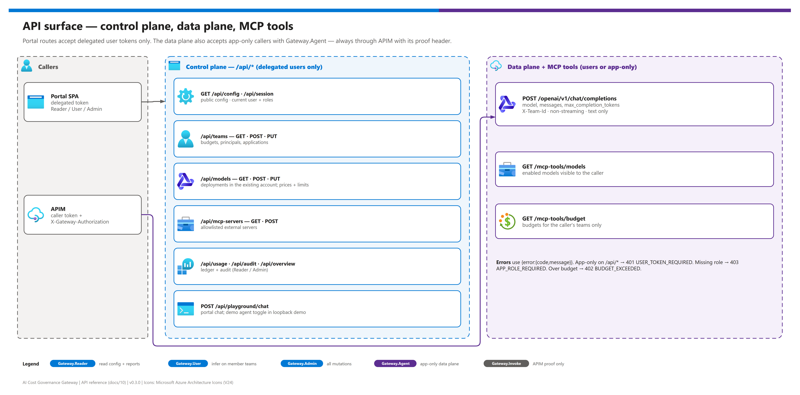

[README](../README.md) › [docs index](./00-reproduce-this-demo.md) › 10 API reference

# 10 - API reference

<p>
  
  
  
  
  
</p>

<p>
  
  
  
</p>

The application contract of the governance API: the browser control plane (`/api/*`), the OpenAI-compatible inference data plane, and the read-only tools that APIM exposes as MCP. It lists every route, the role it needs, request and response shapes, and error codes. It is for developers integrating clients or agents with the gateway.

## At a glance

| | Topic | One-line answer |
|---|---|---|
|  | **Money** | Non-negative safe integers in **USD microdollars** (1 USD = 1,000,000). Prices are microdollars per million tokens. |
|  | **Shapes** | Errors `{ "error": { "code": "...", "message": "..." } }`; lists `{ "items": [...] }`. |
|  | **Auth** | Entra bearer access tokens. Demo mode is loopback-only and prominently labeled. |
|  | **Control plane** | Delegated users only. Mutations need `Gateway.Admin`; reads need `Gateway.Reader` or `Gateway.Admin`. |
|  | **Data plane** | Users (`Gateway.User`/`Gateway.Admin` + team membership) or app-only callers (`Gateway.Agent` + team registration), through APIM. |
|  | **MCP tools** | `GET /mcp-tools/models`, `GET /mcp-tools/budget` - exported by APIM as MCP tools. |

> [!IMPORTANT]
> **Never trust cost, role, price, or usage data supplied by a caller.** Principal IDs are validated Entra `oid` values, not user-provided team headers. `X-Team-Id` selects a team; membership is checked against the token.

## Surface map

[](./assets/api-surface-map.png)

<sub>Editable source: [`assets/api-surface-map.drawio`](./assets/api-surface-map.drawio) - regenerate with `python scripts/export_diagrams.py docs/assets`.</sub>

Mutations require `Gateway.Admin`; read access requires `Gateway.Reader` or `Gateway.Admin`. User-only sessions may read principal-filtered team/model lists for the playground, but not organization-wide budgets, audit, or management inventory. Inference requires `Gateway.User` or `Gateway.Admin` AND membership in the selected team's `principals` list.

App-only callers (managed identities, service principals, Entra agent identities) may use the **data plane only** (`/openai/v1/chat/completions` and `/mcp-tools/*`) when their token has no `scp`, carries the application-permission app role `Gateway.Agent`, and their service-principal object ID (token `oid`) is listed in the selected team's `applications`. The client application ID (`azp`, or v1 `appid`) is recorded for attribution. App-only tokens are rejected on every `/api/*` portal route, and a delegated user token never gains `Gateway.Agent` even if the claim is present.

## Browser control plane

| Route | Role | Request | Response |
|---|---|---|---|
| `GET /healthz` | public | - | `{status:"ok",mode}` - liveness, no secrets |
| `GET /readyz` | public | - | `200` when the durable database and schema are ready, else `503 NOT_READY` |
| `GET /api/config` | public | - | `{mode:"demo"\|"azure", auth:{tenantId,clientId,apiScope}}` |
| `GET /api/session` | any user | - | `{user:{id,name,roles:string[],type:"user"},mode,demoAgent?}` - `demoAgent:{id,name,clientAppId}` only in the loopback demo |
| `GET /api/overview` | Reader / Admin | - | `{period,teams,deployments,mcpServers,budgetMicros,spentMicros,reservedMicros}` |
| `GET /api/teams` | Reader / Admin (users: own teams) | - | list of `{id,name,monthlyBudgetMicros,spentMicros,reservedMicros,period,allowedModels:string[],principals:string[],applications:string[]}` |
| `POST /api/teams` | Admin | `{id,name,monthlyBudgetMicros,allowedModels,principals,applications?}` | `201` team |
| `PUT /api/teams/:id` | Admin | `{name,monthlyBudgetMicros,allowedModels,principals,applications?}` | team |
| `GET /api/models` | Reader / Admin (users: allowed models) | - | list of `{id,displayName,deploymentName,modelName,modelVersion,status,inputPriceMicrosPerMillion,outputPriceMicrosPerMillion,contextWindowTokens,maxOutputTokens,pricingValidUntil,enabled}` |
| `POST /api/models` | Admin | `{id,displayName,deploymentName,modelName,modelVersion,sku,capacity,inputPriceMicrosPerMillion,outputPriceMicrosPerMillion,contextWindowTokens,maxOutputTokens,pricingValidUntil,enabled}` | `202` (Azure, asynchronous provisioning) or `201` (demo) |
| `PUT /api/models/:id` | Admin | `{displayName,inputPriceMicrosPerMillion,outputPriceMicrosPerMillion,contextWindowTokens,maxOutputTokens,pricingValidUntil,enabled}` | model |
| `GET /api/mcp-servers` | Reader / Admin | - | list of `{id,name,path,backendUrl,authAudience,status,toolCostsCovered:false}` |
| `POST /api/mcp-servers` | Admin | `{id,name,path,backendUrl,authAudience}` | `202` (Azure) or `201` (demo) |
| `GET /api/usage` | Reader / Admin | - | list of `{id,createdAt,teamId,modelId,reservedMicros,chargedMicros,status,actorId,actorType:"user"\|"app",clientAppId?,promptTokens?,completionTokens?}` |
| `GET /api/audit` | Reader / Admin | - | list of `{id,timestamp,actor,actorType,action,target,outcome,detail}` |
| `POST /api/playground/chat` | User / Admin + team | `{teamId,modelId,messages:[{role,content}],maxCompletionTokens,simulateAgent?}` | `{id,content,usage:{promptTokens,completionTokens,chargedMicros}}` |

Route notes:

- **Teams.** `applications` are service-principal object IDs of app-only callers. Omitting it on update preserves the stored list; an ID cannot be in both lists (`PRINCIPAL_CONFLICT`). A budget below current-month spent plus reserved funds is rejected (`BUDGET_COMMITTED`).
- **Models.** `POST` provisions within the configured existing Foundry account, never an arbitrary caller-supplied account. `PUT` changes pricing/governance fields only. Model provisioning status is the provider state, or `demo` for local simulated models.
- **MCP servers.** Register an HTTPS Streamable HTTP server in APIM only if its host/audience is operator-allowlisted. Never return tokens or subscription keys. See [09 - MCP governance](./09-mcp-governance.md).
- **Usage.** Status is `reserved`, `held`, `invalid_usage`, or `settled`; the first three still consume reserved budget.
- **Audit.** `actorType` is `user`, `app`, `system`, or `unknown` for rows written before v0.2.0.
- **Playground.** `simulateAgent:true` runs as the fake demo agent identity and is rejected with `DEMO_ONLY` outside the loopback demo. The portal playground calls APIM using the user's token, not Foundry directly.

## Inference data plane

`POST /openai/v1/chat/completions` accepts the supported OpenAI subset `{model,messages,max_completion_tokens,stream?:false}` plus the `X-Team-Id` header, and returns an OpenAI-compatible Chat Completions response. Only plain-text system/user/assistant messages are supported. Streaming, tools, images, audio, `n != 1`, unknown options and unsupported model IDs are explicitly rejected.

```http
POST {APIM_GATEWAY_URL}/openai/v1/chat/completions
Authorization: Bearer <user or app-only access token for the user API>
X-Team-Id: product-engineering
Content-Type: application/json

{ "model": "<gateway model id>", "max_completion_tokens": 256,
  "messages": [ { "role": "user", "content": "Summarize our budget policy." } ] }
```

Production inference requires both a valid end-user (or app-only) token and APIM's separate managed-identity proof header `X-Gateway-Authorization` (a bearer token for `GATEWAY_API_AUDIENCE`, validated against the configured `APIM_PRINCIPAL_ID` and the application role `Gateway.Invoke`). APIM preserves the caller's Authorization header.

> [!WARNING]
> Clients must not retry automatically. A `502 RESERVATION_HELD` or `GATEWAY_OUTCOME_UNCERTAIN` means the provider **may** have billed the call; the reservation stays held. A client retry is a new admission with a new maximum reservation.

### App-only (agent) callers

An agent running as a managed identity or service principal requests a token for `api://<ENTRA_API_AUDIENCE>/.default` (client credentials or managed identity) and calls `POST <APIM_GATEWAY_URL>/openai/v1/chat/completions` with `X-Team-Id`. Prerequisites: an administrator assigns the agent's service principal the `Gateway.Agent` app role on the user API enterprise application, and registers the same object ID in the team's `applications` ([07 - Identity and security](./07-identity-and-security.md#enable-an-app-only-caller)). Errors: `APP_ROLE_REQUIRED` (403, role missing), `TEAM_ACCESS_DENIED` (403, not registered to the team or model not allowed), `BUDGET_EXCEEDED` (402). Reservations, settlement and audit record `actorType=app` and the client application ID.

In the loopback demo, send `X-Demo-Caller: app` on the data-plane routes to act as the fake demo agent (registered to `demo-engineering` by the demo seed):

```powershell
$body = @{ model = 'demo-chat'; max_completion_tokens = 32; messages = @(@{ role = 'user'; content = 'Hello from an agent' }) } | ConvertTo-Json -Depth 4
Invoke-RestMethod http://127.0.0.1:3001/openai/v1/chat/completions -Method Post -ContentType application/json `
  -Headers @{ 'X-Team-Id' = 'demo-engineering'; 'X-Demo-Caller' = 'app' } -Body $body
```

## Read-only tools exposed as MCP by APIM

| Route | Returns | Who |
|---|---|---|
| `GET /mcp-tools/models` | Enabled models visible to the authenticated principal | User (Reader/User/Admin) or app-only (`Gateway.Agent`) |
| `GET /mcp-tools/budget` | Current budgets for that principal's teams | Same; app-only callers see only teams that register them, never peer identities |

APIM exports these REST operations as a separate MCP API. Both require the same end-user or app-only (`Gateway.Agent`) and gateway authentication as inference. External MCP server execution is subject to its own authentication/rate policies; external-provider charges are **not** part of the model-cost ledger.

## Budget invariant (contract)

```text
settled spend + all outstanding reservations + new maximum charge <= configured monthly budget
```

Before contacting Foundry, atomically reserve a conservative upper charge against the UTC monthly team ledger using transactional row locking. Include existing settled spend and all in-flight/uncertain reservations in admission. Capture immutable pricing and month on each reservation. Settle once using validated provider usage; do not release money on timeout, missing usage, crashes, or uncertain outcomes. Never automatically retry inference or replay an old request to Foundry. Reject stale pricing or unavailable durable storage.

The initial conservative maximum reserves the configured deployment context window at the greater of input/output rates (plus any necessary separately bounded output allowance). Administrators must verify actual deployment limits and rate cards. Text input has a conservative UTF-8-byte/framing bound before admission. This is a configured-price admission guarantee, NOT a cap on the Azure invoice or bypass traffic. Keep uncertain reservations until an explicit, auditable reconciliation with evidence. Full detail: [06 - Budgets and ledger](./06-budgets-and-ledger.md).

## Error codes

| HTTP | Code | Meaning |
|---|---|---|
| 400 | `INVALID_REQUEST` | Invalid, missing, unsafe or unsupported fields (schema validation) |
| 400 | `CONTEXT_LIMIT` | Conservative input bound plus requested output exceeds verified model limits |
| 400 | `DEMO_ONLY` | Agent simulation requested outside the loopback demo |
| 400 | `IDEMPOTENCY_NOT_SUPPORTED` | Replay keys are not supported; inference is never retried |
| 400 | `PRINCIPAL_CONFLICT` | An object ID is both a user member and an application identity |
| 400 | `MCP_TARGET_REJECTED` | MCP host, path or audience not allowlisted, or not public HTTPS |
| 400 | `STALE_PRICING` / `UNKNOWN_MODEL` / `UNSUPPORTED_QUERY` | Invalid model configuration or request options |
| 401 | `UNAUTHENTICATED` / `INVALID_TOKEN` | Missing or invalid bearer token |
| 401 | `USER_TOKEN_REQUIRED` | An app-only token on a portal route |
| 402 | `BUDGET_EXCEEDED` | Insufficient prepaid monthly budget, including held reservations |
| 403 | `APP_ROLE_REQUIRED` | App-only caller without `Gateway.Agent` |
| 403 | `TEAM_ACCESS_DENIED` | Caller not on the team, or model not allowed for it |
| 403 | `GATEWAY_PROOF_REQUIRED` | Missing or invalid APIM proof header |
| 403 | `FORBIDDEN` / `MODEL_DISABLED` | Role missing; model disabled, quarantined or not ready |
| 403 | `DEMO_LOCAL_ONLY` / `ORIGIN_REJECTED` | Non-loopback demo request; cross-origin request |
| 404 | `NOT_FOUND` / `TEAM_NOT_FOUND` / `MODEL_NOT_FOUND` / `RESERVATION_NOT_FOUND` | Unknown route or resource |
| 409 | `ALREADY_EXISTS` / `BUDGET_COMMITTED` | Duplicate team; budget below committed funds |
| 409 | `STALE_PRICING` / `MODEL_NOT_READY` / `MODEL_QUARANTINED` / `UNSUPPORTED_DEPLOYMENT` / `INVENTORY_ID_COLLISION` | Model lifecycle conflicts |
| 502 | `RESERVATION_HELD` / `INVALID_USAGE_RESERVATION_HELD` | Uncertain or out-of-bound outcome; money stays held |
| 502 | `GATEWAY_OUTCOME_UNCERTAIN` / `GATEWAY_REQUEST_FAILED` | Playground call to APIM failed or could not be verified |
| 502 | `AZURE_CONTROL_PLANE_FAILED` / `INVENTORY_LIMIT` | ARM call failed or inventory exceeded the bounded page limit |
| 503 | `SERVICE_UNAVAILABLE` / `NOT_READY` / `STORAGE_UNAVAILABLE` / `DATABASE_OPERATION_FAILED` / `DATABASE_IDENTITY_FAILED` / `MANAGED_IDENTITY_UNAVAILABLE` | Durable storage or identity unavailable - fail closed |

> [!NOTE]
> Startup configuration errors (`CONFIG_MISSING`, `CONFIG_INVALID`, `DEMO_LOCAL_ONLY`, `DATABASE_RUNTIME_ROLE_UNSAFE`) stop the process before it serves traffic. They are listed with fixes in [05 - Troubleshooting](./05-troubleshooting.md#governance-api-startup).

---

Next: [11 - azd integration contract](./11-azd-integration-contract.md) →

*Last updated: 2026-10-08*
