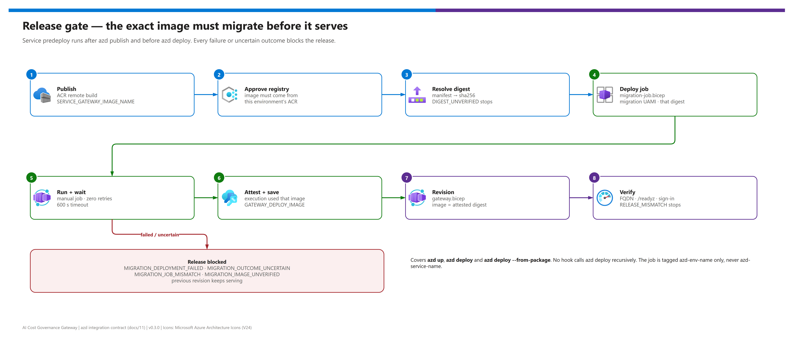

[README](../README.md) › [docs index](./00-reproduce-this-demo.md) › 11 azd integration contract

# 11 - azd integration contract

<p>
  
  
  
  
  
  
</p>

<p>
  
  
  
  
</p>

The engineering contract behind `azd up`: which template deploys what, in which order, which environment values flow in and out, how the database identity model works, and why the release is gated on a migration job that ran the exact image digest. It is for maintainers changing the infrastructure or hooks, and for reviewers who want to know what the automation is allowed to do. Operators who just want to deploy should start with [03 - Deployment](./03-deployment.md).

## At a glance

| | Topic | One-line answer |
|---|---|---|
|  | **Templates** | `infra/azd/main.bicep` (subscription scope, provision), `gateway.bicep` (revision), `migration-job.bicep` (gated job). |
|  | **Build** | Native azd remote build in ACR from the existing `Dockerfile`; no local Docker. |
|  | **Release gate** | Service `predeploy` resolves the digest, runs the migration job on it, and only then saves `GATEWAY_DEPLOY_IMAGE`. |
|  | **Database** | Private PostgreSQL 17, Entra-only; migration identity is the only administrator; runtime gets a mapped non-admin role. |
|  | **Entra** | Created or validated in `preup`; provision hooks never change Entra. |
|  | **Validation** | `npm run validate:azd` and `scripts/Test-AzdInfrastructure.ps1` compile every entry point and check this contract offline. |

> [!NOTE]
> The azd profile is additive: `infra/azd` is the subscription-scoped entry point. `infra/main.bicep` and the PowerShell helper remain the advanced bring-your-own-resource alternative ([03b](./03b-manual-deployment.md)); this profile reuses its modules (`foundry-access.bicep`, `gateway.bicep`, `observability.bicep`) and policies without modifying them.

## Release gate

[](./assets/azd-release-gate.png)

<sub>Editable source: [`assets/azd-release-gate.drawio`](./assets/azd-release-gate.drawio) - regenerate with `python scripts/export_diagrams.py docs/assets`.</sub>

Ordering was verified in azd 1.30.0's `service_manager.go`: Publish completes before the service Deploy event. Publish saves `SERVICE_GATEWAY_IMAGE_NAME`; the hook resolves its registry manifest to a digest and saves `GATEWAY_DEPLOY_IMAGE` only after that exact image's job succeeds. The revision parameter file consumes that digest. Direct `azd deploy` runs the same gate, including `--from-package`; unapproved registries are rejected (`UNAPPROVED_IMAGE`, `REGISTRY_MISMATCH`). No hook calls `azd deploy` recursively.

## Deployment sequence

| Step | | Stage | What it does |
|---|---|---|---|
| **1** |  | `preup` | Verifies tools, selected tenant/subscription/region and existing Foundry inputs, then creates or validates owned Entra registrations. `preprovision` repeats read-only validation; provision hooks never create or change Entra registrations. |
| **2** |  | provision | Creates a resource group, ACR, APIM, Container Apps environment, private PostgreSQL 17/network/DNS, Log Analytics, workspace-based Application Insights with an APIM managed-identity logger and inference diagnostics (LLM token metrics), runtime and migration identities, and narrowly scoped role assignments. No application placeholder is published. |
| **3** |  | package + publish | azd builds and publishes the application remotely through ACR using the existing Dockerfile and the public npm registry (or a build-argument mirror). |
| **4** |  | service `predeploy` | Configures APIM's `Gateway.Invoke` application-role assignment and the SPA redirect URI, idempotently and failure-closed. |
| **5** |  | service `predeploy` | After native publish, runs a manual Container Apps migration job with that exact published image, waits for success, and blocks app release on failure. The job has a separate PostgreSQL administrator identity. |
| **6** |  | deploy | azd revision-based deployment applies the application Bicep with its actual image. Runtime has only PostgreSQL application-data permissions; startup verifies the schema, never migrates production. |
| **7** |  | `postdeploy` | Checks actual application readiness and identity/endpoint setup. Command success must not imply unperformed live MCP/inference tests. |

## Deployment boundary and release contract

- `main.bicep` is **subscription scoped**. It creates `rg-${AZURE_ENV_NAME}` with `azd-env-name`, two distinct user-assigned identities, Basic ACR, APIM, a private PostgreSQL 17 server/database and DNS/network, and an ACA workload-profile environment containing only the **Consumption** profile. It creates **no Container App or migration job**, hence no first revision.
- `gateway.bicep` is **resource-group scoped**, applied by azd's revision-based service deployment. Its required `imageName` is `${GATEWAY_DEPLOY_IMAGE}`: the immutable digest resolved by service predeploy from native publish's `${SERVICE_GATEWAY_IMAGE_NAME}`. There is no placeholder, empty-image fallback, local Docker invocation or image rebuild. Keep `azure.yaml`'s service API version at `2025-01-01`.
- `migration-job.bicep` is a separate **resource-group scoped** deployment created/updated by the **service predeploy hook**, which azd 1.30.0 runs **after** Publish has saved `SERVICE_GATEWAY_IMAGE_NAME`. `migration-job.parameters.json` documents the complete substitution contract. The hook compiles `migration-job.bicep` using local `bicep build --stdout` and submits the template and resolved parameters to ARM using azd authentication. It does not use Azure CLI authentication or rely on ARM to expand `${...}` placeholders. The hook validates the published registry image, resolves its immutable digest, creates/updates and starts the job with that same digest, and waits for success. It saves `GATEWAY_DEPLOY_IMAGE` only after successful execution before allowing native deploy. It rejects a missing, stale or failed migration gate. Only service predeploy is used, not postpublish or recursive deploy; this covers `azd up`, direct `azd deploy` and `azd deploy --from-package`.
- The job runs `node apps/api/dist/bootstrap.js`, manually, one replica, a 600-second timeout, and **zero automatic retries**. An explicit operator rerun uses the bootstrap's idempotency and principal-mapping checks. It is intentionally **not** tagged `azd-service-name=gateway`: discovery must not confuse the job with the application.
- Foundation outputs include the deterministic app ID and expected URL `https://<app-name>.<ACA-environment-defaultDomain>`. APIM uses that same URL before the application exists. Service predeploy configures the SPA redirect and `Gateway.Invoke` assignment; postdeploy compares the actual FQDN to the expected URL and verifies readiness. A provision-only URL is not proof of a running app.

The service also outputs the actual `SERVICE_GATEWAY_ENDPOINT_URL`; it intentionally does not overwrite the expected `GATEWAY_URL` before the hook compares them. In azd 1.30.0, `deploymentHost` does **not** look up a named template output: it examines the deployment result's `Resources` (ARM `outputResources`) and parses the deployed resource IDs. The service template deploys exactly one `Microsoft.App/containerApps` resource and no competing app/job host.

The migration template's exact ARM parameter contract is `environmentName`, `location`, `jobName`, `containerAppsEnvironmentName`, `containerRegistryName`, `migrationIdentityId`, `migrationClientId`, `imageName`, `postgresHost`, `postgresDatabase`, `postgresAppRole`, `migrationPrincipalName`, and `runtimePrincipalId`. The hook supplies the foundation environment and registry names; the template resolves their resource ID and login server. It tags the job with `azd-env-name`, never `azd-service-name`, and sets `GATEWAY_MODE=azure` and `DATABASE_AUTH=entra` for bootstrap.

> [!IMPORTANT]
> Do not run concurrent deployments against the same azd environment. A failed or uncertain job blocks release; there is no `continueOnError` escape hatch.

## Environment inputs

Subscription, tenant and location are **operator-selected at actual deployment**; this profile never infers a usable subscription from an existing CLI login. Foundry inputs refer to an existing account **in that same subscription**. The account must be reachable from the app; this profile does not change its firewall, private endpoints, deployed models or DNS.

| Group | Values | Notes |
|---|---|---|
| Required at deployment | `AZURE_ENV_NAME`, `AZURE_SUBSCRIPTION_ID`, `AZURE_LOCATION`, `AZURE_TENANT_ID` | Tenant ↔ subscription is verified (`TENANT_MISMATCH`) |
| Existing Foundry | `FOUNDRY_RESOURCE_GROUP`, `FOUNDRY_ACCOUNT_NAME`, `FOUNDRY_ENDPOINT` | Endpoint derived from the account and checked (`FOUNDRY_ENDPOINT_MISMATCH`) |
| APIM publisher | `APIM_PUBLISHER_NAME`, `APIM_PUBLISHER_EMAIL` | Setup may prompt or require explicit values |
| Created or validated by setup | `ENTRA_SPA_CLIENT_ID`, `ENTRA_API_AUDIENCE`, `ENTRA_API_SCOPE`, `GATEWAY_API_AUDIENCE` | User and proof API audiences must remain distinct |
| Saved for safe resume | Graph application/object IDs, `GATEWAY_AGENT_ROLE_ID` | Nonsecret; access tokens are never persisted |

`FOUNDRY_ENDPOINT` and `ENTRA_SPA_CLIENT_ID`/`ENTRA_API_SCOPE` are passed to the release, not used to create new Foundry or Graph resources. Setup also saves `GATEWAY_AGENT_ROLE_ID` (the user API's Application-only `Gateway.Agent` app role) when that role exists. It is never assigned automatically; operators assign it per app-only caller.

Optional development defaults are explicit, validated, and documented: APIM Developer (evaluation, no production SLA), PostgreSQL Burstable, empty external MCP allowlists, `LLM_TOKENS_PER_MINUTE_PER_CALLER=0` (optional `llm-token-limit` off). Foundry remains an existing account. Every optional value with its default is listed in [12 - Configuration reference](./12-configuration-reference.md#azd-environment-variables).

## Shared infrastructure outputs

Use these exact names or coordinate a change before consumers are written. The offline test reads this table and fails if any listed output is missing from the compiled template.

| Output | Meaning |
| --- | --- |
| `AZURE_RESOURCE_GROUP` | New resource group |
| `AZURE_CONTAINER_REGISTRY_NAME` | ACR name |
| `AZURE_CONTAINER_REGISTRY_ENDPOINT` | ACR login server |
| `AZURE_CONTAINER_APPS_ENVIRONMENT_NAME` | ACA environment name |
| `AZURE_CONTAINER_APPS_ENVIRONMENT_ID` | ACA environment resource ID |
| `AZURE_CONTAINER_APP_NAME` | Deterministic gateway app name |
| `SERVICE_GATEWAY_RESOURCE_ID` | Gateway resource ID, even before first release |
| `GATEWAY_URL` | Expected application HTTPS URL using environment default domain |
| `APIM_SERVICE_NAME`, `APIM_RESOURCE_GROUP`, `APIM_GATEWAY_URL` | APIM coordinates |
| `APIM_PRINCIPAL_ID` | APIM system-assigned identity object ID |
| `AZURE_CLIENT_ID` | Runtime UAMI client ID |
| `RUNTIME_IDENTITY_ID`, `RUNTIME_PRINCIPAL_ID` | Runtime identity resource/object ID |
| `MIGRATION_IDENTITY_ID`, `MIGRATION_CLIENT_ID` | Migration UAMI resource/client ID |
| `MIGRATION_PRINCIPAL_ID`, `MIGRATION_PRINCIPAL_NAME` | PG Entra admin object/display name |
| `POSTGRES_HOST`, `POSTGRES_DATABASE` | Server FQDN and application database |
| `POSTGRES_APP_ROLE` | Runtime database role, `gateway_app` |
| `DATABASE_URL` | Passwordless runtime URI with `sslmode=verify-full` |
| `DATABASE_AUTH` | `entra` |
| `MIGRATION_JOB_NAME` | Manual job name for bootstrap and migrations |
| `AZURE_LOG_ANALYTICS_WORKSPACE_ID` | Shared Log Analytics workspace resource ID |
| `APPLICATIONINSIGHTS_NAME`, `APPLICATIONINSIGHTS_ID` | Workspace-based Application Insights receiving APIM telemetry and LLM token metrics |

## Application database authentication

The existing database-URL password authentication behavior is kept for the manual profile and demo. `DATABASE_AUTH=entra` is used for azd. In this mode a `ManagedIdentityCredential` obtains an Azure PostgreSQL access token per new connection (never embedded in the URI or logged). There is no credential fallback.

The migration image entry point is `node apps/api/dist/bootstrap.js`. It consumes:

| Variable | Value |
|---|---|
| `AZURE_CLIENT_ID` | Migration identity client ID - not the runtime identity |
| `POSTGRES_HOST`, `POSTGRES_DATABASE`, `POSTGRES_APP_ROLE` | Server FQDN, database, runtime role (`gateway_app`) |
| `MIGRATION_PRINCIPAL_NAME` | Administrator login name (the migration UAMI display name) |
| `RUNTIME_PRINCIPAL_ID` | Application identity object ID |

It maps `gateway_app` to the runtime service principal using supported `pgaadauth` functions, refuses an existing role mapped to another principal, runs idempotent migrations, then grants only required table permissions. Audit is append/read; migration metadata is read-only for the runtime. The runtime must not be the PostgreSQL administrator (`DATABASE_RUNTIME_ROLE_UNSAFE`). Bootstrap never loads a `.env` file; only the job's explicit environment is consumed. Reference: [manage Microsoft Entra users in PostgreSQL](https://learn.microsoft.com/azure/postgresql/security/security-manage-entra-users).

## Database, network and identity boundaries

The new VNet uses `10.42.0.0/16`, with an ACA-delegated `10.42.0.0/23` subnet and PostgreSQL-delegated `10.42.2.0/24` subnet. This is a **workload-profile environment with Consumption**, not the older consumption-only networking model. No peering or customer route table is created. Review address overlap before connecting this isolated development VNet to other networks.

| Resource | Product | Setting |
|---|---|---|
|  PostgreSQL | Azure Database for PostgreSQL | Linked `private-<token>.postgres.database.azure.com` private DNS zone, delegated subnet, `publicNetworkAccess: Disabled`; **no firewall rules**, local-password inputs, password outputs or local administrator |
|  NSG | Network security group | Accepts 5432 only from ACA and its own database subnet before denying other VNet inbound traffic; default outbound keeps Entra and Storage connectivity |
|  Migration UAMI | Managed identity | The **only** database Entra administrator (`ServicePrincipal`, object ID + display name); no Foundry/APIM management roles |
|  Runtime UAMI | Managed identity | Not an administrator; mapped to `gateway_app`; URI `postgresql://gateway_app@<server-FQDN>:5432/gateway?sslmode=verify-full` |
|  ACR | Container Registry | Basic; admin and anonymous access off; registry RBAC (not repository ABAC); ARM-audience token support for ACA identity pulls; both identities `AcrPull` only |
|  ACA | Container Apps | App and job each request 0.5 vCPU / 1 GiB; Log Analytics retains 30 days |

ACR, APIM and ACA HTTPS ingress are public to support remote build, browser and APIM access; only database connectivity is private. Public ACA ingress does not bypass the application's user-token and APIM-proof authorization checks.

The existing Foundry module grants runtime account-scoped inference and a custom deployment read/write role, not account creation/deletion or key reads. The APIM runtime role permits only API registration/read/policy operations. APIM's own system identity acquires the separate proof-API token; the Entra `Gateway.Invoke` app-role assignment is performed by setup, **not Bicep**. No runtime identity receives Graph permissions.

PostgreSQL has seven-day local backups, no zone HA, no geo-redundant backup and no automatic storage growth. The replica environment values are bounded string parameters converted with `int()` inside the service template: azd 1.30.0's revision helper substitutes JSON strings directly, unlike the foundation provisioning parameter pipeline.

## Security and execution boundaries

- PostgreSQL is Entra-only and privately reachable from the ACA environment/job.
- No all-Azure or internet-wide database firewall rule and no local migration against a private database.
- The lockfile resolves from the public npm registry. A mirror is selected per user (`npm config set registry`) or per image build (`NPM_CONFIG_REGISTRY` build argument); npm rewrites the lockfile host to the configured registry.
- The default path requests native ACR remote builds and never installs or invokes Docker itself. azd 1.30 may explicitly fall back to an available local engine after a remote-build failure; resolve the remote network/registry/permissions issue first.
- Offline validation performs no deployment, Entra mutation, token acquisition, cloud build, database change, or role assignment.
- Offline hook tests inject/mock Azure/Graph calls and verify failure paths.
- Owned Entra resources are identifiable and reused safely; externally supplied registrations are validated, not silently repurposed or deleted.
- Admin consent/permission errors stop with clear operator actions. Broad Graph permissions are never granted to runtime identities.

> [!CAUTION]
> `predown` (`guard-down`) blocks `azd down` unless `AZD_ALLOW_DATA_DELETION=true` is set, because it would delete the PostgreSQL budget ledger. Entra registrations are intentionally retained on teardown.

## Module selection

Selection was reviewed in order: AVM **azd patterns**, resource modules, then small explicit resources. The official azd revision workflow explicitly supports a direct service resource and an image parameter at deployment time.

| Component | Choice | Why |
|---|---|---|
|  Container Registry | `avm/res/container-registry/registry:0.13.1` | Exposes ARM-audience auth and registry-RBAC controls explicitly |
|  Managed identities | `avm/res/managed-identity/user-assigned-identity:0.6.0` (both) | Small, pinned, no implicit roles |
|  App + job | Direct resources | `avm/ptn/azd/container-app-upsert` and `acr-container-app` would create a placeholder revision; `container-apps-stack` does not expose the ACR ARM-audience/registry-RBAC controls |
|  PostgreSQL, VNet, environment, APIM | Direct resources | The PostgreSQL AVM module exposes local administrator/password and firewall inputs; this profile deliberately has none |

Direct app/job resources make image-before-release, distinct identities, bootstrap command and probes auditable without upsert behavior. Small DNS/network/logging resources support that same fixed topology without unrelated optional deployments. Existing APIM policies and custom Foundry roles are reused rather than copied or broadened to module-default Contributor roles. AVM usage telemetry is disabled.

<details><summary><b>Show the references checked for these decisions</b></summary>

- [azd Container Apps revision and job workflows](https://learn.microsoft.com/azure/developer/azure-developer-cli/container-apps-workflows)
- [azd extensibility (hooks)](https://learn.microsoft.com/azure/developer/azure-developer-cli/azd-extensibility)
- [azd 1.30.0 native Publish/Deploy implementation](https://github.com/Azure/azure-dev/blob/azure-dev-cli_1.30.0/cli/azd/pkg/project/service_target_containerapp.go)
- [azd 1.30.0 deploymentHost and compileBicep helpers](https://github.com/Azure/azure-dev/blob/azure-dev-cli_1.30.0/cli/azd/pkg/project/service_target_dotnet_containerapp.go)
- [AVM pattern catalog](https://azure.github.io/Azure-Verified-Modules/indexes/bicep/bicep-pattern-modules/)
- [azd Container Apps stack interface](https://github.com/Azure/bicep-registry-modules/blob/main/avm/ptn/azd/container-apps-stack/main.bicep)
- [ACR resource module](https://github.com/Azure/bicep-registry-modules/tree/main/avm/res/container-registry/registry)
- [UAMI resource module](https://github.com/Azure/bicep-registry-modules/tree/main/avm/res/managed-identity/user-assigned-identity)
- [PostgreSQL resource module](https://github.com/Azure/bicep-registry-modules/tree/main/avm/res/db-for-postgre-sql/flexible-server)
- [PostgreSQL 2025-08-01 server schema](https://learn.microsoft.com/azure/templates/microsoft.dbforpostgresql/2025-08-01/flexibleservers)
- [PostgreSQL Entra administrator schema](https://learn.microsoft.com/azure/templates/microsoft.dbforpostgresql/2025-08-01/flexibleservers/administrators)
- [PostgreSQL private networking and DNS](https://learn.microsoft.com/azure/postgresql/network/concepts-networking-private)
- [ACA delegated subnet requirements and managed-resource costs](https://learn.microsoft.com/azure/container-apps/custom-virtual-networks)
- [ACA identity-based image pull prerequisites](https://learn.microsoft.com/azure/container-apps/managed-identity-image-pull)
- [Azure resource naming rules](https://learn.microsoft.com/azure/azure-resource-manager/management/resource-name-rules)
- [Graph: list appRoleAssignedTo](https://learn.microsoft.com/graph/api/serviceprincipal-list-approleassignedto)

</details>

## Offline validation

Deployment prerequisites are azd, Bicep CLI, Node.js 24 and PowerShell 7. With Bicep CLI available, from the repository root:

```powershell
# First-time public module download only (no Azure login or deployment).
bicep restore .\infra\azd\main.bicep
# Cached modules; compilation and contract tests never contact Azure.
.\scripts\Test-AzdInfrastructure.ps1
npm run validate:azd
```

`Test-AzdInfrastructure.ps1 -Restore` combines those steps if public module restore is desired. Default tests use `--no-restore`, compile every profile Bicep file through stdout, and leave **no generated artifacts**. They inspect compiled resources plus contract/auth/policy invariants, including every output in [Shared infrastructure outputs](#shared-infrastructure-outputs). Bicep CLI 0.44.1 was used during initial preparation; 0.48.1 for the v0.2.0 observability changes.

> [!WARNING]
> Compilation is not ARM what-if, SKU/quota validation, Graph consent, private DNS resolution, RBAC propagation, a successful real migration, APIM policy acceptance (MCP uses a preview API), actual FQDN/readiness or live MCP/inference verification. Those remain deployment gates in a real, approved target.

---

Next: [12 - Configuration reference](./12-configuration-reference.md) →

*Last updated: 2026-10-08*
