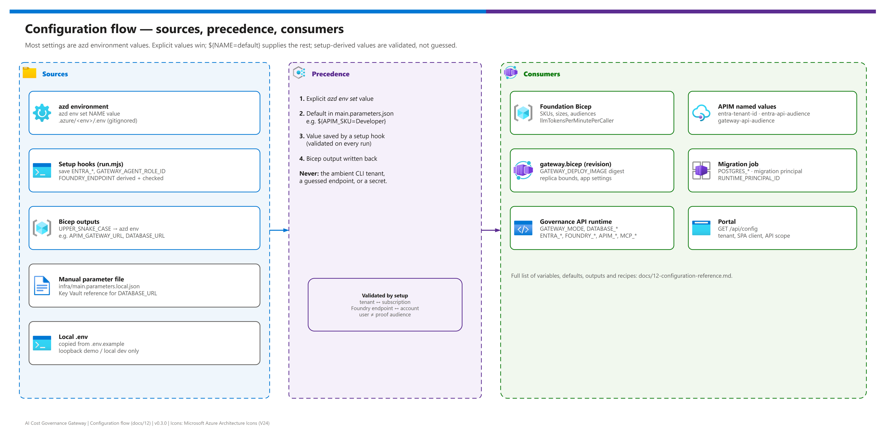

[README](../README.md) › [docs index](./00-reproduce-this-demo.md) › 12 Configuration reference

# 12 - Configuration reference

  
  
  
  
  
  

  
  
  

Every value you can set, in one place - so nobody has to read code to change a SKU, a replica bound, an allowlist, an identity mode or the local runtime. It covers the azd environment, template outputs, the manual parameter file, the application's runtime variables, the migration job, and build/tooling settings, followed by recipes for common goals. It is for operators and maintainers.

## At a glance

| | Where configuration lives | Used by |
|---|---|---|
|  | **azd environment** (`azd env set`, stored in `.azure/<env>/.env`, gitignored) | azd profile: hooks, `infra/azd/*.parameters.json` |
|  | **Template outputs** (written back to the azd environment) | Hooks, revision deployment, migration job |
|  | **Manual parameter file** (`infra/main.parameters.local.json`, gitignored) | Manual profile: `scripts/Deploy-Gateway.ps1` |
|  | **Container environment variables** (set by `gateway.bicep` / `main.bicep`) | Governance API runtime |
|  | **Local `.env`** (copy of `.env.example`, gitignored) | Loopback demo and local development |

## Overview and precedence

Editable source: [`assets/configuration-flow.drawio`](./assets/configuration-flow.drawio) - regenerate with `python scripts/export_diagrams.py docs/assets`.

| Order | Source | Example |
|---|---|---|
| **1** | Explicit `azd env set` value | `azd env set APIM_SKU StandardV2` |
| **2** | Default in `infra/azd/*.parameters.json` | `"${APIM_SKU=Developer}"` |
| **3** | Value saved by a setup hook, re-validated every run | `ENTRA_API_AUDIENCE`, `GATEWAY_AGENT_ROLE_ID` |
| **4** | Template output written back to the environment | `APIM_GATEWAY_URL`, `DATABASE_URL` |

> [!IMPORTANT]
> Setup never derives a value from ambient state. The tenant must match the subscription (`TENANT_MISMATCH`), the Foundry endpoint is derived from the selected account and an inconsistent explicit value is rejected (`FOUNDRY_ENDPOINT_MISMATCH`), and the user and proof API audiences must differ. Secrets are refused as environment values (`UNSAFE_ENVIRONMENT_VALUE`).

## azd environment variables

### Target and identity

| Variable | Default | Effect |
|---|---|---|
| `AZURE_ENV_NAME` | (azd) | Environment name; resource group is `rg-<name>` |
| `AZURE_SUBSCRIPTION_ID` | prompted | Target subscription; must belong to the tenant |
| `AZURE_TENANT_ID` | required | Target tenant; always set it explicitly |
| `AZURE_LOCATION` | prompted | Region for every new resource |
| `ENTRA_SETUP_MODE` | `auto` | `auto` creates/reuses owned registrations; `existing` only validates administrator-supplied ones |
| `ENTRA_SPA_CLIENT_ID` | saved by setup | Portal SPA client ID (required input in `existing` mode) |
| `ENTRA_API_AUDIENCE` | saved by setup | User API application GUID (v2 `aud`) |
| `ENTRA_API_SCOPE` | saved by setup | `api://<user-api-guid>/access_as_user` |
| `GATEWAY_API_AUDIENCE` | saved by setup | Separate proof API application GUID |
| `GATEWAY_ADMIN_OBJECT_ID` | signed-in user | Bootstrap `Gateway.Admin`; required for service-principal/CI deployments |
| `ENTRA_SPA_OBJECT_ID`, `ENTRA_API_SERVICE_PRINCIPAL_ID`, `GATEWAY_PROOF_SERVICE_PRINCIPAL_ID`, `GATEWAY_INVOKE_ROLE_ID`, `GATEWAY_AGENT_ROLE_ID` | saved by setup | Nonsecret IDs for safe resume and for assigning roles (`GATEWAY_AGENT_ROLE_ID` is never assigned automatically) |

### Platform, sizing and policy

| Variable | Default | Effect |
|---|---|---|
| `FOUNDRY_RESOURCE_GROUP` | prompted | Existing Foundry account's resource group (same subscription) |
| `FOUNDRY_ACCOUNT_NAME` | prompted | Existing OpenAI or AIServices account with a custom subdomain |
| `FOUNDRY_ENDPOINT` | derived | Account-root HTTPS URL; validated against the account |
| `FOUNDRY_NETWORK_REVIEWED` | unset | Set `true` only after designing connectivity to a network-restricted Foundry account |
| `APIM_PUBLISHER_NAME`, `APIM_PUBLISHER_EMAIL` | prompted | APIM publisher contact |
| `APIM_SKU` | `Developer` | `Developer`, `BasicV2`, `StandardV2` or `PremiumV2` (`INVALID_SKU` otherwise); Developer has no production SLA |
| `APIM_CAPACITY` | `1` | 1-10 units for non-Developer SKUs (Developer is always one) |
| `POSTGRES_TIER` | `Burstable` | `Burstable`, `GeneralPurpose` or `MemoryOptimized` |
| `POSTGRES_SKU` | `Standard_B1ms` | Must match tier and regional availability |
| `POSTGRES_STORAGE_SIZE_GB` | `32` | 32-16384; Premium SSD, no automatic growth |
| `GATEWAY_MIN_REPLICAS` | `1` | 1-10; keep ≥ 1 so readiness stays available |
| `GATEWAY_MAX_REPLICAS` | `3` | 1-30, ≥ minimum (`INVALID_SCALE` otherwise) |
| `MCP_ALLOWED_HOSTS` | empty | Exact comma-separated public DNS names; empty denies all external MCP registrations |
| `MCP_ALLOWED_AUDIENCES` | empty | Exact comma-separated token audiences; must not include the proof API |
| `LLM_TOKENS_PER_MINUTE_PER_CALLER` | `0` | 0-100000000 per-caller APIM `llm-token-limit`; `0` disables it |

### Release and lifecycle

| Variable | Set by | Effect |
|---|---|---|
| `SERVICE_GATEWAY_IMAGE_NAME` | azd publish | Image azd built in ACR (input to the release gate) |
| `GATEWAY_DEPLOY_IMAGE` | `predeploy` hook | Immutable digest attested by a successful migration; consumed by `gateway.bicep` |
| `GATEWAY_MIGRATION_EXECUTION` | `predeploy` hook | Name of the last migration job execution (inspect its logs on failure) |
| `AZD_ALLOW_DATA_DELETION` | you | Must be `true` before `azd down` can delete the ledger |

> [!WARNING]
> Never put a secret, token or password in the azd environment. The hooks refuse to persist unsafe values, and `.azure/` is gitignored, but the file still sits unencrypted on disk.

## Outputs

Each output of `infra/azd/main.bicep` lands in the azd environment under the same name. The authoritative list and meanings are in [11 - azd integration contract](./11-azd-integration-contract.md#shared-infrastructure-outputs); the table below shows who consumes them.

| Output | Consumed by |
|---|---|
| `AZURE_RESOURCE_GROUP`, `AZURE_CONTAINER_APP_NAME`, `AZURE_CONTAINER_APPS_ENVIRONMENT_NAME`, `AZURE_CONTAINER_APPS_ENVIRONMENT_ID` | azd service deployment, hooks |
| `AZURE_CONTAINER_REGISTRY_NAME`, `AZURE_CONTAINER_REGISTRY_ENDPOINT` | Remote build, release-gate registry check |
| `SERVICE_GATEWAY_RESOURCE_ID`, `GATEWAY_URL` | `postdeploy` verification, SPA redirect |
| `APIM_SERVICE_NAME`, `APIM_RESOURCE_GROUP`, `APIM_GATEWAY_URL`, `APIM_PRINCIPAL_ID` | App settings; `Gateway.Invoke` assignment |
| `AZURE_CLIENT_ID`, `RUNTIME_IDENTITY_ID`, `RUNTIME_PRINCIPAL_ID` | Runtime identity in the revision; database role mapping |
| `MIGRATION_IDENTITY_ID`, `MIGRATION_CLIENT_ID`, `MIGRATION_PRINCIPAL_ID`, `MIGRATION_PRINCIPAL_NAME`, `MIGRATION_JOB_NAME` | Migration job |
| `POSTGRES_HOST`, `POSTGRES_DATABASE`, `POSTGRES_APP_ROLE`, `DATABASE_URL`, `DATABASE_AUTH` | Runtime and migration job |
| `AZURE_LOG_ANALYTICS_WORKSPACE_ID`, `APPLICATIONINSIGHTS_NAME`, `APPLICATIONINSIGHTS_ID` | Operators (queries, alerts) |

## Manual profile parameters

`infra/main.bicep` parameters, supplied in `infra/main.parameters.local.json` (copy of `main.parameters.example.json`). The helper rejects unresolved markers, empty required fields, non-GUID tenant/subscription IDs, mutable images, wildcard MCP hosts and secret literals.

| Parameter | Default | azd equivalent | Notes |
|---|---|---|---|
| `location` | resource group location | `AZURE_LOCATION` | |
| `appName`, `apimServiceName` | required | derived | APIM name is globally unique |
| `publisherName`, `publisherEmail` | required | `APIM_PUBLISHER_NAME`, `APIM_PUBLISHER_EMAIL` | |
| `apimSku`, `apimCapacity` | `StandardV2`, `1` | `APIM_SKU`, `APIM_CAPACITY` | Different defaults by profile |
| `containerRegistryName` | required | created | Existing ACR in the target RG, registry-RBAC mode |
| `imageRepositoryDigest` | required | `GATEWAY_DEPLOY_IMAGE` | `gateway@sha256:<64-hex>`, never a mutable tag |
| `databaseUrl` | required, `@secure()` | `DATABASE_URL` (passwordless) | Key Vault parameter reference only |
| `azureTenantId`, `entraSpaClientId`, `entraApiAudience`, `entraApiScope`, `gatewayApiAudience` | required | same names in UPPER_SNAKE | You create the registrations |
| `foundryResourceGroup`, `foundryAccountName`, `foundryEndpoint` | required | `FOUNDRY_*` | Same subscription |
| `mcpAllowedHosts`, `mcpAllowedAudiences` | `[]` | `MCP_ALLOWED_*` | Arrays here, comma-separated strings in azd |
| `infrastructureSubnetId` | `''` | - | Attach the ACA environment to a prepared subnet |
| `minReplicas`, `maxReplicas` | `1` (1-10), `5` (1-30) | `GATEWAY_MIN_REPLICAS`, `GATEWAY_MAX_REPLICAS` (`1`, `3`) | Different defaults by profile |
| `llmTokensPerMinutePerCaller` | `0` | `LLM_TOKENS_PER_MINUTE_PER_CALLER` | |
| `logRetentionInDays` | `30` (30-730) | fixed 30 | Dedicated workspace in the manual profile |
| `tags` | `{ application: 'foundry-ai-gateway' }` | - | Applied to created resources |

`Deploy-Gateway.ps1` switches: `-Action Checklist|Build|Validate|WhatIf|Deploy` (default `Checklist`), `-SubscriptionId`, `-ResourceGroup`, `-ParameterFile`, `-DeploymentName` (default `ai-gateway`), `-PrerequisitesReviewed`, `-ApproveDeployment`, `-DryRun`. See [03b - Manual deployment](./03b-manual-deployment.md).

## Runtime environment variables

Read by `apps/api/src/config.ts`. In `azure` mode every Entra/Azure value is required (`CONFIG_MISSING`); in `demo` mode they are ignored.

| Variable | Default | Effect |
|---|---|---|
| `GATEWAY_MODE` | `demo` (local), `azure` (container image) | `demo` is loopback-only and refused with `NODE_ENV=production` |
| `HOST`, `PORT` | `127.0.0.1`, `3001` | Bind address; the image binds `0.0.0.0:3001` in `azure` mode |
| `NODE_ENV` | - | `production` in the image; forbids demo mode |
| `DATABASE_URL` | `pglite://data/gateway` | `pglite://` (local, single process) or `postgres(ql)://` with exactly one `sslmode=verify-full` in Azure |
| `DATABASE_AUTH` | `password` | `entra` uses the managed identity per connection (azd); requires `AZURE_CLIENT_ID` |
| `AZURE_TENANT_ID`, `ENTRA_SPA_CLIENT_ID`, `ENTRA_API_AUDIENCE`, `ENTRA_API_SCOPE` | - | User token validation and portal sign-in |
| `GATEWAY_API_AUDIENCE`, `APIM_PRINCIPAL_ID` | - | APIM proof validation (audiences must differ) |
| `AZURE_SUBSCRIPTION_ID`, `FOUNDRY_RESOURCE_GROUP`, `FOUNDRY_ACCOUNT_NAME`, `FOUNDRY_ENDPOINT` | - | Existing Foundry account (account-root HTTPS URL) |
| `APIM_RESOURCE_GROUP`, `APIM_SERVICE_NAME`, `APIM_GATEWAY_URL` | - | APIM coordinates (`APIM_GATEWAY_URL` is the origin, no API path) |
| `AZURE_CLIENT_ID` | - | User-assigned identity for ARM/Foundry; required with `DATABASE_AUTH=entra` |
| `MCP_ALLOWED_HOSTS`, `MCP_ALLOWED_AUDIENCES` | empty | Fail-closed external MCP allowlists |

App-only callers need **no** extra runtime setting: assign them `Gateway.Agent` and register their object ID on a team.

### Migration job (bootstrap)

`node apps/api/dist/bootstrap.js` never runs the demo seed and never loads `.env`. It requires `GATEWAY_MODE=azure`, `DATABASE_AUTH=entra`, `AZURE_CLIENT_ID` (migration identity), `POSTGRES_HOST`, `POSTGRES_DATABASE`, `POSTGRES_APP_ROLE`, `MIGRATION_PRINCIPAL_NAME` and `RUNTIME_PRINCIPAL_ID`. Do not pass `DATABASE_URL` to the job. The manual profile instead runs `node apps/api/dist/cli.js migrate` with the production environment.

## Build and tooling variables

| Variable | Used by | Effect |
|---|---|---|
| `NPM_CONFIG_REGISTRY` | `Dockerfile` build argument | npm registry for image builds (default `https://registry.npmjs.org/`) |
| `npm config set registry <url>` | local npm | Per-user mirror; npm rewrites the lockfile host, integrity still checked |
| `TEST_DATABASE_URL` | `npm run test:integration` | Dedicated PostgreSQL test database; the test drops only its own schema |
| `DRAWIO_EXE` | `scripts/export_diagrams.py` | Path to draw.io desktop when it is not found automatically |

## Recipes

| Goal | Change |
|---|---|
| Production-like APIM | `azd env set APIM_SKU StandardV2` (or `PremiumV2`) and `azd env set APIM_CAPACITY <n>`, then `azd provision` |
| Bigger database | `azd env set POSTGRES_TIER GeneralPurpose`, `azd env set POSTGRES_SKU <sku>`, `azd env set POSTGRES_STORAGE_SIZE_GB <n>` - check regional availability first |
| Scale the app | `azd env set GATEWAY_MIN_REPLICAS 2`, `azd env set GATEWAY_MAX_REPLICAS 10`, then `azd deploy gateway` |
| Throttle token bursts | `azd env set LLM_TOKENS_PER_MINUTE_PER_CALLER 20000`, then `azd provision` |
| Allow one external MCP server | `azd env set MCP_ALLOWED_HOSTS tools.example.com`, `azd env set MCP_ALLOWED_AUDIENCES api://<server-app-guid>`, then `azd up`; register it in the portal |
| Use administrator-made registrations | `azd env set ENTRA_SETUP_MODE existing` plus `ENTRA_SPA_CLIENT_ID`, `ENTRA_API_AUDIENCE`, `GATEWAY_API_AUDIENCE`, `GATEWAY_ADMIN_OBJECT_ID` |
| Deploy from CI as a service principal | `azd env set GATEWAY_ADMIN_OBJECT_ID <user-object-guid>`; prefer `existing` mode |
| Build through a package mirror | `npm config set registry <mirror-url>` locally; `--build-arg NPM_CONFIG_REGISTRY=<mirror-url>` for images |
| Tear down (after ledger backup) | `azd env set AZD_ALLOW_DATA_DELETION true`, then `azd down` |

> [!TIP]
> After any `azd env set`, run `azd env get-values` and confirm the tenant and subscription before `azd provision` or `azd up`.

---

Next: [README](../README.md) → (back to the overview)

*Last updated: 2026-10-08*
